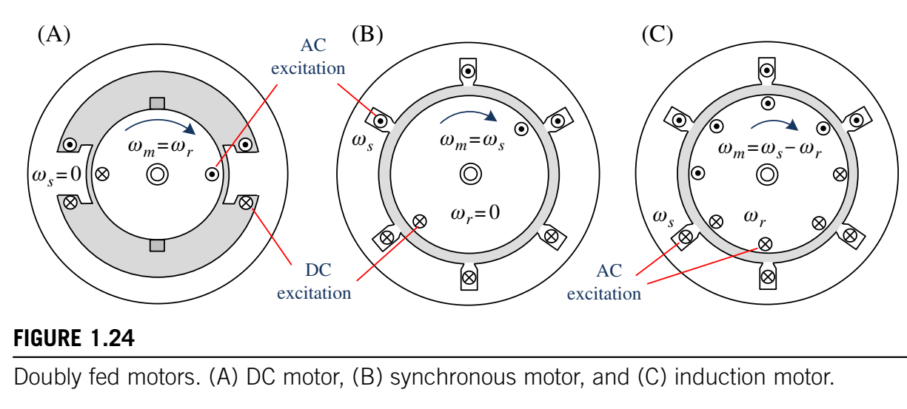
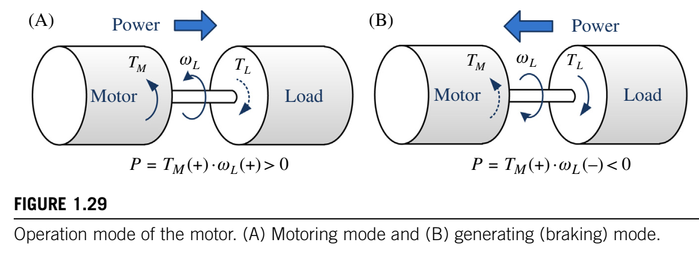
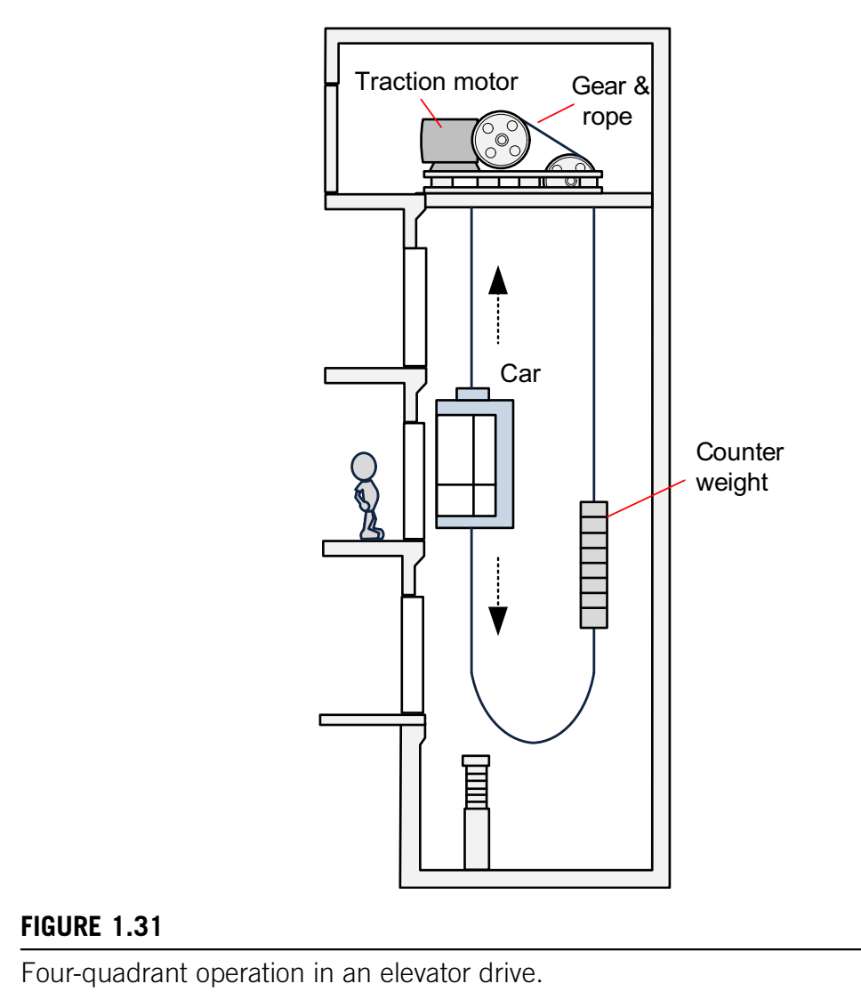

# 第一章 电机基础

​	具有直线运动或旋转运动的移动物体由原动机提供动力。原动机是一种利用热能、电能、液压能、蒸汽、气体等产生机械能的设备。原动机的例子包括气轮机、内燃机和电动机。其中，近来电动机已成为最重要的原动机之一，其使用量正在迅速增加。当前工业中使用的所有电力中，近 70% 用于电机驱动系统中的电力生产 [1]。

 

图 1.1 电动机的分类：交流电机和直流电机

​	根据所使用的电源类型，电动机可分为两种不同类型，如图 1.1 所示：直流(DC)电机和交流(AC)电机。最近开发的无刷直流电机很难被归类为其中任何一种电机，因为其结构类似于永磁同步电机(交流电机)，而其电气特性类似于直流电机。 

​	第一台电动机的建造灵感来自迈克尔・法拉第对电磁感应的发现。1831 年，迈克尔・法拉第和约瑟夫・亨利同时在实验室实验中首次成功运行了电动机。1834 年，M. 雅可比发明了第一台实用的直流电机。从转矩产生的角度来看，直流电机是所有电机的原型。1888 年，尼古拉・特斯拉因其交流电机的发明获得专利，其中包括同步电机、磁阻电机和感应电机。到 1895 年，三相电源、分布式定子绕组和鼠笼式转子依次被开发出来。通过这些发展，三相感应电机最终于 1896 年可供商业使用 [2]。 	

​	传统上直流电机由于其转矩控制容易且驱动性能优异，已广泛用于速度和位置控制应用。另一方面，感应电机由于成本低且结构坚固，已广泛用于恒速应用。感应电机约占电机耗电量的 80%。 	

​	直到 20 世纪 70 年代初，主要的改进工作主要集中在降低电机的成本、尺寸和重量上。磁性材料、绝缘材料、设计和制造技术的改进起到了重要作用，并取得了很大进展。因此，一台现代的 100 马力电机与 1897 年使用的 7.5 马力电机尺寸相同。由于 1973 年石油危机导致油价上涨，节约能源成本已成为一个特别重要的问题。从那时起，主要的努力都集中在提高电机的效率上。最近，能源成本的快速增长以及全球对减少二氧化碳排放的强烈关注，促使各行业更加关注高效电机及其驱动系统 [1]。 	

​	随着电机的不断改进，其驱动技术也取得了诸多进展。20 世纪 60 年代，采用功率半导体器件的电力电子转换器问世，使得制造出具有符合特定系统应用的运行特性的电机成为可能。此外，使用具备高性能数字信号处理功能的微控制器，让工程师能够将先进的控制技术应用于电机，极大地提升了电机驱动系统的性能。 

 ## 1.1 电动机的基本工作原理 

### 1.1.1电动机的结构

图1.2电动机的结构。(A)直流电机，(B)交流同步电机，(C)交流感应电机

​	电动机由两个主要部分组成：如图1.2所示，一个称为定子的静止部分和一个称为转子的运动部分。定子和转子之间的气隙是使转子能够旋转所必需的，气隙的长度可根据电机的种类而变化。

图 1.3 电动机的电气和磁性部件
 

​	定子和转子部分各自都有电路和磁路。如图1.3所示，定子和转子由铁芯构成，绕组电流产生的磁通量将通过铁芯流动，铁芯起到支撑绕组导体的作用。插入铁芯槽中的载流导体形成电路。当电流在这些导体中流动时，通过铁芯产生磁场，定子和转子各自成为电磁铁。 	

​	为了在导体中给定电流下获得更大的磁通量，铁芯通常由具有高磁导率的铁磁材料制成，例如硅钢。在某些情况下，定子或转子通过使用永磁体产生磁通量。

 ### 1.1.2电动机的基本工作原理

 

图1.4 电动机的旋转。(A)两个磁场；(B)一个磁场和磁性材料。
 

​	所有的电动机都基于相同的工作原理进行旋转。如图1.4A所示，电动机内部通常有两个磁场。其中一个在静止的定子上形成，另一个在旋转的转子上形成。这些磁场通过通电绕组、使用永磁体或感应电流产生。这两个磁场相互作用产生的力在转子上产生转矩，使转子转动。另一方面，一些电机，如磁阻电机，利用一个磁场与磁性材料(如铁)之间的相互作用，但它们不能产生大转矩(图1.4B)。如今商业上使用的大多数电机，包括直流电机、感应电机和同步电机，都利用两个磁场相互作用产生的力来产生较大的转矩。 	

​	电机中产生的转矩必须持续产生，才能作为驱动机械负载的电机发挥作用。根据所用电源分类的两种电机类型，即直流电机和交流电机，有不同的实现连续旋转的方式。现在，我们来仔细看看这些实现连续旋转的方法。

#### 1.1.2.1 直流电机 

 
图1.5 直流电机的工作原理。(A)转子电流和定子磁场；(B)两个磁场。
 	

​	直流电机旋转的原理是通过在定子磁场中转子的载流导体产生的力而旋转，如图1.5A所示。或者，可以从两个磁场的角度来考虑直流电机的工作原理，如图1.4A所示。 	

​	如图1.5B所示，直流电机中有两个静止磁场。一个静止磁场是由磁铁或励磁绕组产生的定子磁场。另一个是由转子导体中的电流产生的转子磁场。需要注意的是，尽管转子旋转，但转子磁场也是静止的。这是由于电刷和换向器的作用，通过它们，无论转子如何旋转，转子导体中的电流分布始终保持相同，如图1.5A所示。因此，转子磁场不会随转子一起旋转。这两个静止磁场之间持续的相互作用产生转矩，使转子持续转动。我们将在第二章中更详细地研究直流电机。 

#### 1.1.2.2 交流电机 

图1.6 交流电机的工作原理。
 	

​	与因两个静止磁场之间的力而旋转的直流电机不同，交流电机利用两个旋转磁场之间的力。在交流电机中，定子磁场和转子磁场都旋转，如图1.6所示。 	

​	正如将在第3章更详细描述的那样，这两个磁场总是以相同的速度旋转，因此，它们相对于彼此是静止的，并保持一个特定的角度。结果，在它们之间产生一个恒定的力，使交流电机能够持续运行。交流电机的工作原理是，两个旋转磁场相互作用产生的力使转子转动。 	

​	在交流电机中，定子上的旋转磁场是由三相电流产生的。当三相交流电源施加到交流电机的三相定子绕组上时，在这些绕组中流动的三相电流会产生一个旋转磁场。我们将在第三章中更详细地研究旋转磁场。 	交流电机有两种：同步电机和感应(异步)电机。它们产生转子磁场的方式不同，但产生定子磁场的方式相同。在如图1.2B所示的同步电机中，转子上的磁场由永磁体或由与定子交流电源分开的直流电源供电的励磁绕组产生。在这种电机中，转子磁场相对于转子是静止的。因此，为了产生转矩，转子应与定子旋转磁场以相同的速度旋转。这个速度称为同步速度。这就是为什么这种电机被称为同步电机。 	

​	另一方面，在如图1.2C所示的感应电机中，转子磁场由交流电源产生。用于转子励磁的交流电源通过电磁感应从定子传输过来。由于这个关键特征，这种电机被称为感应电机。在感应电机中，转子磁场以一定速度相对于转子旋转。为了产生转矩，定子和转子旋转磁场应同速旋转。这就要求转子本身以定子和转子旋转磁场之间的速度差旋转。更准确地说，转子旋转磁场以定子旋转磁场与转子之间的速度差旋转。为了利用电磁感应进行转子励磁，转子速度应始终小于同步速度。因此，感应电机也被称为异步电机。

> 转子旋转磁场相对于转子有一个旋转速度，这个速度是在满足产生转矩条件下，与定子旋转磁场速度相关联的。为了产生转矩，定子和转子旋转磁场应同速旋转，由于转子磁场相对于转子本身有一个旋转速度，所以转子旋转磁场以定子旋转磁场与转子之间的速度差旋转。同时，因为要通过电磁感应进行转子励磁，所以转子速度(包括转子旋转磁场相对于转子的速度)应始终小于同步速度。

​	在各种电机中，直流电机由于其简单性，在很大程度上被用于速度和转矩控制。其简单性源于直流电机的速度与电压成正比，转矩与电流成正比这一事实。然而，由于直流电机需要定期维护电刷和换向器，近年来的趋势是采用免维护的交流电机，因为它们能够以合理的价格提供高性能。

​	如前所述，电动机能够基于这样一个基本原理运行：由定子和转子中产生的磁场相互作用所产生的转矩使电动机运转。现在，我们来看看确保电动机持续产生转矩的要求。

## 1.2 持续转矩产生的要求

图1.7 机电能量转换

​	电动机是一种机电能量转换装置，它将电能转换为机械能。通过分析电动机的能量转换过程，可以理解其转矩产生的原理。机电能量转换装置在其能量转换过程中通常将磁场作为中间媒介。因此，如图1.7所示，一个机电能量转换装置由三个不同的部分组成：电气系统、磁系统和机械系统。

​	现在，我们将通过研究机电能量转换装置内部力(或转矩)是如何产生的，来探讨电动机转矩产生的机制。

图1.8 电动机的能量守恒方程

​	为了评估能量转换装置内部产生的力(或转矩)，我们将应用能量守恒定律：“在一个孤立系统内，能量可以从一种形式转换为另一种形式，或者从一个地方转移到另一个地方，但它既不能被创造也不能被消灭。”因此，能量的总量是恒定的。图1.8展示了机电能量转换装置作为电动机时能量守恒定律的应用。

​	此外，少量电能$dW_e$在三个部分中各自转化为损耗：电气系统中的铜损，磁系统中的铁芯损耗(如磁滞损耗和涡流损耗)，以及机械损耗(如摩擦损耗和风阻损耗)。由于这些损耗可能以热或噪声的形式耗散，在评估能量转换过程中的力或转矩产生时，我们可以忽略这些损耗。因此，图1.8中的能量转换方程可写为
$$
dW_e = dW_f + dW_m \tag {1.1}
$$

### 1.2.1 磁能

图1.9 缠绕在铁芯上的线圈

​	在电机(包括电动机)中，如图1.9所示，磁通量通常由缠绕在铁芯上的线圈产生。因为像铁芯这样的铁磁材料具有高磁导率，对于给定的电流，在铁芯中产生的磁通量比在空气中产生的磁通量要大得多。现在，我们来看看磁系统中存储的磁能$W_f$，如图1.9所示，磁通量$\phi$在铁芯中产生。

图1.10 磁通-电流特性

​	首先，我们需要了解在这个磁系统中，铁芯中产生的磁通量$\phi$与线圈电流$i$之间的关系。图1.10展示了这种关系，即被称为磁化曲线的$B-H$特性。在曲线的起始部分，磁通量$\phi$与线圈电流$i$的增加成比例地迅速增加，直到达到某个值。像这样磁通量与所施加电流呈线性关系的区域被称为线性区域或不饱和区域。

​	然而，超过那个特定值后，电流进一步增加时磁通量的增加量相对较小。最终，电流增加时磁通量几乎完全不变。曲线趋于平坦的区域被称为饱和区，此时铁芯被认为是饱和的。当出现饱和时，电流的任何进一步增加对磁通量的增加几乎没有影响或完全没有影响。在电机中，磁通量被设计得尽可能大，因为电机的转矩与磁通量成正比。因此，大多数电机通常在磁化曲线的膝点附近运行，这是两个区域(线性区和饱和区)之间的过渡范围。

​	电机利用通常由许多匝构成的线圈来产生磁通量。因此，引入了磁链$\lambda$的概念(它是匝数$N$与与每匝交链的磁通量$\phi$的乘积)来代替磁通量$\phi$。$N$匝线圈的磁链可由
$$
\lambda = N\phi\quad (Wb-turns)\tag {1.2}
$$
式给出。

​	电感$L$与磁链$\lambda$和线圈电流$i$的关系如下：
$$
L = \frac{\lambda}{i}=N\frac{\phi}{i} \quad (H\ or\ Wb/A) \tag {1.3}
$$

图1.11 线圈的电感

​	磁系统的电感值越大意味着相同的电流能产生更大的磁链。式(1.3)表明，图1.10中曲线的斜率就是如图1.11所示的这个磁系统的电感。在不饱和区域，电感较大且相对恒定，但随着铁芯严重饱和，电感会逐渐下降到非常低的值。 

图1.12 根据气隙长度变化的磁通 - 电流特性

​	现在，我们来看一下存储在磁系统中的磁能$W_{f}$，如图1.12所示，在铁芯中有磁通量$\phi$产生。

​	磁系统的磁链-电流($\lambda - i$)特性随气隙长度$x$而变化。因此，线圈的电感$L(x)$被表示为气隙长度$x$的函数。如图1.12所示，随着气隙长度$x$增加，$\lambda - i$曲线的斜率变小，从而导致电感变小。

​	磁系统的电感$$L$$与其磁阻$$\Re$$成反比，磁阻$$\Re$$被定义为磁动势($$mmf$$)$$F( = Ni)$$与磁通量$$\phi$$的比值，如下式所示：
$$
L = \frac{\lambda}{i}=\frac{N\phi}{i}=\frac{N^{2}}{\Re}\propto\frac{1}{\Re}\ (F = \Re\phi = Ni) \tag {1.4}
$$

图1.13 与电源电压相连的磁系统

​	现在，假设如图1.13所示，在时间$$dt$$内，电源电压$$v$$施加在铁芯上的$$N$$匝线圈的端子上。然后，有电流$$i$$将在该线圈中流动。产生的磁动势$$F( = Ni)$$会在铁芯中产生磁通量$$\phi$$，并在该线圈中建立磁链$$\lambda( = N\phi)$$。现在，我们将讨论存储在磁系统中的能量。

> **磁动势(MMF)和磁通量**
>
> ​	磁通量$$\phi$$对于电机产生转矩是必不可少的。能够产生磁通量的力称为磁动势(mmf)$$F$$。一般来说，磁动势是由电流产生的，所以磁通量的来源是电流。当电流$$I$$流过一个$$N$$匝线圈时，磁动势$$F$$用$$NI$$(安匝)表示，即$$F = NI$$。对于给定的磁动势，产生的磁通量大小取决于磁通量所经过的闭合路径的长度。长度越长，磁通密度就越低。因此，将使用代表每单位长度磁动势的磁场强度$$H$$来代替磁动势。 
> $$
> mmf = F = NI=\oint Hdl \to H=\frac{mmf}{l}=\frac{NI}{l}\ (A/m)
> $$
> ​	此外，对于给定的磁场强度，磁通密度会因磁通所通过的材料不同而不同。例如，在铁或钢中可以产生较高的磁通密度，但在气隙中则不能，如下图所示。
>
> 
>
>  ​	这种磁特性可以根据相对于自由空间磁导率$$\mu_{0}$$的相对磁导率$$\mu_{r}$$来描述。因此，电流产生的磁通密度$$B$$可以表示为
> $$
> B=\mu_{0}\mu_{r}H\quad(Wb/m^{2})
> $$
> ​	在均匀磁通密度$$B$$下，流过磁路横截面$$A$$的总磁通量可表示为
> $$
> \phi=\int_{A}B\cdot n dA = BA\cos\theta\quad (Wb)
> $$
> 其中$$\theta$$是磁场线与表面$$A$$之间的夹角。 与电路中欧姆定律描述的电流和电压之间的关系类似，在磁路中，磁动势$$F$$和磁通$$\phi$$之间有如下关系：$$F = \Re\phi$$，其中$$\Re$$被称为磁阻，且与磁导率成反比。

​	在图1.13所示的系统中，在微小时段$$dt$$内所提供的电能$$dW_{e}$$根据输入功率$$P( = vi)$$可表示为
$$
dW_{e}=Pdt = vidt\quad \tag {1.5}
$$
​	从电源提供的电能中减去线圈中电流产生的铜损后，剩余的能量作为磁场能储存起来。即
$$
dW_{f}=(vi - Ri^{2})dt=(v - Ri)idt = eidt \tag {1.6}
$$
其中$$e$$是线圈中感应出的反电动势电压。

​	由于$$N$$匝线圈上的反电动势电压$$e$$与磁链$$\lambda$$随时间的变化率成正比，即$$e = d\lambda/dt$$，式(1.5)可以表示为
$$
dW_{f}=eidt = id\lambda\ \tag{1.7}
$$
​	当磁链从0增加到$$\lambda$$时，磁系统中存储的总能量为
$$
dW_{f}=\int_{0}^{\lambda}id\lambda\ \tag{1.8}
$$

图1.14 磁通 - 电流特性中的磁能。(A)线性系统和(B)非线性系统。

​	这种磁能是$\lambda - i$曲线左侧的面积，如图1.14所示。另一方面，$\lambda - i$曲线右侧的面积称为余能$W_{f}'$，它在计算力时是一个有用的量，可表示为
$$
W_{f}' = \int_{0}^{\lambda}\lambda di \tag {1.9}
$$
​	对于$$\lambda - i$$曲线是直线的线性系统，磁能等于余能。在磁通路径中有气隙的磁系统是线性系统。

> 反电动势($Back-EMF$)，或感应电压$e$
>
> 法拉第定律指出，在线圈一匝中感应出的电压$$e$$与穿过该匝的磁通$$\phi$$相对于时间的变化率成正比。如果线圈有$$N$$匝，且相同的磁通穿过线圈的每一匝，那么在线圈上感应出的总电压由
> $$
> e = N\frac{d\phi}{dt}=\frac{d\lambda}{dt}
> $$
> 
>
> 根据楞次定律，感应电压的方向与引起它的磁通变化方向相反，因此在上式中包含一个负号。

### 1.2.2 直线运动装置

图 1.15 直线运动装置

​	现在，我们来研究可动能量转换装置内部产生的力。在研究旋转电机之前，我们先研究直线运动装置，如图1.15所示，它由一个固定部件(也称为定子)和一个运动部件组成。

图1.16 可动部件的运动。

​	如果在这个装置中，流经$N$匝线圈的电流产生了磁通，那么，从日常经验可知，我们可以很容易地知道，可动部件将朝着定子移动，如图1.16所示。现在，我们将讨论引起这种运动的力。

图1.17 磁链 - 电流特性(可动部件的快速运动)

​	假设在可动部件移动前后，线圈的电流$I$保持不变。假设可动部件从位置$x_{1}$移动到位置$x_{2}$。由于这种移动，气隙的长度发生了变化。这也改变了系统的$\lambda - i$特性，如图1.17所示。随着移动，气隙减小，导致磁阻减小，从而使磁链从$\lambda_{1}$增加到$\lambda_{2}$。工作点将从$A$点移动到$B$点。移动的轨迹取决于移动速度。因此，我们将针对两种极限移动速度求出作用在可动部件上的力。

​	首先，假设运动发生得非常快。在这种情况下，运动速度极快，以至于在磁链$\lambda$发生任何显著变化之前运动就可能已经完成。因此，在运动期间，磁链$\lambda_{1}$保持不变，这样工作点就如图1.17所示从$A$点移动到$C$点。

​	运动完成后，磁链将从$\lambda_{1}$变为$\lambda_{2}$，工作点将从$C$移至$B$。在运动过程中，磁链不变，这导致反电动势为零，所以电能输入为零，即$dW_{e}=eidt = id\lambda = 0$。因此，式(1.1)可写为
$$
dW_{m}=-dW_{f}\tag {1.10}
$$
这个方程式表明，运动所需的机械能完全由磁能提供。运动过程中减少的磁能量与$\lambda - i$特性曲线中的$OAC$阴影区域相对应。 

​	考虑到力被定义为每位移$dx$所做的机械功$dW_{m}$，根据式(1.10)，在此运动过程中产生的力为
$$
f_{m}=\frac{dW_{m}}{dx}=-\left.\frac{dW_{f}(i,x)}{dx}\right|_{\lambda = 常数} \tag {1.11}
$$
这意味着该力的作用方向是系统磁能减小的方向。

​	现在，我们将根据线圈电流来表示式(1.11)中的力。为简单起见，假设$\lambda - i$特性是线性的。式(1.8)中的磁能可表示为：
$$
W_{f}=\int id\lambda=\int\frac{\lambda}{L(x)}d\lambda=\frac{\lambda^{2}}{2L(x)}=\frac{1}{2}L(x)i^{2} \tag {1.12}
$$
​	通过将式(1.12)代入式(1.11)中的力，我们得到
$$
\begin{align*} f_{m}&=-\left.\frac{dW_{f}(i,x)}{dx}\right|_{\lambda = 常数}=-\left.\frac{d}{dx}\left(\frac{\lambda^{2}}{2L(x)}\right)\right|_{\lambda = 常数}\\ &=\frac{\lambda^{2}}{2L^{2}(x)}\frac{dL(x)}{dx}=\frac{1}{2}i^{2}\frac{dL(x)}{dx} \end{align*} \tag {1.13}
$$
式(1.13)表明，该力作用于使磁系统电感增加的方向。由于使电感增加的方向是气隙长度减小的方向，所以力作用在朝着定子移动的可动部件上。 

​	由此，我们可以解释电磁铁(或磁体)与磁性材料之间的吸引力。当电磁铁和磁性材料相互紧密贴合(无气隙)时，系统具有最大的电感。这样，在这两个物体之间就会产生一种吸引力，使它们相互靠近。 

图1.18 磁链 - 电流特性(可动部件的极慢运动)

​	接下来，假设可动部件移动得非常缓慢。在这种情况下，在移动过程中电流$i=(v - e)/R$保持恒定。这是因为反电动势$e(=d\lambda/dt)$小到可以忽略不计。因此，如图1.18所示，$\lambda - i$特性曲线上的工作点从$A$向上移动到$B$。

​	在这种运动过程中，电能的变化由
$$
dW_{e}=eidt = id\lambda = i(\lambda_{2}-\lambda_{1}) \tag {1.14}
$$
给出。

​	这与区域$ABEF$相对应。在这种情况下，根据式(1.8)，存储磁能的变化量由
$$
dW_{f}=\int_{0}^{\lambda_{2}}id\lambda - \int_{0}^{\lambda_{1}}id\lambda=Area\ OBE -Area\ OAF \tag {1.15}
$$
给出。

​	因此，根据式(1.1)，运动所需的机械能为
$$
dW_{m}=dW_{e}-dW_{f}\tag {1.16}
$$
​	通过将式(1.14)和式(1.15)代入式(1.16)，可以很容易看出机械能与$\lambda - i$特性曲线中的阴影区域$OAB$相对应，并且等于余能的增量$dW_{f}'$。因此，运动所消耗的机械能等于运动过程中余能的增量$dW_{f}'$，如下所示：
$$
dW_{m}=dW_{f}' \tag {1.17}
$$
​	因此，在该运动过程中产生的力为
$$
f_{m}=\frac{dW_{m}}{dx}=\left.\frac{dW_{f}'(i,x)}{dx}\right|_{i = 常数}\tag {1.18}
$$
​	缓慢运动时力的表达式与快速运动时力的表达式相同。对于线性系统，$dW_{f}=dW_{f}'$，将式(1.12)代入式(1.18)，我们可得：
$$
\begin{align*} f_{m}&=\left.\frac{dW_{f}'(i,x)}{dx}\right|_{i = 常数}=\left.\frac{dW_{f}(i,x)}{dx}\right|_{i = 常数}\\ &=\left.\frac{d}{dx}\left(\frac{1}{2}L(x)i^{2}\right)\right|_{i = 常数}=\frac{1}{2}i^{2}\frac{dL(x)}{dx} \end{align*}\tag {1.19}
$$
​	这与在式(1.13)中得出的结论相同，这意味着无论移动速度如何，力都是一样的。 

​	这个力也可以依据磁阻ℜ来表示。式(1.8)中的磁能(表示为磁阻ℜ的函数)是
$$
W_{f}=\int_{0}^{\lambda}id\lambda=\int_{0}^{\phi}Fd\phi=\int_{0}^{\phi}\mathfrak{R}\phi d\phi=\frac{1}{2}\mathfrak{R}(x)\phi^{2}\tag {1.20}
$$
​	根据式(1.20)，式(1.11)中的力为
$$
f_{m}=-\left.\frac{d}{dx}\left(\frac{1}{2}\mathfrak{R}(x)\phi^{2}\right)\right|_{\phi = 常数}=-\frac{1}{2}\phi^{2}\frac{d\mathfrak{R}(x)}{dx} \tag {1.21}
$$
​	这意味着该力作用于使磁系统磁阻减小的方向。由于气隙长度的减小会导致磁阻减小，所以力作用在朝着定子移动的可动部件上。接下来，我们将讨论旋转电机中的转矩产生。 

### 1.2.3旋转电机 

图1.19 旋转电机

​	我们首先从图1.19所示的电机开始研究，它产生旋转运动。旋转电机由一个固定部分(称为定子)和一个运动部分(称为转子)组成。 

​	转子安装在轴上，可以在定子磁极之间自由旋转。 使转子旋转的力可以表示为扭矩，即每旋转距离或角度θ所做的机械功，如下所示：
$$
T=\frac{dW_{m}}{d\theta}\quad\tag{1.22}
$$
​	在图1.18所示的电机中，当电流$i_{s}$在定子线圈中流动时，会产生磁通量，根据式(1.12)和(1.22)，作用在转子上的扭矩可以表示为
$$
T=\frac{1}{2}i_{s}^{2}\frac{dL(\theta)}{d\theta}=-\frac{1}{2}\phi^{2}\frac{d\mathfrak{R}(\theta)}{d\theta}\tag {1.23}
$$
​	这个扭矩是由磁阻(或电感)随转子位置的变化而产生的，因此被称为磁阻扭矩。使用这种扭矩的电机被称为磁阻电机。对于圆柱形转子结构的电机，由于磁阻不随转子位置变化，所以无法产生磁阻扭矩。 

​	现在，我们来看看确保该电机连续旋转作为电动机运行的必要条件。首先，不难想到，如果线圈中有直流电流流动，该电机永远不会作为连续旋转的电动机运行。因此我们考虑绕组由交流电流$i_{s}(=I_{m}\cos\omega_{s}t)$激励的情况。在这种情况下，式(1.23)中的扭矩可以用定子电流$i_{s}$和定子自感$L_{ss}$表示为
$$
T=\frac{1}{2}i_{s}^{2}\frac{dL_{ss}(\theta)}{d\theta}\tag {1.24}
$$
其中电感$L_{ss}(=\lambda_{s}/i_{s})$定义为定子线圈中总磁链$\lambda_{s}$与产生磁通量的定子电流$i_{s}$的比值。 

图1.20 定子自感Lss相对于转子位置的曲线

​	自感$L_{ss}$在图1.19所示的电机中随转子的角位置θ变化，如图1.20所示。 转子旋转一周有两个电感周期。当$\theta = 0^{\circ}$时，气隙最小，电感$L_{ss}$达到最大值$L_{max}$。当$\theta = 90^{\circ}$时，气隙最大，电感达到最小值$L_{min}$。这样，定子自感$L_{ss}$随转子位置θ呈正弦变化，可以表示为
$$
L_{ss}(\theta)=L_{0}+L_{2}\cos2\theta\quad\tag{1.25}
$$
其中$L_{0}=(L_{max}+L_{min})/2$，$L_{2}=(L_{max}-L_{min})/2$ 。

​	将式(1.25)代入式(1.24)得到
$$
T=\frac{1}{2}i_{s}^{2}\frac{dL_{ss}(\theta)}{d\theta}=-I_{m}^{2}L_{2}\sin2\theta\cos^{2}\omega_{s}t \tag {1.26}
$$
​	如果转子以恒定的角速度$\omega_{m}$旋转，那么转子的角位置θ可以表示为
$$
\theta=\omega_{m}t+\delta\quad\tag{1.27}
$$
其中$\delta$是转子的初始角位置。 

> 自感和互感 
>
> 线圈的电感L定义为线圈中每安培电流产生的磁链。
>
> 自感：自感是同一绕组中的电流在该绕组中产生的磁链除以该电流。
>
> 
>
> 互感：互感是一个绕组中由另一个绕组中的电流所产生的磁链除以该电流。
>
> 

​	同时，当位置$\theta$增加(顺时针运动)时，我们认为$\omega_{m}$为正。将式(1.27)代入式(1.26)得到 
$$
\begin{aligned}T&=-I_{m}^{2}L_{2}\sin2(\omega_{m}t+\delta)\frac{1+\cos2\omega_{s}t}{2}\\&=-\frac{1}{2}I_{m}^{2}\left\{L_{2}\sin2(\omega_{m}t+\delta)+\frac{1}{2}\sin2([\omega_{m}+\omega_{s}]t+\delta)+\frac{1}{2}\sin2([\omega_{m}-\omega_{s}]t+\delta)\right.\end{aligned} \tag {1.28}
$$
​	式(1.28)右边的三个正弦项是时间$t$的函数，其平均值为零。

​	因此，这个扭矩的平均值为零。 这意味着在这个电机中，任何方向都不能产生恒定的扭矩。因此，该电机不能作为连续旋转的电动机运行。然而，如果$\omega_{m}=0$或$\omega_{m}=\pm\omega_{s}$，则可以产生非零的平均扭矩。由于$\omega_{m}=0$表示不旋转，所以将其排除。因此，连续旋转的要求是$\omega_{m}=\omega_{s}$。这要求转子必须以等于激励电流角频率$\omega_{s}$的速度旋转，这也称为同步速度。在这种情况下，该电机可以作为连续旋转的电动机运行，其平均扭矩为
$$
T_{avg}=-\frac{1}{4}I_{m}^{2}L_{2}\sin2\delta=-\frac{1}{8}I_{m}^{2}(L_{max}-L_{min})\sin2\delta \tag {1.29}
$$
​	平均产生的扭矩取决于电感差$(L_{max}-L_{min})$和初始转子位置$\delta$。最大扭矩出现在$\delta=-45^{\circ}$时。由于该电机中由磁阻(或电感)随转子位置变化而产生的扭矩只能在同步速度下产生，所以该电机被称为同步磁阻电机。 

图1.21 双馈电机

​	接下来，我们将研究定子和转子都有载流绕组的双馈电机连续旋转的必要条件，如图1.21所示。典型的电动机，如直流电动机、感应电动机和同步电动机都属于双馈电机。

​	假设该电机是一个线性系统，其中磁能和余能相同，即$W_{f}=W_{f}'$。与式(1.19)中的力类似，该电机的扭矩可由
$$
T = \left.\frac{dW_{f}'(i,\theta)}{d\theta}\right|_{i = constant} = \left.\frac{dW_{f}(i,\theta)}{d\theta}\right|_{i = constant}\tag {1.30}
$$

得出。 

​	为了计算这个扭矩，我们需要得到该电机中的磁能$w_{f}$。当磁场由绕组电流$i_{s}$和$i_{r}$建立时，存储的磁能$W_{f}$可以通过将转子锁定在任意位置(使其不产生机械输出)轻松推导出来。如果没有机械输出，那么在$dt$期间磁场能量的增量为
$$
dW_{f} = dW_{e} = e_{s}i_{s}dt + e_{r}i_{r}dt = i_{s}d\lambda_{s} + i_{r}d\lambda_{r}\tag {1.31}
$$
​	这里，定子磁链$\lambda_{s}$由定子电流$i_{s}$产生的$\lambda_{ss}$和转子电流$i_{r}$产生的$\lambda_{sr}$组成。这个定子磁链可以表示为绕组电流和电感的函数，即
$$
\lambda_{s} = \lambda_{ss} + \lambda_{sr} = L_{ss}i_{s} + L_{sr}i_{r}\tag {1.32}
$$
​	其中$L_{ss}(=\lambda_{ss}/i_{s})$是定子绕组的自感，$L_{sr}(=\lambda_{sr}/i_{r})$是定子和转子绕组之间的互感。转子绕组中的磁链$\lambda_{r}$也由转子电流$i_{r}$产生的$\lambda_{rr}$和定子电流$i_{s}$产生的$\lambda_{rs}$组成。这个转子磁链$\lambda_{r}$表示为
$$
\lambda_{r} = \lambda_{rr} + \lambda_{rs} = L_{rr}i_{r} + L_{rs}i_{s}\tag {1.33}
$$
​	其中$L_{rr}(=\lambda_{rr}/i_{r})$是转子绕组的自感，$L_{rs}(=\lambda_{rs}/i_{s})$是定子和转子绕组之间的互感。对于线性磁系统，$L_{sr} = L_{rs}$。 

​	在图1.21所示的双馈电机中，自感$L_{ss}$、$L_{rr}$和互感$L_{sr}$、$L_{rs}$都随转子位置$\theta$变化。例如，当$\theta = 0^{\circ}$时，气隙长度最小，系统的磁阻最小，电感最大。因此，$\lambda_{s}$和$\lambda_{r}$是转子位置$\theta$的函数。 

​	将式(1.32)和(1.33)代入式(1.31)得到：
$$
\begin{aligned} dW_{f} &= i_{s}d(L_{ss}i_{s}+L_{sr}i_{r}) + i_{r}d(L_{sr}i_{s}+L_{rr}i_{r})\\ &= L_{ss}i_{s}di_{s} + L_{rr}i_{r}di_{r} + L_{sr}d(i_{s}i_{r}) \end{aligned}\tag {1.34}
$$
​	假设在定子电流从0增加到$i_{s}$之后，转子电流从0增加到$i_{r}$，那么存储的总磁能将是： 
$$
\begin{aligned} W_{f} &= L_{ss}\int_{0}^{i_{s}}i_{s}di_{s} + L_{rr}\int_{0}^{i_{r}}i_{r}di_{r} + L_{sr}\int_{0}^{i_{s},i_{r}}d(i_{s}i_{r})\\ &=\frac{1}{2}L_{ss}i_{s}^{2}+\frac{1}{2}L_{rr}i_{r}^{2}+L_{sr}i_{s}i_{r} \end{aligned}\tag {1.35}
$$
​	通过将式(1.35)代入式(1.30)，扭矩表示为：
$$
\begin{aligned} T &= -\left.\frac{dW_{f}(i,\theta)}{d\theta}\right|_{i = constant}\\ &=\frac{1}{2}i_{s}^{2}\frac{dL_{ss}}{d\theta}+\frac{1}{2}i_{r}^{2}\frac{dL_{rr}}{d\theta}+i_{s}i_{r}\frac{dL_{sr}}{d\theta} \end{aligned}\tag {1.36}
$$
​	这个扭矩表达式是在转子被锁定不产生机械输出的条件下推导出来的。即使转子在旋转，我们也能得到相同的扭矩表达式[3]。 

​	在式(1.36)中，右边的前两项代表与自感随转子位置$\theta$变化有关的磁阻扭矩。最后一项与互感变化有关，它表示由定子和转子电流$i_{s}$和$i_{r}$产生的两个磁场相互作用形成的电磁扭矩。典型的旋转电机，如直流电机、感应电机和同步电机，都是基于这种扭矩工作的。 

​	在前面的章节中，我们看到磁阻电机必须以等于激励电流角频率的速度运行才能产生平均扭矩。在双馈电机中，如果定子和转子电流的工作频率不同，那么电机将需要在两个不同的速度下同步才能产生平均扭矩。一次只能满足其中一个条件，另一个扭矩项将是振荡的。这将导致不希望出现的速度振荡。然而，我们可以通过消除式(1.36)中的一个或两个磁阻扭矩项来解决这个问题。 

图1.22 圆柱形转子结构

​	首先，我们将消除与定子自感变化有关的磁阻扭矩项。我们可以通过使转子呈圆柱形结构来实现这一点，如图1.22所示。 

图1.23 圆柱形定子和转子结构

​	在圆柱形转子结构中，定子自感$L_{ss}$变为恒定值，因为对于定子绕组产生的磁通量而言，无论转子位置如何，磁路都是恒定的。因此，
$$
\frac{dL_{ss}}{d\theta}=0\tag {1.37}
$$
​	因此，由定子励磁引起的磁阻转矩项将从式(1.36)中消失。

​	此外，如果我们将定子制成如图1.23所示的与转子同轴的空心圆柱体，那么无论转子位置如何，转子自感$L_{rr}$都将变为恒定值。因此，
$$
\frac{dL_{rr}}{d\theta}=0\tag {1.38}
$$
​	这将导致由于转子励磁而产生的第二个磁阻转矩项消失。

​	我们可以看到，在定子和转子都为圆柱形结构的圆柱形电机中，不会产生磁阻转矩。这种圆柱形电机仅产生涉及定子和转子绕组间互感变化的转矩，如式(1.39)所示：
$$
T = i_{s}i_{r}\frac{dL_{sr}}{d\theta}\tag {1.39}
$$
​	即使在圆柱形电机中，这种互感也可通过根据转子位置改变定子和转子绕组的相对位置来使其变化。

​	现在，我们来研究圆柱形电机持续产生转矩的必要条件。假设定子绕组和转子绕组中的电流分别为 
$$
i_{s}=I_{sm}\cos\omega_{s}t\quad\tag{1.40}
$$

$$
i_{r}=I_{rn}\cos(\omega_{r}t + \alpha)\quad\tag{1.41}
$$

​	如果两个绕组的轴线对齐，即如图1.23所示当$\theta = 0^{\circ}$时，那么两个绕组的交链磁通将达到最大值，这也会使互感达到最大值。因此，根据转子位置的互感可表示为
$$
L_{sr}=L_{m}\cos\theta\tag {1.42}
$$
​	其中$L_{m}$是最大互感，$\theta$是定子和转子绕组轴线之间的夹角。转子以角速度$\omega_{m}$转动时，在时刻$t$转子的位置是
$$
\theta=\omega_{m}t + \delta\tag {1.43}
$$
​	其中$\delta$是$t = 0$时转子的初始位置。

​	将式(1.40)、(1.41)和(1.42)代入式(1.39)可得：
$$
\begin{aligned} T&=i_{s}i_{r}\frac{dL_{sr}}{d\theta}\\ &=-I_{sm}I_{rm}L_{m}\cos\omega_{s}t\cdot\cos(\omega_{r}t + \alpha)\cdot\sin(\omega_{m}t + \delta)\\ &=-\frac{I_{sm}I_{rm}L_{m}}{4}\left[\sin\left\{(\omega_{m}+(\omega_{s}+\omega_{r}))t + \alpha + \delta\right\}\right.\\ &\quad+\sin\left\{(\omega_{m}-(\omega_{s}+\omega_{r}))t + \alpha + \delta\right\}\\ &\quad+\sin\left\{(\omega_{m}+(\omega_{s}-\omega_{r}))t + \alpha + \delta\right\}\\ &\quad\left.+\sin\left\{(\omega_{m}-(\omega_{s}-\omega_{r}))t + \alpha + \delta\right\}\right] \end{aligned} \tag {1.44}
$$
​	由于对正弦函数的一个周期求平均为零，式(1.44)的平均转矩也将为零。然而，如果式(1.44)中正弦项里$t$的系数为零，则可以产生平均转矩。这需要满足以下条件：
$$
\vert\omega_{m}\vert=\vert\omega_{s}\pm\omega_{r}\vert\tag {1.45}
$$
​	典型的电动机，如直流电机、感应电机和同步电机，以不同的方式满足这一条件，因此能够持续旋转。

​	现在，我们来看看这三种电机中的每一种是如何满足产生平均转矩这一要求的。首先，我们将忽略定子和转子绕组都由直流电激励($\omega_{s}=\omega_{r}=0$)的情况，因为式(1.45)会得出$\omega_{m}=0$，这表示电机处于不旋转的状态。

#### 1.2.3.1 直流电机 

​	如果定子由直流电源激励($\omega_{s}=0$)，转子由角频率为$\omega_{r}$的交流电源激励，那么产生平均扭矩的式(1.45)的必要条件是
$$
\vert\omega_{m}\vert=\vert\omega_{r}\vert\quad\tag{1.46}
$$

图1.24 双馈电机。(A)直流电机，(B)同步电机，(C)感应电机。

​	这意味着转子需要以与转子电流频率$\omega_{r}$相同的频率旋转。如图1.24A所示的直流电机满足这一条件。在直流电机中，通过换向器和电刷的作用，转子电流变为交流，其角频率自然等于转子速度。因此，直流电机具有特殊的机械结构，使其总是满足式(1.46)。由式(1.44)和(1.46)可得，该电机的平均扭矩为
$$
T_{avg}=-\frac{I_{sm}I_{rm}}{2}L_{m}\sin\delta\quad\tag{1.47}
$$
​	在直流电机中，$\delta$表示定子磁场磁通与转子磁动势之间的夹角，在结构上总是$90^{\circ}$电角度，所以每安培的最大扭矩可表示为
$$
T_{avg}=-\frac{L_{m}}{2}I_{sm}I_{rm}\quad\tag{1.48}
$$

#### 1.2.3.2 同步电机 

​	如果定子由角频率为$\omega_{s}$的交流电源激励，转子由直流电源激励，如图1.24B所示，那么只有当
$$
\vert\omega_{m}\vert=\vert\omega_{s}\vert\quad\tag{1.49}
$$
​	式(1.45)才能满足。 

​	为了实现这一点，转子必须以与定子电流频率$\omega_{s}$同步的角频率旋转。满足这一条件的电机成为同步电机。“同步电机”这个名称就是由此而来。由式(1.44)可得，该电机的平均扭矩为
$$
T_{avg}=-\frac{I_{sm}I_{rm}}{2}L_{m}\sin\delta\tag{1.47}
$$
​	与直流电机不同，即使在相同电流流动的情况下，该电机的平均扭矩也会根据定子和转子磁场磁通之间的夹角$\delta$而变化。我们可以很容易地看到，同步电机没有启动扭矩，因为它在启动时不能满足$\omega_{m}=\omega_{s}$的要求。 

#### 1.2.3.3 感应电机 

​	当定子和转子绕组分别由不同频率$\omega_{s}$和$\omega_{r}$的交流电源激励时，必要条件应该是
$$
\omega_{m}=\omega_{s}-\omega_{r}\quad\tag{1.50}
$$
​	这意味着转子必须以$\omega_{s}-\omega_{r}$的角频率旋转。这可以在如图1.24C所示的感应电机中实现。在感应电机中，通过电磁感应在转子绕组中感应的电流频率$\omega_{r}$自然地变为$\omega_{s}-\omega_{m}$，这是定子电流和转子速度在角频率上的差值。因此，感应电机总是满足式(1.50)。由式(1.44)可得，该电机的平均扭矩为
$$
T_{avg}=-\frac{I_{sm}I_{mm}}{2}L_{m}\sin(\alpha+\delta)\tag {1.51}
$$
​	与直流电机不同，即使在相同电流流动的情况下，感应电机的平均扭矩也会根据定子和转子磁场磁通之间的夹角$\delta$而变化。 

​	如我们之前所见，电动机可以分为圆柱形电机和磁阻电机。圆柱形电机利用如前所述的绕组之间互感变化产生的扭矩。这些在定子和转子上都有绕组的圆柱形电机虽然在结构上更复杂，但能产生更大的扭矩。因此，大多数电机是圆柱形类型的。相比之下，非圆柱形结构的磁阻电机利用磁路电感(或磁阻)变化产生的扭矩。磁阻电机结构简单，但这些电机中产生的扭矩较小。

## 1.3 机械负载系统

​	电动机是一种将电能转换为机械转矩的机电设备。当电动机产生的转矩传递到与其相连的负载时，负载变量如速度、位置、气流、压力和张力将得到控制。现在，我们将讨论与电动机相连的负载的特性以及描述电机驱动系统的数学表达式。

### 1.3.1运动动力学方程

图1.25 (A)直线运动物体和(B)旋转运动物体。

​	考虑一个驱动力$F_M$作用在质量为$M$的物体上，如图1.25A所示，使物体以速度$v$运动\[4\]。根据牛顿第二定律，物体动量的变化率与所施加的力成正比，我们有
$$
F_M - F_L=\frac{d}{dt}(Mv)=M\frac{dv}{dt}+v\frac{dM}{dt}\tag {1.53}
$$
其中$F_L$是负载力，其方向与$F_M$相反，$Mv$是物体的动量。 

​	如果负载的质量$M$是恒定的，那么式(1.53)中导数的第二项为零。因此，式(1.53)由牛顿第二定律导出的一个众所周知的方程给出，即
$$
F_M - F_L = M\frac{dv}{dt}=Ma\tag {1.54}
$$
其中$a(=\frac{dv}{dt})$是物体的加速度。 

​	接下来，对于图1.25B中的旋转运动，式(1.53)的旋转类似物由
$$
T_M - T_L=\frac{d}{dt}(J\omega)=J\frac{d\omega}{dt}+\omega\frac{dJ}{dt}\tag{1.55}
$$
给出，其中$T_M$和$T_L$分别是驱动转矩和负载转矩，$\omega$是旋转物体的角速度。$J$表示旋转物体的转动惯量，$J\omega$是物体的角动量。 

​	当转动惯量$J$被假设为常数时，我们可以将式(1.55)重写为
$$
T_M - T_L = J\frac{d\omega}{dt}=J\alpha\tag {1.56}
$$
其中$\alpha(=\frac{d\omega}{dt})$是物体的角加速度。 

​	我们可以看到，如果$T_M>T_L$，那么物体将加速，如果$T_M<T_L$，那么物体将减速。在$T_M=T_L$的情况下，速度将不会改变。因此，当驱动负载时，为了保持负载速度恒定，电动机转矩必须等于负载转矩。

> 转动惯量：$J(kg\cdot m^2)$ 
>
> ​	旋转物体保持其原始旋转运动状态的趋势称为转动惯量$J$。以角速度$\omega$旋转的刚体的旋转动能根据其转动惯量表示为$\frac{1}{2}J\omega^2$。物体的转动惯量也是衡量物体加速或减速快慢的指标。 
>
> ​	刚体的转动惯量与质量分布以及物体的质量$m$有关。因此，物体的转动惯量可能取决于其形状。例如，如果两个物体质量相同但半径不同，如图所示，那么它们可能具有不同的转动惯量。 
>
> 
>
> ​	如果物体的半径较大，那么转动惯量就较大。原因如下。一个旋转物体由许多距离旋转轴不同距离的小粒子组成。当物体旋转时，距离旋转轴较远的粒子将比较靠近旋转轴的粒子移动得更快。因此，距离旋转轴较远的粒子在旋转时需要更多的动能。每个粒子的转动惯量$I$定义为其质量乘以从旋转轴到粒子的距离$r$的平方，即$I = mr^2$。因此，对于相同的物体质量，其质量分布离旋转轴越远，物体的转动惯量就越大。对于实心或空心圆柱体，转动惯量可以通过下式计算。 
>
> 
>
> ​	在工业应用中，通常使用$GD^2(=4J)$，也称为飞轮效应，而不是$J$。这里，$G$是质量($kg$)，$D$是直径($m$)。 电动机有最大允许负载转动惯量。确保电动机的转动惯量与被驱动负载的转动惯量相匹配是很重要的。理想情况下，负载和电动机之间的转动惯量比为1:1是可取的。对于牵引电动机，电动机转动惯量应足够大以驱动大转动惯量的负载。为了具有大的转动惯量，电动机将设计成具有大直径和短轴向长度的转子结构。另一方面，对于频繁加速/减速运行的伺服电动机，转子的转动惯量应该较小。因此，转子将设计成具有小直径和长轴向长度。 

图1.26 简化的电机驱动系统。

​	图1.26显示了一个由驱动电动机和被驱动机械负载组成的简化电机驱动系统配置，其中电动机的转矩通过轴和联轴器传递到负载。 从电动机的角度来看，机械负载可以看作是连接到其轴上的负载转矩$T_L$。因此，根据式(1.56)，电机驱动系统的运动方程可以表示为
$$
T_M=(J_M + J_L)\frac{d\omega}{dt}+T_L\tag{1.57}
$$
其中$J_M$和$J_L$分别是电动机转动惯量和负载转动惯量。 

​	当电动机驱动机械负载时，运行负载所需的转矩是负载转矩$T_L$，它随负载类型而变化。 除了式(1.57)，当负载开始移动并处于运动状态时，会产生摩擦力，阻碍运动。因此，运动方程需要包括摩擦力$T_F$，即
$$
T_M=(J_M + J_L)\frac{d\omega}{dt}+T_F+T_L\tag{1.58}
$$
​	摩擦力通常与速度成正比，由$T_F = B\omega$给出，其中$B$是摩擦系数。最后，我们得到一个运动方程，它表达了电机驱动系统的动态行为，即
$$
T_M = J\frac{d\omega}{dt}+B\omega+T_L\tag{1.59}
$$
其中$J = J_M + J_L$。 

​	电机驱动系统具有机械传动装置，如轴、齿轮箱或联轴器，用于连接电动机和负载。在实际系统中，这些部件的刚度是有限的，并且传动是柔性的。因此，如果电动机和负载之间的联轴器或轴较长或有弹性，那么它可能会受到扭转。在这种情况下，我们需要在式(1.59)中添加由轴扭转变形产生的转矩项$K_{sh}\theta$，其中$K_{sh}(Nm/rad)$是刚度系数。

> 负载转矩$T_{LK}$
>
> ​	有几种类型的负载可以由电动机驱动。在大多数负载中，所需的转矩通常是速度的函数。有三种典型的负载，其速度 - 转矩特性如图所示。
>
> 
>
> 1. 恒转矩负载
>
>    这种类型负载所需的转矩与速度无关，保持恒定。电梯、螺杆压缩机、输送机和给料机等负载具有这种类型的特性。    
>
> 2. 恒功率负载($T_L\propto\frac{1}{\omega}$)
>
>    这种负载需要的转矩与速度成反比，因此被认为是恒功率负载。这种类型最常见于机床行业和钻孔、铣削行业。
>
> 3. 与速度平方成正比的负载($T_L\propto\omega^2$)
>
>    这种负载的转矩与速度的平方成正比。这是风扇、鼓风机和泵的典型特性，在工业驱动应用中最为常见。 牵引驱动中的负载，如电力机车和电动汽车，在低速时表现出恒转矩负载的特性，在高速时表现出恒功率负载的特性。

#### 1.3.1.1 平移运动和旋转运动的组合系统

图1.27 平移运动与旋转运动的组合系统。

​	工业中的许多运动，如电梯、输送机或电动汽车，是平移运动和旋转运动的组合，如图1.27所示。在这种情况下，我们需要将负载参数，如负载转动惯量，转换到电动机轴上。 

​	图1.27中平移运动的表达式由
$$
F_M - F_L = M\frac{dv}{dt}\tag{1.60}
$$
给出。 

​	力与转矩、速度与角速度之间的关系为
$$
T_M = rF_M\tag{1.61}
$$

$$
T_L = rF_L\tag{1.62}
$$

$$
\omega=\frac{v}{r}\tag{1.63}
$$

​	通过将式(1.61)~(1.63)代入式(1.60)，我们得到
$$
T_M - T_L = Mr^2\frac{d\omega}{dt}=J_e\frac{d\omega}{dt}\tag{1.64}
$$
其中$J_e = Mr^2$表示等效转动惯量，它是平移运动中质量$M$在电动机轴侧的反映。

#### 1.3.1.2 带齿轮或滑轮的系统

​	通常，负载所需的速度与电动机的额定速度相比太低。电动机和被驱动负载之间的齿轮或滑轮最常用于改变速度。在这种情况下，我们需要知道通过齿轮或滑轮在电动机侧看到的负载情况。 

图1.28 带齿轮的系统。

​	我们来看齿轮啮合的例子，如图1.28所示。

​	负载侧的运动方程由
$$
T_L = J_L\frac{d\omega_L}{dt}+B\omega_L\tag{1.65}
$$
给出。 

​	因为两个齿轮将移动相同的距离，所以我们有
$$
\omega_L=\frac{N_1}{N_2}\omega_M\tag{1.66}
$$
其中$N_1$和$N_2$分别是电动机侧和负载侧齿轮的齿数。 

​	当忽略齿轮的摩擦和损耗时，齿轮输入和输出的功率相同，即
$$
P = T_L\omega_L = T_M\omega_M\to T_L=\frac{N_2}{N_1}T_M\tag{1.67}
$$
​	将式(1.65)和(1.66)代入式(1.65)得到
$$
T_L = J_L(\frac{N_1}{N_2})\frac{d\omega_L}{dt}+B_L(\frac{N_1}{N_2})\omega_L = (\frac{N_2}{N_1})T_M\tag{1.68}
$$
​	最后，电动机侧的运动方程由
$$
T_M = J_L(\frac{N_1}{N_2})^2\frac{d\omega_M}{dt}+B_L(\frac{N_1}{N_2})^2\omega_M=(J_M + J)\frac{d\omega_M}{dt}+B\omega_M\tag{1.69}
$$
给出，其中$J = J_L(\frac{N_1}{N_2})^2$和$B = B_L(\frac{N_1}{N_2})^2$分别是转换到电动机侧的负载转动惯量$J_L$和摩擦系数$B_L$。可以看出，反映回电动机的负载参数是齿轮比$\frac{N_1}{N_2}$的平方函数。

### 1.3.2 电动机的运行模式

​	电动机的运行可以根据能量传递的方向分为两种模式。

图1.29 电动机的运行模式。(A)电动模式和(B)发电(制动)模式。

​	当电动机沿其产生的转矩方向旋转时，如图1.29A所示，电动机将向负载提供机械能。在这种情况下，电动机作为典型的电动模式运行。另一方面，当电动机沿与其产生的转矩相反的方向旋转时，如图1.29B所示，负载的机械能被提供给电动机。在这种情况下，电动机充当发电机。它对应于发电模式，其中电动机吸收负载能量，提供制动作用。 

​	制动时，负载的机械能通过电动机转换为电能，产生的电能可以返回电源。这种称为再生制动的方法是最有效的制动方法，但它需要高成本的功率转换器。处理产生的电能的另一种方法是将其作为热量在电阻器中耗散。这称为动态制动，效率低但成本低。

图1.30 四象限运行模式。

​	类似地，在反向驱动中也有电动和发电的运行模式。因此，变速驱动系统中有四象限运行模式，如图1.30所示。象限1和2分别是正向驱动中的电动和发电运行模式，而象限3和4是反向驱动中的两种运行模式。制动发生在象限2和4中。为了在电机驱动系统中实现四象限运行模式，应控制转矩的正负方向和速度的正反方向。 

图1.31 电梯驱动中的四象限运行。

​	作为四象限运行的一个例子，让我们看一下如图1.31所示的电梯驱动系统。在电梯系统中，载有人员或货物的轿厢通过绳索和齿轮连接到牵引电动机并由其驱动。作为牵引电动机，感应电动机应用最为广泛。然而，近年来，永磁同步电动机也被使用。 

​	连接到绳索另一侧的对重减少了移动轿厢所需的功率。对重的重量通常等于轿厢的重量加上电梯容量的40% - 50%。当轿厢上升或下降时，由于轿厢和对重之间的重量差异，我们可以看到驱动电动机的四象限运行如下：

- 象限1运行：

​	正向电动模式($+T,+\omega$) 当载有人员的轿厢上升且比对重重时，牵引电动机需要产生正向转矩，因此它以正向电动模式运行。

- 象限2运行：

​	正向制动模式($-T,+\omega$) 当空轿厢上升且比对重轻时，牵引电动机需要产生反向制动转矩，因此它以正向制动(发电)模式运行。

- 象限3运行：

​	反向电动模式($-T,-\omega$) 当空轿厢下降且比对重轻时，牵引电动机需要产生反向转矩，因此它以反向电动模式运行。

- 象限4运行：

​	反向制动模式($+T,-\omega$) 当载有人员的轿厢下降且比对重重时，牵引电动机需要产生正向制动转矩，因此它以反向制动(发电)模式运行。 

这里，轿厢上升被假定为正向。

## 1.4 电动驱动系统的组成部分 

​	对于给定的机械负载，适当设计电机驱动系统对于满足其所需的性能标准(如速度 - 转矩特性、运行速度范围、速度调节、效率、成本、工作周期等)至关重要。

图1.32 电梯驱动中的四象限运行。

​	电机驱动系统通常由五个部分组成，如图1.32所示。在可用电源范围内，我们必须适当地选择这些组件以实现驱动性能要求。现在我们简要介绍一下这五个部分。

### 1.4.1 电源

​	单相或三相交流电压源是最常用的电源，为电机驱动提供电能。三相交流电压源通常用于几千瓦或更高功率的电机。在许多情况下，交流电压源被转换为直流电源，然后通过使用功率电子转换器(如逆变器或斩波器)将其转换为电机所需的功率形式。最近，直流电源通常由可再生能源(如太阳能电池和燃料电池)提供。

### 1.4.2 电动机

​	对于驱动电机，我们必须选择满足被驱动机械负载所需速度 - 转矩特性的电机。此外，还需要考虑重要的性能标准，如效率、尺寸、成本、工作周期和运行环境。如前所述，驱动电机有两种基本类型：直流电机和交流电机。一些应用使用特殊类型的电机，如无刷直流电机或步进电机，它们不能归类为基本类型。 

​	直流电机具有速度/转矩控制简单的优点，驱动性能出色。然而，由于其换向器和电刷的磨损，直流电机可靠性较低，不适合免维护运行。另一方面，交流电机比直流电机更小、更轻，功率密度更高。交流电机实际上也不需要维护，因此更适合高速运行。然而，高性能的交流驱动系统比直流驱动系统更复杂、更昂贵。

### 1.4.3 功率电子转换器

​	功率电子转换器的作用是从电力系统获取电能并将其转换为电机所需的合适形式。功率电子转换器可以根据给定的电源和驱动电机来确定。 

​	对于直流驱动，可以使用功率电子转换器(如可控整流器或斩波器)来调节直流功率，这将在第2章中详细描述。相比之下，交流驱动大多使用逆变器来调节交流电源的电压和频率，这也将在第7章中详细描述。在这种情况下，通常包括一个整流器，将市电电源系统中的交流电源转换为直流电源。 

​	这些功率电子转换器使用功率半导体器件，如门极可关断(GTO)晶闸管、集成门极换流晶闸管(IGCT)、绝缘栅双极晶体管(IGBT)、功率金属氧化物半导体场效应晶体管(MOSFET)和功率双极结型晶体管(BJT)。这些开关器件根据其功率处理能力和开关速度来确定。功率处理能力按MOSFET、IGBT、GTO晶闸管的顺序递增，而开关速度按GTO晶闸管、IGBT、MOSFET的顺序递增。上述所有开关器件均基于硅(Si)半导体材料。最近，基于宽带隙材料(如碳化硅(SiC)或氮化镓(GaN))的开关器件被认为是有前途的未来器件。

### 1.4.4 数字控制器

​	负责执行算法以控制电机的控制器是电机驱动系统中最重要的部分。该控制器操纵功率电子转换器的操作，以调整提供给电机的频率、电压或电流。如今，通常使用数字控制器。数字控制器基于微处理器、微控制器或数字信号处理器(DSP)，可以是16位或32位，也可以是定点或浮点型。 

​	在控制性能和成本之间存在权衡。需要相对简单控制的直流电机和无刷直流电机驱动可能使用16位处理器，而需要复杂控制(如矢量控制感应电机或同步电机)的交流电机驱动可能需要高性能的32位处理器或DSP。

### 1.4.5 传感器和其他辅助电路

​	为了实现高性能的电机驱动，通常采用位置、速度或电流的闭环控制，在这种情况下，需要速度/位置或电流信息。 

​	传感器对于获取此信息至关重要。分流电阻、霍尔效应传感器或电流互感器主要用作电流传感器。分流电阻更具成本效益，而霍尔效应传感器通常可以提供高分辨率以及控制器与系统之间的隔离。编码器和旋转变压器广泛用作速度/位置传感器，这也将在第9章中讨论。 

​	除了这些组件外，可能还需要几个用于保护、滤波、功率因数校正或谐波降低的电路，以提高驱动系统的可靠性和质量。

## 参考文献

1. Chapman, S.J. (1999). *Electric Machinery Fundamentals*, Third Edition. McGraw - Hill, Boston, MA. 
2. Slemon, G.R. & Stranghen, A. (1980). (Chapter 3) *Electric Machines*. Addison - Wesley. 
3. Leonhard, W. (1996). *Control of Electrical Drives*, Second Edition. Springer - Verlag, Berlin Heidelberg New York. 
4. Scheiling, P.E. et al. (April 2007). United States Industrial Motor - Driven Systems Market Assessment: Charting a Roadmap to Energy Savings for Industry. U.S. Department of Energy.
