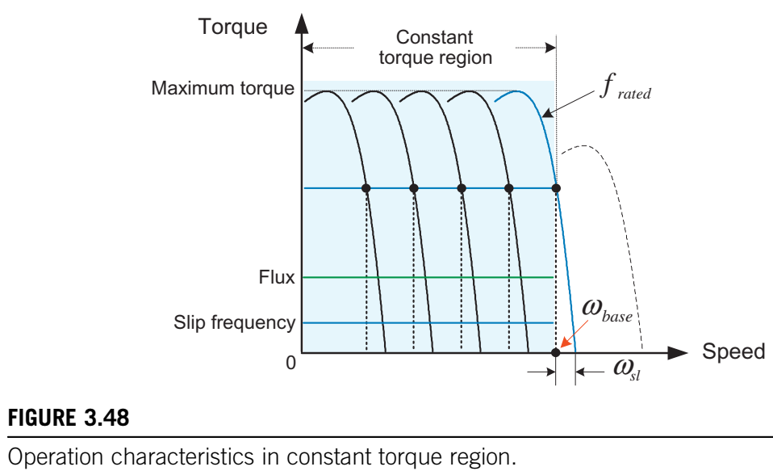

# 第三章 交流电机：同步电机与感应电机

​	如第1章所述，交流(AC)电机的旋转利用了两个以相同速度旋转的磁场相互作用所产生的力。交流电机有两种分类：同步电机和异步电机。异步电机常被称为感应电机。

​	同步电机和感应电机具有相同的定子结构来产生旋转磁场。然而，由于它们产生转子磁场的方式不同，它们的转子结构也不同。在同步电机中，通常转子磁场是由直流电源激励的励磁绕组产生的。对于中小型同步电机，永磁体通常用于产生转子磁场。另一方面，在感应电机中，转子磁场是由交流电源产生的。值得注意的是，这个交流电源是通过电磁感应从定子传递过来的。

​	感应电机具有多个优点，例如结构简单、可靠性高、坚固耐用、维护少、成本低、具备高速运行能力以及能够直接连接到交流电源运行。另一方面，同步电机在效率、功率密度、动态响应和功率因数方面优于感应电机。

​	在本章中，我们将更详细地研究交流电机的基本工作原理和特性。我们将从研究更常见的电机类型——感应电机开始。

## 3.1 感应电机 

图3.1 阿拉戈圆盘与感应电机的基本概念

​	感应电机的基本原理最早在1824年由阿拉戈圆盘实验所证实。从这个实验中发现，当一个磁铁沿着铜盘(一种非磁性物质)的边缘旋转时，铜盘会以较小的速度沿磁铁的方向旋转(图3.1)。1832年，法拉第证明了这种现象是由于在铜盘中感应出的电流所导致。这一现象的发现最终促成了感应电机基本概念的发展。当一个磁铁经过铜盘边缘时，在铜盘中经历变化磁场的部分会感应出电动势(EMF)。感应电压会使铜盘中产生涡流。结果，由于载流部分处于磁铁的磁场之下，在载流部分上会产生一个力(称为洛伦兹力)。这个力的方向与磁铁的运动方向相同，这个力使铜盘与磁铁一起旋转。 

​	基于这个基本概念的感应电机中，这样的旋转磁铁是由连接到三相交流电源的三相定子绕组产生的旋转磁场来实现的。然后，转子跟随这个旋转磁场。 

​	由于其低成本和坚固的结构，感应电机在许多工业应用中被广泛用作通用电机。传统上，感应电机直接连接到60或50Hz的线电压上，并以几乎恒定的速度运行。然而，最近，通过诸如逆变器等电力电子转换器，变速驱动成为可能，因此感应电机在许多需要速度控制的应用中得到广泛使用。 

### 3.1.1 感应电机的结构

图3.2 感应电机的典型结构

​	感应电机的典型结构如图3.2所示。感应电机具有圆柱形的定子和转子结构，它们由均匀的径向气隙隔开。定子和转子由铁芯组成，铁芯内部插有绕组。铁芯不是单个实心块，而是由一叠绝缘的硅钢片组成，通常厚度约为0.3 - 0.5mm，以减少涡流损耗。铁芯由铁磁材料制成，如钢、软铁或各种镍合金，以有效地产生磁通量并减少磁滞损耗。 

#### 3.1.1.1 定子 

图3.3 定子绕组

​	在感应电机中，只有定子绕组由三相交流电源供电。需要注意的是，三相定子绕组同时起到直流电机的电枢绕组和励磁绕组的作用。这些三相绕组放置在沿着铁芯内周轴向切割的槽中，如图3.3所示。它们沿圆周彼此错开120电角度，并且通常在低电源电压时采用三角形连接，在高电源电压时采用星形连接。 

图3.4 定子相绕组 (A)定子铁芯 (B)正弦分布绕组与磁动势

​	每个绕组中的所有匝数连续分布在围绕圆周分布的众多槽中，使得绕组密度可以呈正弦分布，如图3.4所示。这种布置的目的是当电流流过时在气隙中建立正弦磁通分布。这种绕组类型称为分布绕组。分布绕组结构提高了铁芯的利用率并减少了磁动势(mmf)空间谐波，与集中绕组(其中相绕组的所有线圈都放置在一个极下的一个槽中)相比，产生的转矩脉动更低。 

#### 3.1.1.2 转子 

​	与定子类似，转子具有由硅钢片叠成的圆柱形铁芯。需要注意的是，转子铁芯中的电路(绕组或导体)不是由外部电源供电，而是其电流由感应电动势驱动。 

​	感应电机中使用的转子有两种类型：鼠笼式转子和绕线式转子。 

##### 3.1.1.2.1 鼠笼式转子 

图3.5 鼠笼式转子

​	鼠笼式转子具有带槽的叠片铁芯，用于放置倾斜的导体，导体可以是铜、铝或合金棒。这些转子导体在两端通过端环短路，如图3.5所示。

​	这种转子因其结构类似于鼠笼而得名。转子导体不是完全平行于轴放置，而是倾斜一个槽距以减小齿槽转矩，从而使电机运行更安静。由于其结构简单且坚固，大约95%的感应电机使用鼠笼式转子。 

##### 3.1.1.2.2 绕线式转子 

图3.6 绕线式转子

​	与定子绕组类似，如图3.6所示的绕线式转子具有一组三相绕组，通常为星形连接。转子绕组连接到转子轴上的滑环，因此可以通过电刷进行访问。由于这种结构，在绕线式感应电机中，可以通过电刷将外部电阻连接到转子绕组来改变转子电阻。这使得感应电机的转矩 - 速度特性可以根据需要进行改变。

​	现在，我们将详细讨论鼠笼式感应电机，它是感应电机中最常见的类型。

 

### 3.1.2 感应电机的基本原理

图3.7 感应电机转子

​	在感应电机中，当三相交流电压源施加到在空间上彼此相差120度电角度的定子绕组时，在这些绕组中流动的三相电流将在气隙中产生旋转磁场，如图3.7所示。该磁场的速度与所施加交流电源电压的频率成正比。 

​	当旋转磁场切割转子中的导体时，基于法拉第定律，在导体中会感应出电动势。感应电压导致导体中产生电流。在旋转磁场中，载流导体上会产生转矩。通过这个产生的转矩，转子将开始沿与旋转磁场相同的方向旋转。 

​	假设旋转磁场逆时针移动，根据楞次定律，感应电压使导体中的电流按图3.7所示方向流动。这是因为感应电流会建立一个磁通，该磁通与旋转磁场施加的变化相反。当将弗莱明左手定则应用于感应电流和旋转磁场时，导体上的力沿与旋转磁场相同的方向发展。 

​	如上所述，感应电机的转子绕组没有外部电源，而是利用电磁感应产生的转子电流。这就是它被称为感应电机的原因。当感应电机运行时，转子速度总是略低于旋转磁场的速度，即同步速度。如果转子以与旋转磁场相同的速度旋转，则转子绕组中不会有感应电压和电流，因此也不会有转矩。在感应电机中，转子速度刚好足够慢，以允许适量的转子电流流动，从而使产生的转矩足以驱动负载。因此，负载增加将导致转子减速。 

​	现在，让我们来看一下旋转磁场，它是交流电机旋转的基础。

#### 3.1.2.1 旋转磁场 

图3.8 as相电流和磁动势

​	旋转磁动势(mmf)是由三相电流流过三相定子绕组产生的。首先，考虑由流过$as$相绕组(如图3.8所示)的电流产生的磁动势。为了简单起见，我们仅考虑$as$相磁轴上的中心线圈(分布绕组)。 在此，符号⊗表示电流方向指向页面内，而符号⊙表示电流方向指向页面外。并且，流入页面的电流被假定为正。当电流在$as$相绕组中流动时，它将产生以其轴线为中心的正弦分布磁动势$F_{as}$。磁动势$F_{as}$的幅度随电流的瞬时值而变化，如图3.8所示。 

图3.9 合成气隙磁动势

​	类似地，$bs$相和$cs$相的绕组根据其电流在各自轴线上产生脉动磁动势，如图3.9所示。如果这些绕组在空间上彼此相差120度电角度，并且由对称的三相交流正弦电流供电，则这些绕组的三个磁动势的矢量和在气隙中成为单个旋转磁动势矢量$F$。这被称为旋转磁场，其移动速度与电流频率成正比。 

图3.10 三相绕组和电流

​	让我们用数学方法描述由三相电流产生的这个合成气隙磁动势。如图3.10所示的三相绕组电流假设为公式(3.1)： 
$$
\begin{cases} i_{as}=I_{sm}\cos\omega_st\\ i_{bs}=I_{sm}\cos(\omega_st - 120^{\circ})\\ i_{cs}=I_{sm}\cos(\omega_st + 120^{\circ}) \end{cases}\tag {3.1}
$$
其中，$\omega_s(=2\pi f_s)$是电流的角频率，$f_s$是电流频率。 

​	由总匝数为$N_s$的绕组中三相电流产生的磁动势由公式(3.2)给出： 
$$
\begin{cases} F_{as}(\theta)=N_si_{as}\cos\theta\\ F_{bs}(\theta)=N_si_{bs}\cos(\theta - 120^{\circ})\\ F_{cs}(\theta)=N_si_{cs}\cos(\theta + 120^{\circ}) \end{cases}\tag {3.2}
$$
​	在此，$as$相的轴线设为$\theta = 0^{\circ}$。 

​	根据公式(3.1)和(3.2)，合成磁动势由公式(3.3)给出： 
$$
\begin{align*}
F(\theta)&=F_{as}(\theta)+F_{bs}(\theta)+F_{cs}(\theta)\\&=N_sI_{sm}[\cos\omega_st\cos\theta+\cos(\omega_st - 120^{\circ})\cos(\theta - 120^{\circ})\\ &\quad+\cos(\omega_st + 120^{\circ})\cos(\theta + 120^{\circ})]\\&=\frac{3}{2}N_sI_{sm}\cos(\omega_st-\theta)
\end{align*}\tag{3.3}
$$
​	公式(3.3)描述了合成磁动势以角频率$\omega_s$随时间旋转，具有恒定幅度$(\frac{3}{2}N_sI_{sm})$，并且在气隙中呈正弦分布，如图3.11所示。 

图3.11 合成磁动势

图3.12 合成磁动势的运动

​	让我们根据三相电流观察这个合成气隙磁动势的运动。图3.12显示了在四个瞬间(如图3.10所示)由三相电流的空间分布产生的合成磁动势的位置。在此，为了简单起见，我们仅考虑三相分布绕组轴线上的中心线圈。我们可以看到，合成气隙磁动势在电流的一个周期内旋转一圈。通过反转电流的相序，可以反转磁动势的旋转方向。 

图3.13 磁动势的分布

​	合成磁动势在气隙中产生一个北极和一个南极，即磁极数为二。在这个两极电机中，磁动势在电流的一个完整周期内进行一次机械旋转。在具有两组三相绕组的四极电机中，磁动势在气隙中产生两个北极和两个南极，如图3.13所示。在这种情况下，电流的一个周期对应于磁动势的半次机械旋转。因此，磁动势旋转一圈需要两个电流周期。完成一次机械旋转所需的电周期数等于极对数。因此，在P极电机中，机械角度$\theta_m$和电角度$\theta_e$之间的关系为
$$
\theta_e=\frac{P}{2}\cdot\theta_m\tag{3.4}
$$
​	在处理电机性能时，所有电量的计算都基于弧度的电角度。在P极电机中，由频率为$f$的三相电流产生的磁动势的旋转速度$n_s$(以每分钟转数(r/min)表示)为
$$
n_s=\frac{2}{P}\cdot f\cdot60=\frac{120f}{P}(r/min)\tag{3.5}
$$
​	这个旋转磁动势的速度称为同步速度。例如，对于由60Hz电流供电的两极感应电机，同步速度为3600r/min。

### 3.1.3 感应电机的等效电路 

​	为了分析感应电机的运行特性和性能，我们通常使用基于电压方程的等效电路来描述电机的行为。在本节中，我们将从稳态等效电路开始，在第4章中，我们将介绍对暂态和稳态特性都有用的等效电路。 

图3.14 两极、三相、星形连接的对称感应电机。

​	考虑如图3.14所示的两极、三相、星形连接的对称感应电机。 

​	假设转子绕组(可能是绕线式或鼠笼式)近似为三相绕组。定子和转子绕组都是分布绕组，但图3.14仅显示了每相轴上的中心线圈。我们首先探讨定子绕组的电压方程。

#### 3.1.3.1 定子电路 

​	定子绕组的电压方程由绕组电阻$R_s$上的电压降和与定子磁链$\lambda_s$随时间变化率成正比的感应电压组成。因此，定子绕组的电压方程写为
$$
v_s = R_si_s+\frac{d\lambda_s}{dt}\tag {3.6}
$$
其中$R_s$是定子绕组电阻，$\lambda_s$是定子绕组磁链。 

​	当定子电压$v_s$施加到有效匝数为$N_s$的定子绕组时，定子电流$i_s$在绕组中流动。电流$i_s$产生定子磁动势$(N_si_s)$，进而在气隙中产生定子磁通$\phi_s$。大部分定子磁通$\phi_s$穿过气隙并与转子绕组相连。这个气隙磁通称为互磁通，通常也称为励磁磁通。只有互磁通有助于能量转换，即产生转矩。然而，一小部分定子磁通不能穿过气隙，而仅与定子绕组本身相连。这称为漏磁通。因此，定子磁链$\lambda_s$将表示为
$$
\lambda_s = N_s(\phi_{ls}+\phi)\tag{3.7}
$$
其中$\phi$是励磁磁通，$\phi_{ls}$是漏磁通。

​	在此，磁链可写为
$$
\lambda_s = L_{ls}i_s + L_mi_m\tag{3.8}
$$
其中$L_{ls}$是漏电感，$L_m$是励磁电感，$i_m$是励磁电流。 

​	将公式(3.8)代入公式(3.6)的电压方程中，得到
$$
v_s = R_si_s + L_{ls}\frac{di_s}{dt}+L_m\frac{di_m}{dt}=R_si_s + L_{ls}\frac{di_s}{dt}+e_s\tag{3.9}
$$
在此，$e_s(=L_m\frac{di_m}{dt})$是定子绕组中的感应电压(称为反电动势)。 

图3.15 定子绕组的等效电路。

​	基于公式(3.9)，定子绕组的等效电路可表示如图3.15所示。在此，$f_s$是定子电压的频率。 

​	为了考虑诸如涡流损耗和磁滞损耗等铁损，该电路包括代表铁损的等效电阻$R_c$。该电阻与励磁电感并联。因此，产生磁通的励磁电流$i_{\phi}$由励磁电流$i_m$和铁损电流$i_c$组成。 

​	虽然感应电机和变压器具有类似的等效电路(如图3.15所示)，但它们在参数值上有所不同。因为感应电机中必须有气隙，所以感应电机中的励磁电感$L_m$将比变压器中的小得多。这意味着需要更高的励磁电流来达到给定的磁通水平。对于变压器，励磁电流占额定电流的15%，而对于感应电机，它占额定电流的30 - 50%。 

​	我们需要知道感应电压$e_s$来完成公式(3.9)的电压方程。感应电压与定子磁链随时间的变化率成正比。为了获得感应电压，我们需要找出定子磁通，这也需要求出磁通密度。 

图3.16 旋转磁场。

​	在3.1.2.1节中讨论的旋转磁场可以简单地看作是在气隙中旋转的磁铁，如图3.16所示。 

图3.17 气隙中的磁通密度分布。

​	旋转磁场将在定子和转子绕组中感应出电压。当旋转磁场与相$as$的磁轴对齐(即$\theta = 0^{\circ}$)时，如图3.17所示，气隙中的磁通密度分布可以表示为
$$
B(\theta)=B_{max}\cos\theta\tag{3.10}
$$
​	气隙中每极的气隙磁通为
$$
\phi=\int_{-\pi/2}^{\pi/2}B(\theta)lrd\theta = 2B_{max}lr\tag{3.11}
$$
其中$l$是定子的轴向长度，$r$是到气隙平均半径的距离。 

​	随着旋转磁场在气隙中移动，与绕组相连的磁通将随其位置而变化，如图3.18所示。 

图3.18 与单匝线圈交链的磁通。

​	对于相$as$的$N_s$匝线圈，磁链$\lambda_a$在$\theta = 0^{\circ}$时最大为$N_s\phi$，在$\theta = 90^{\circ}$时为零。因此，$\lambda_a$将随位置角$\theta(=\omega_st)$的余弦而变化，即
$$
\lambda_a = N_s\phi\cos\omega_st\tag{3.12}
$$
​	根据法拉第定律，相$as$绕组中感应的电压为
$$
e_a = -\frac{d\lambda_a}{dt}=\omega_sN_s\phi\sin\omega_st = E_{max}\sin\omega_st\tag{3.13}
$$
​	类似地，其他绕组中感应的电压为
$$
e_b = E_{max}\sin(\omega_st - 120^{\circ})\tag{3.14}
$$

$$
e_c = E_{max}\sin(\omega_st + 120^{\circ})\tag{3.15}
$$

​	感应电压的均方根(rms)值为
$$
E_{rms}=\frac{E_{max}}{\sqrt{2}}=\frac{\omega_sN_s\phi}{\sqrt{2}} = 4.44f_sN_s\phi\tag{3.16}
$$
其中$N_s$是形成集中全节距绕组的每相串联总匝数。全节距绕组意味着线圈节距(即线圈两边之间的距离)等于极距(即两个相邻磁极之间的距离)。如果线圈节距小于极距，则称为分数节距或短节距绕组。在实际的分布绕组中，放置在不同槽中的线圈中感应的电压在时间相位上不同，因此当所有线圈串联连接用于相绕组时，电压的相量和小于它们的数值和。考虑到这一点，使用一个称为绕组系数$K_{ws}$的缩减因子。大多数电机的绕组系数$K_{ws}$约为0.85 - 0.95。因此，对于分布绕组，每相的rms感应电压为
$$
E_s = 4.44f_sN_s\phi K_{ws}\tag{3.17}
$$
​	需要注意的是，定子磁通与感应电压和定子频率的比值成正比，即$\phi\propto E_s/f_s$。这一事实为稍后将描述的感应电机速度控制提供了有用的基础。 

​	接下来，让我们获取转子绕组的等效电路。 

#### 3.1.3.2 转子电路 

​	气隙中的旋转磁场在转子电路以及定子电路中感应出电压。这个感应电压成为施加到转子电路的电源电压。与公式(3.17)类似，转子电路中感应的电压可以表示为
$$
E_r = 4.44N_r\phi K_{\omega r}f_r\tag{3.18}
$$
其中$N_r$是每相的总匝数，$K_{\omega r}$是转子绕组的绕组系数，$f_r$是转子绕组中感应电压的频率。 

​	由于转子绕组由于旋转磁场和转子之间的速度差异而经历磁通变化，转子电路中感应电压的频率$f_r$变为旋转磁场频率$f_s$与转子旋转频率$f$之间的差值$f_s - f$。因此，感应电压$E_r$取决于转子速度，即
$$
E_r = 4.44N_r\phi K_{\omega r}\times f_r = 4.44N_r\phi K_{\omega r}\times(f_s - f)\tag{3.19}
$$
​	在静止状态($f = 0$)时，频率$f_r$与定子频率$f_s$相同。因此，转子绕组中的感应电压将最大，为
$$
E_{r0}=4.44N_r\phi K_{\omega r}f_s\tag{3.20}
$$
​	在这种情况下，类似于变压器，两个绕组中感应电压的比值等于它们匝数的比值。 

​	闭合转子绕组中的感应电压产生转子电流。转子绕组中的转矩是由这个转子电流与定子旋转磁场的相互作用产生的。然后转子将开始旋转。假设转子最终达到稳态速度$n$(r/min)。这个转子速度总是小于定子旋转磁场的速度(即同步速度)。同步速度$n_s$与转子速度$n$之间的差值称为转差速度。转差速度以同步速度的分数表示称为转差率$s$，可定义为
$$
s=\frac{n_s - n}{n_s}\tag{3.21}
$$
​	需要注意的是，转差率在感应电机中是一个非常重要的因素，因为感应电机的大多数性能特性，如产生的转矩、电流、效率和功率因数，都取决于运行转差率。运行转差率取决于负载。负载增加将导致转子减速并增加转差率。负载减小将导致转子加速并降低转差率。典型的感应电机在0.01 - 0.05(即1 - 5%)的转差率范围内运行。例如，一台四极电机在60Hz下运行，同步速度为1800r/min。如果满载时转子速度为1765r/min，则转差率为1.9%。 

​	现在，让我们研究当转子以速度$n$(转差率$s$)旋转时转子绕组中的感应电压。转差率为$s$时转子电路中的频率$f_r$称为转差频率，由公式
$$
f_r = f_s - f = sf_s\tag{3.22}
$$
​	从公式(3.20)可知，转差率为$s$时转子电路中的感应电压变为
$$
E_r = 4.44N_r\phi K_{\omega r}\times f_r = 4.44N_r\phi K_{\omega r}\times sf_s = sE_{r0}\tag{3.23}
$$
​	我们可以看到，转子绕组中感应电压的大小与转差率成正比。当转子静止(即$s = 1$)时，转子电路中感应出最大电压。随着转子速度增加，感应电压减小。如果转子速度等于同步速度，则感应电压变为零。 

图3.19 转子等效电路。(A)转子侧等效电路；(B)定子侧等效电路。

​	现在，我们准备讨论转子绕组的等效电路。从公式(3.23)可以看出，转子电路中的电源电压为$sE_{r0}$。考虑转子电路的电阻$R_r$和漏电感$L_{lr}$，转子等效电路如图3.19A所示。图3.19A中的转子等效电路处于转子频率$f_r$下。因此，我们不能将这个转子电路与图3.16中的定子等效电路合并在一个电路中，因为两个电路的工作频率不同。因此，我们需要调整转子频率以合并两个电路。通过将图3.19A中的电压和阻抗除以转差率$s$，我们将得到图3.19B中的转子等效电路。在该电路中，转子电流与图3.19A中的相同，但其工作频率等于定子频率$f_s$。因此，这成为从定子看的转子等效电路。现在可以通过考虑定子绕组和转子绕组的匝数比$a(=N_s/N_r)$将这两个电路连接在一起。 

图3.20 三相感应电机完整的每相等效电路。

​	三相感应电机每相的完整等效电路如图3.20所示。 

​	这个等效电路类似于变压器的等效电路，除了速度变化的影响。从转子反射到定子的量用撇号$'$表示。从现在开始，我们将省略撇号。 

​	类似于定子绕组的三相电流，转子绕组中感应的三相电流也在气隙中产生旋转磁场$F_r$，如图3.21A所示。从转子结构的角度来看，这个转子旋转磁场$F_r$以速度$n_r(=n_s - n)$旋转。由于转子本身以$n$旋转，从定子结构的角度来看，转子旋转磁场以同步速度$n_s(=n_r + n)$旋转。因此，定子磁场和转子磁场总是在气隙中以相同的同步速度旋转。因此，这两个定子和转子磁场相对于彼此保持静止，如图3.21B所示。这两个场之间的相互作用被认为产生了转矩。

图3.21 旋转磁场。(A)由转子电流产生的磁场；(B)由定子电流和转子电流产生的磁场。

### 3.1.4 感应电动机的特性 

​	在本节中，我们将从图3.20的等效电路讨论感应电动机的特性，如电流、输入功率因数、输出转矩和效率。我们将看到这些特性取决于转差率，即运行速度。 

#### 3.1.4.1 定子电流 

​	定子电流是感应电动机的输入电流。从图3.20中，忽略铁芯损耗，转差率函数的输入阻抗表示为：
$$
Z_{s}=R_{s}+jX_{ls}+[X_{m}/(\frac{R_{r}}{s}+jX_{lr})]=|Z_{s}|\angle\theta_{s}\tag{3.24}
$$
其中$\theta_{s}$是输入阻抗角。 

​	根据施加的定子电压和式(3.24)的输入阻抗，定子电流表示为： 
$$
I_{s}=\frac{V_{s}}{Z_{s}}=I_{\phi}+I_{r}\tag{3.25}
$$
​	定子电流是励磁电流$I_{\phi}$和转子电流$I_{r}$的总和。在定子电压$V_{s}$恒定的情况下，定子电流$I_{s}$作为速度(即转差率$s$)的函数如图3.22所示。 

图3.22 定子电流随转速变化的函数关系(5-hp，4极)。

​	在启动时($s = 1$)，由于阻抗最小，定子电流将达到最大值，可能是额定电流的5 - 8倍。随着速度增加，转差率$s$减小。随着转差率$s$减小，转子电流$I_{r}$减小，因此定子电流也减小。在同步速度下，即$s = 0$时，$R_{r}/s\approx\infty$，所以没有转子电流，即$I_{r}=0$。因此，定子电流$I_{s}$将等于励磁电流$I_{\phi}$。 

#### 3.1.4.2 输入功率因数

图3.23 输入功率因数(5-hp，4极电动机)。

​	根据式(3.24)的输入阻抗角$\theta_{s}$，感应电动机的输入功率因数表示为： 
$$
PF = cos\theta_{s}\tag{3.26}
$$
​	功率因数随速度变化如图3.23所示。由于感应电动机固有地汲取滞后电流以产生磁通量，所以功率因数总是小于1。功率因数也随施加到电动机的负载而变化。功率因数在空载时最小，并随负载增加而增加。它通常在满载或接近满载时达到峰值。 

#### 3.1.4.3 输出转矩

图3.24 感应电动机中的功率流图。

​	我们可以从如图3.24所示的功率流图推导出感应电动机输出转矩的一般表达式。 

​	输入到感应电动机的功率$P_{in}(=3V_{s}I_{s}cos\theta_{s})$，不包括定子损耗(如定子铜损和铁芯损耗)，将通过气隙传递到转子，然后转换为机械功率$P_{mech}$。我们可以使用机械功率$P_{mech}$推导出输出转矩。

​	通过气隙从定子传递到转子的功率称为气隙功率$P_{ag}$。参考图3.20给出的等效电路，气隙功率表示为： 
$$
P_{ag}=I_{r}^{2}\frac{R_{r}}{s}\tag{3.27}
$$
​	由于感应电动机通常在低转差率$0.01 - 0.05$(即$1\% - 5\%$)下运行，气隙功率相当大。这个气隙功率$P_{ag}$，即转子的输入功率，将在转子电路的电阻$R_{r}$中耗散(即转子铜损)并转换为机械输出。因此，式(3.27)可以分为两个分量： 
$$
P_{ag}=\frac{I_{r}^{2}R_{r}}{\begin{array}{c}转子铜损\\P_{r}\end{array}}+\frac{I_{r}^{2}\frac{R_{r}}{s}(1 - s)}{\begin{array}{c}机械输出\\P_{mech}\end{array}}\tag{3.28}
$$

$$
P_{r}=I_{r}^{2}R_{r}=sP_{ag}\tag{3.29}
$$

$$
P_{mech}=I_{r}^{2}\frac{R_{r}}{s}(1 - s)=(1 - s)P_{ag}\tag{3.30}
$$

​	式(3.28)右侧的第一项表示转子铜损$P_{r}$。第二项表示产生输出转矩的机械输出功率$P_{mech}$。图3.25显示了基于式(3.28)的转子电路中的功率分布。 

图3.25 气隙功率的分布情况。

​	可以看出功率分布取决于转差率$s$。很明显，电动机的转差率越低，转子铜损越低，机械输出功率越高。 

​	机械功率等于输出转矩$T_{mech}$乘以角频率$\omega_{mech}$，即： 
$$
P_{mech}=I_{r}^{2}\frac{R_{r}}{s}(1 - s)=T_{mech}\cdot\omega_{mech}\tag{3.31}
$$
​	因此，感应电动机的输出转矩表示为： 
$$
T_{mech}=\frac{P_{mech}}{\omega_{mech}}=\frac{1}{\omega_{mech}}I_{r}^{2}\frac{R_{r}}{s}(1 - s)=\frac{1}{\omega_{s}}I_{r}^{2}\frac{R_{r}}{s}\tag{3.32}
$$
其中$\omega_{mech}=(1 - s)\omega_{s}$，$\omega_{s}$表示同步角频率。 

图3.26 感应电动机的近似每相等效电路。

​	我们需要用输入电压而不是不可测量的转子电流来表示这个转矩方程。转子电流可以从图3.26给出的近似等效电路中轻松获得，其中忽略了铁芯损耗电阻，并假设$R_{s}+jX_{ls}\ll\omega_{s}L_{m}$，将励磁电感移到输入侧。 

​	从这个电路中，转子电流表示为： 
$$
I_{r}=\frac{V_{s}}{(R_{s}+\frac{R_{r}}{s})+j(X_{ls}+X_{lr})}\tag{3.33}
$$
​	通过将这个转子电流代入式(3.32)，输出转矩(每相)表示为： 
$$
转矩：T_{mech}=\frac{1}{\omega_{s}}\frac{V_{s}^{2}}{(R_{s}+\frac{R_{r}}{s})^{2}+j(X_{ls}+X_{lr})^{2}}\frac{R_{r}}{s}\tag{3.34}
$$
​	这是给定输入电压$V_{s}$下的稳态平均每相转矩，它是转差率的函数。对于给定的转差率，转矩与定子输入电压的平方成正比。使用这个近似电路计算的转矩与全电路计算的转矩相差在$5\%$以内[2]。轴转矩，即电机轴上可用于负载的转矩，可以通过从这个输出转矩中减去摩擦和风阻转矩来获得。 

​	让我们根据式(3.34)研究感应电动机的速度 - 转矩特性。在低转差率区域，这是感应电动机的正常运行范围，等效电路参数的阻抗显示以下关系： 
$$
R_{s}+\frac{R_{r}}{s}\gg X_{ls}+X_{lr} \quad \&\&\quad \frac{R_{r}}{s}\gg R_{s}\tag{3.35}
$$
​	因此，式(3.34)中的转矩可以简化为：
$$
T_{mech}\approx\frac{1}{\omega_{s}}\frac{V_{s}^{2}}{R_{r}}s\to T_{mech}\propto s\tag{3.36}
$$
​	在这种情况下，值得注意的是，输出转矩随转差率$s$线性增加。另一方面，在转差率较大的低速范围内：
$$
R_{s}+\frac{R_{r}}{s}\ll X_{ls}+X_{lr}\tag{3.37}
$$
​	因此，转矩几乎与转差率$s$成反比变化： 
$$
T_{mech}=\frac{1}{\omega_{s}}\frac{V_{s}^{2}}{(X_{ls}+X_{lr})^{2}}\frac{R_{r}}{s}\to T_{mech}\propto\frac{1}{s}\tag{3.38}
$$
​	存在一个速度，在该速度下会产生最大转矩，通常称为牵出转矩或崩溃转矩。最大转矩时的转差率可以通过求解$dT_{mech}/ds = 0$得到： 
$$
s_{max}=\frac{R_{r}}{\sqrt{R_{r}^{2}+(X_{ls}+X_{lr})^{2}}}\tag{3.39}
$$
​	要注意转子电阻$R_{r}$是确定最大转矩出现时转差率的重要参数。根据$s_{max}$，最大转矩可以表示为：
$$
T_{max}=\frac{1}{2\omega_{s}}\frac{V_{s}^{2}}{R_{s}+\sqrt{R_{s}^{2}+(X_{ls}+X_{lr})^{2}}}\tag{3.40}
$$
​	最大转矩的值与转子电阻无关，转子电阻决定了最大转矩时转差率的值。典型的三相感应电动机的速度 - 转矩曲线如图3.27所示。这条曲线显示了感应电动机在不同转差率下的转矩特性。

图3.27 感应电动机的转速-转矩曲线。

​	感应电动机的正常运行范围接近同步转速，转差率被限制在小于5%的范围内。在这个低转差率区域，输出转矩随转差率的增大而线性增加。转差率随负载的增加近似呈线性增大，因此转子转速随负载的增加近似呈线性降低。

#### 3.1.4.4 稳定工作点 

​	当电动机驱动机械负载时，电动机将在一个稳定状态下以某一转速运行，在该转速下电动机产生的转矩等于负载所需的转矩。从式(3.41)所示的运动方程可以看出，当电动机转矩$T_{motor}$超过负载转矩$T_{load}$时，电动机转速将会升高。当电动机转矩小于负载转矩时，电动机转速将会降低。因此，平衡点就是电动机转矩等于负载转矩时的转速。
$$
T_{motor}-T_{load}=(J_{motor}+J_{load})\frac{d\omega}{dt} \tag {3.41}
$$
​	存在两种平衡工作点：稳定点和不稳定点。在稳定工作点处，当由于输入电压或负载出现扰动而使转速稍微偏离原始平衡点后，转速将会恢复。然而，在不稳定工作点处，转速则不会恢复。

图3.28 电机驱动中的工作点。

​	在感应电动机驱动中，稳定工作点处于转速-转矩曲线中出现最大转矩时的转速之上的范围内。例如，参考图3.28，该图展示了感应电动机的转速-转矩曲线以及两条不同的负载曲线。 

​	存在三个平衡工作点。在这些工作点中，A点是一个不稳定工作点，而B点和C点是稳定工作点。在A点处，当驱动系统出现扰动时，系统将无法维持其原有的平衡状态。例如，假设在A点处，由于扰动导致转速下降。在这种情况下，转速的下降会使得电动机转矩小于负载转矩。结果，系统将会减速并最终停止运行。同样地，由扰动引起的转速升高会使电动机转矩大于负载转矩。这样一来，工作点就会从A点移动到B点。因此，A点是一个不稳定工作点。 相反，B点和C点是稳定工作点。在这些点处，当因扰动而出现转速偏差后，转速将会恢复到其原始值。稳定性的判定准则由
$$
\frac{d\left(T_{load}-T_{motor}\right)}{d\omega}>0\tag{3.42}
$$
给出。 

​	因此，稳定运行需要满足以下条件：当转速下降时，电动机产生的转矩需要大于负载转矩。而当转速升高时，电动机转矩需要小于负载转矩。

#### 3.1.4.5 效率

​	接下来，我们将讨论感应电动机的效率。效率被定义为电动机输出功率与输入功率的比率，其表达式为
$$
\eta = \frac{P_{out}}{P_{in}} = \frac{P_{out}}{P_{out} + P_{loss}}×100(\%)\tag{3.43}
$$
​	对于电动机而言，效率体现了电动机将电能转换为机械能的优劣程度。感应电动机的输入功率由下式给出：
$$
P_{in}=3V_{s}I_{s}\cos\theta_{s} \tag {3.44}
$$
​	如图3.24所示，感应电动机中的损耗通常可归为五个主要来源：定子铜损$P_{s}$、铁芯损耗$P_{f}$、转子铜损$P_{r}$、风摩损耗$P_{v}$以及杂散负载损耗。杂散负载损耗表示的是那些难以通过直接测量或计算来确定的剩余损耗。定子铜损在电动机损耗中占很大一部分。图3.29展示了按额定功率划分的损耗分布情况[3]。 

图3.29 感应电动机的损耗分布。

​	感应电动机的效率也取决于转差率。如果忽略所有与转差率几乎没有关系或者毫无关系的损耗，那么效率可表示为转差率的函数，即
$$
\eta=\frac{P_{out}}{P_{in}}\to\frac{P_{mech}}{P_{ag}}=\frac{P_{ag}-P_{r}}{P_{ag}} = 1 - s\tag {3.45}
$$
​	这被称为理想效率或内效率。内效率作为转速的函数如图3.30所示。内效率可衡量传递到气隙的功率中有多少可用于产生机械功率。从式(3.29)可以看出，转差率越低，运行效率越高，因为转子铜损与转差率成正比。一般来说，功率较大的电动机比功率较小的电动机效率更高。如今的高效三相感应电动机，其效率范围从1马力时的86.5%到300马力时的95.8%。 

图3.30 实际效率和理想效率。

> 例子1
>
> ​	一台5马力、220伏、60赫兹、四极三相感应电动机在额定电压和额定频率下满载运行时，转速为1740$\mathrm{r/min}$。该电动机的参数为：定子电阻$R_{s}=0.295$$\Omega$，转子电阻$R_{r}=0.379$$\Omega$，励磁电抗$X_{m}=22.243$$\Omega$，定子漏电抗$X_{ls}$=$X_{lr}$=$0.676$$\Omega$。计算以下各项： 
>
> 1. 在额定工况下运行时的转差率、功率因数、定子电流、励磁电流以及产生的转矩。
>
> 2. 全电压启动时的定子电流和产生的转矩。
>
> 3. 产生最大转矩时的转差率。
>
> 解：
>
> 1. 同步转速为
>
> $$
> n_{s}=\frac{120f_{s}}{P}=\frac{120×60}{4}=1800\mathrm{r/min}
> $$
>
> ​	因此，额定转差率
> $$
> s=\frac{n_{s}-n}{n_{s}}=\frac{1800 - 1740}{1800}=0.0333
> $$
> ​	根据图3.20中的等效电路，转子阻抗
> $$
> Z_{r}=\frac{R_{r}}{s}+jX_{lr}=11.37 + j0.679
> $$
> ​	输入阻抗为：
> $$
>  \begin{aligned} Z_{s} &= R_{s} + jX_{ls} + \frac{Z\cdot jX_{lr}}{Z_{r} + jX_{lr}} = 8.887 + j5.599\\ &= \vert Z_{s}\vert\angle\theta_{s} = 10.5\angle32.212 \end{aligned} 
> $$
> ​	功率因数为
> $$
> \cos\theta_{s}=0.846
> $$
> ​	定子电流为
> $$
> I_{s}=\frac{V_{phase}}{\vert Z_{s}\vert}=\frac{(\frac{220}{\sqrt{3}})}{10.5}=12.092 \mathrm{A}
> $$
> ​	转子电流为
> $$
> I_{r}=I_{s}\cdot\frac{jX_{m}}{Z_{r} + jX_{m}} = 10.512 \mathrm{A}
> $$
> ​	转矩为
> $$
> T_{mech}=\frac{1}{\omega_{s}}I_{r}^{2}\frac{R_{r}}{s}=\frac{1}{188.5}\cdot10.512^{2}\cdot\frac{0.379}{0.0333}=20 \mathrm{Nm}
> $$
> ​	其中
> $$
> \omega_{s}=2\pi f_{s}(\frac{2}{P}) = 188.5 \mathrm {rad/s}
> $$
>
> 2. 由于启动时$s = 1$，转子阻抗
>
> $$
> Z_{r}=\frac{R_{r}}{s}+jX_{lr}=0.379 + j0.679
> $$
>
> ​	输入阻抗为
> $$
> Z_{s}=R_{s} + jX_{ls} + \frac{Z\cdot jX_{lr}}{Z_{r} + jX_{lr}} = 0.652 + j1.343
> $$
> ​	定子电流为 
> $$
> I_{s}=\frac{V_{\text{phase}}}{\vert Z_{s}\vert}=\frac{(\frac{220}{\sqrt{3}})}{1.493}=85.08\mathrm{A}
> $$
> ​	并且启动电流是额定电流的7倍。 
>
> ​	转子电流为 
> $$
>  I_{r}=I_{s}\frac{jX_{m}}{Z_{r}+jX_{m}} = 82.557\mathrm{A} 
> $$
> ​	启动转矩为 
> $$
> T_{\text{mech}}=\frac{1}{\omega_{s}}\frac{I_{r}^{2}R_{r}}{s}=\frac{1}{188.5}\cdot\frac{82.557^{2}\cdot0.379}{1}=41.1\mathrm{Nm}
> $$
>
> 3. 最大转矩时的转差率为 
>
> $$
>  s_{\text{max}}=\frac{R_{r}}{\sqrt{R_{r}^{2}+(X_{ls}+X_{lr})^{2}}}=0.273 
> $$
>
> ​	所产生的最大转矩为 
> $$
> T_{\text{max}}=\frac{3V^{2}}{2\pi f_{s}\left[2R_{r}+\sqrt{4R_{r}^{2}+(X_{ls}+X_{lr})^{2}}\right]} = 73.28
> $$
> ​	根据上述结果，该感应电动机的速度 - 转矩曲线如下所示。
>
> 

### 3.1.5 感应电动机的运行模式 

图3.31 感应电动机的三种运行模式：反接制动模式、电动模式和发电模式。

​	感应电动机根据其运行速度和旋转方向可以在三种模式下运行。图3.31显示了感应电动机三种可用运行模式下的功率、运行速度和转矩。 

​	首先，感应电动机的典型运行模式是电动模式，在这种模式下，转子沿与定子旋转磁场相同的方向旋转，但速度稍慢。因此，转差率在0到1之间(0 < s ≤ 1)，气隙功率和机械功率均为正，即
$$
P_{ag}=I_{r}^{2}\frac{R_{r}}{s}>0,\quad P_{mech}=(1 - s)P_{ag}>0\tag{3.46}
$$
​	这意味着在电动模式下，感应电动机通过气隙将输入的电能转换为机械能。 

​	如果感应电动机被外部原动机驱动到高于同步速度的转速，那么转差率将为负(s < 0)，并且气隙功率和机械功率均为负，即
$$
P_{ag}=I_{r}^{2}\frac{R_{r}}{s}<0,\quad P_{mech}=(1 - s)P_{ag}<0\tag{3.47}
$$
​	这意味着来自机械系统的功率流入转子电路，然后穿过气隙到达定子电路和外部电气系统。因此，感应电动机将在发电模式下运行。 

​	这种模式可能在降低感应电动机定子频率以降低转子速度时发生。在这个过程中，由于驱动系统的惯性，转子的瞬时速度可能会高于瞬时同步速度。这导致负转差率，并且电机中产生的转矩方向将与转子的旋转方向相反。这个转矩将作为制动转矩使转子速度减慢。在这种情况下，电机作为发电机运行，并且产生的电能反馈回电源。这个过程称为再生制动。 

​	最后一种运行模式是反接制动模式，在这种模式下，转子沿与定子磁场相反的方向旋转，因此转差率s > 1。在这种模式下，气隙功率和机械功率分别为
$$
P_{ag}=I_{r}^{2}\frac{R_{r}}{s}>0,\quad P_{mech}=(1 - s)P_{ag}<0\tag{3.48}
$$
​	两种功率都流入转子并在转子中以热量形式耗散。因此，转子导条可能会过热。这种模式也可用于使电机快速制动停止。当感应电动机运行时，通过切换三相绕组中的任意两相可以改变定子磁场的旋转方向。在这种情况下，产生的转矩将与定子磁场方向相同但与转子旋转方向相反，感应电动机将在反接制动模式下运行。

### 3.1.6 转子电阻的影响 

​	转子电路中的电阻对感应电动机的特性有很大影响。这是因为产生最大转矩时的速度取决于转子电阻，如公式(3.39)所示。 

图3.32 不同转子电阻值下的转矩-速度特性。

​	图3.32显示了两种不同转子电阻值下的速度 - 转矩特性。高转子电阻将提供高启动转矩，从而使机械负载系统快速加速。这对于启动时的低启动电流和高功率因数也是理想的。然而，高转子电阻会导致正常运行期间的高转差率。这会导致转子损耗增加和效率降低。因此，在正常运行期间，低转子电阻是理想的。这会导致较低的转差率，从而提高效率。 

​	因此，我们可以看到，为了获得令人满意的性能，对转子电阻存在相互矛盾的要求，即在启动时需要高电阻，而在正常运行速度下需要低电阻。出于这个原因，已经开发了不同类型的转子，以实现转子电阻随运行速度的变化。 

​	在绕线转子感应电动机中，可以通过滑环将外部电阻连接到转子绕组，如图3.6所示。因此，通过根据转子速度改变外部电阻的值，可以在启动和运行条件下都获得令人满意的性能。 

​	对于鼠笼式感应电动机，转子电阻取决于运行速度。这是因为由于趋肤效应，转子导体的有效电阻可能会随转子频率而变化。趋肤效应是交流电流倾向于在导体表面附近流动的趋势。趋肤效应导致导体横截面的有效面积在较高频率下减小，从而增加了导体的有效电阻。在静止时，转子频率很高，因为它等于定子频率，而在正常运行速度下，对于60Hz的电动机，它大约为1 - 3Hz。因此，转子电路的有效电阻随着运行速度的增加而减小。 

图3.33 转子导条的比较。(A)普通转子和(B)深槽转子。

​	除了趋肤效应，转子导体可以被适当设计为在启动时具有更高的电阻。在这种情况下，转子导体被制成深槽形式，如图3.33B所示。在载流深槽中，围绕深槽导体底部部分的漏磁通更大。图3.33B右侧的虚线展示了上部的漏磁通线。底部导体元件的漏电感大于上部导体元件的漏电感。因此，与具有大漏电抗的底部相比，上部的交流电流更容易流动。这种不均匀的电流分布使导条的有效电阻增加。 

​	由于漏电抗与频率成正比，这种不均匀的电流分布在转子频率较高的启动时更为显著。在正常运行速度下，由于转子频率较低，转子电流几乎均匀地分布在导条的横截面上，因此有效电阻$R_{eff}$将与直流电阻$R_{dc}$一样低。对于深槽转子，其在启动时的有效电阻可能比额定速度时大几倍，如图3.34所示。 

图3.34 深槽转子中的有效电阻和输出转矩。

​	如上所述，对于采用深槽转子的感应电机，转子电阻会根据速度变化，以便在启动和正常运行时都能获得令人满意的性能。

图3.35 双笼型转子。

​	双笼型转子是另一种有效电阻会变化的转子类型，如图3.35[4]所示。它由两个鼠笼组成，其电阻变化比深槽转子更大。上部鼠笼的横截面积比下部鼠笼小。此外，上部鼠笼由比下部鼠笼电阻更高的材料制成。与深槽转子类似，下部鼠笼的导条具有更大的漏磁通，因此漏电感更高。在启动时，由于转子频率较高，转子电流的分配主要由两个鼠笼间的漏电抗差异决定。大部分电流将流入具有较低漏电抗但电阻较高的上部鼠笼。 

​	另一方面，在正常运行速度下，由于转子频率较低，转子电流的分配主要取决于两个鼠笼的电阻。大部分电流将流入电阻较低的下部鼠笼。因此，对于双笼型转子，在启动时，电流主要流向上部电阻较高的鼠笼，而在正常运行时，电流流入下部电阻较低的鼠笼。

#### 3.1.6.1 感应电动机的设计类型 

​	如1.3节所述，有几种类型的负载。驱动电机所需的性能特性可能因被驱动负载而异。例如，起重机或提升机驱动电机的性能特性可能与泵和鼓风机驱动电机的性能特性有很大不同。

​	感应电动机可以根据启动和正常运行特性分为不同的设计类型。对于电机的分类，有两种最广泛使用的标准：美国国家电气制造商协会(NEMA)和国际电工委员会(IEC)。NEMA标准主要规定了四种设计类型：设计A、B、C和D。其中，最广泛使用的是设计B(正常转矩)和设计C(高转矩)。以下总结了这四种设计类型的描述。 

- 设计A：其特点是正常启动转矩(通常为额定值的150 - 170%)、高启动电流、低运行转差率和高击穿转矩(在所有NEMA类型中最高)；常见应用包括风扇、鼓风机和泵。 

- 设计B：其特点是正常启动转矩、低启动电流和低运行转差率；常见应用与设计A相同。设计B是通用应用中最常用的类型。 

- 设计C：其特点是高启动转矩、低启动电流和比设计A和B更高的运行转差率；常见应用包括压缩机和输送机。 

- 设计D：其特点是高启动转矩(高于所有NEMA电机类型)、高启动电流、高运行转差率(5 - 13%)以及对于连续负载运行效率低；通常用于间歇负载，如冲床。 图3.36显示了四种NEMA设计的速度 - 转矩曲线[4]。

图3.36 感应电动机根据设计类型划分的转矩特性。

### 3.1.7 确定等效电路参数 

图3.37 感应电动机的等效电路参数。

​	为了根据如图3.37所示的感应电机等效电路分析其运行和性能特性，需要确定给定感应电机的参数。此外，准确了解电机参数对于感应电机的高性能控制至关重要，这将在第5章中讨论。现在，我们将介绍对感应电机进行的具体测试，以确定其等效电路参数。 

#### 3.1.7.1 定子电阻$R_s$的测量 

​	三相绕组任意两个端子之间的电阻$R$(绕组可能连接成三角形或星形)可以直接测量。对于星形连接，我们可以得到定子电阻$R_s = R/2$；对于三角形连接，$R_s = 1.5R$。对于大型电机，由于其电阻非常小，此测试必须使用精密仪器进行。定子电阻也可以通过在两个绕组之间施加直流电压后测量电流来获得。 

#### 3.1.7.2 空载测试 

​	此测试可以确定定子电路参数$L_{ls}+L_m$以及参数$R_c$。这里，$R_c$代表铁芯损耗和旋转损耗。该测试对应于变压器的开路测试。在测试中，在定子端子上施加额定电压，且电机无机械负载。然后，测量电机输入端的电压$V_N$、电流$I_N$和输入功率$P_N$。感应电机在空载时的转差率几乎为零，因此$R_r/s≈∞$且$I_r≈0$。所以，等效电路的转子支路可以忽略，如图3.38所示。 

图3.38 空载测试。

​	在空载测试中，测得的输入功率等于损耗，包括定子铜损、铁芯损耗以及摩擦和风阻损耗等旋转损耗。由于转子电流极小，转子铜损可以忽略不计。这里，铁芯损耗和旋转损耗之和(通常在所有运行条件下几乎恒定)被视为$R_c$。利用预先测量的定子电阻$R_s$的值，可以通过以下公式计算$R_c$： 
$$
P_N = 3I_N^2(R_s + R_c) \to R_c=\frac{(\frac{P_N}{3})}{I_N^2}-R_s\tag{3.49}
$$
​	根据测量数据$P_N$、$V_N$和$I_N$，等效阻抗和电阻为： 
$$
Z_N=\frac{(\frac{V_N}{\sqrt{3}})}{I_N}, R_N=\frac{P_N}{3I_N^2}\tag{3.50}
$$
​	等效电抗为： 
$$
X_N=\sqrt{Z_N^2 - R_N^2}=X_{ls}+X_m\tag{3.51}
$$
​	$X_{ls}$和$X_m$的值将由后续的堵转测试数据分别确定。 

#### 3.1.7.3 堵转测试 

​	该测试确定转子电阻$R_r$以及漏电感之和$L_{ls}+L_{lr}$，对应于变压器的短路测试。在测试中，锁定转子使其不能旋转，并通过调节施加的电压将电流维持在额定值。然后，测量电机输入端的电压$V_B$、电流$I_B$和功率$P_B$。由于转子不旋转，转差率$s = 1$，导致$X_m\gg R_r + jX_{lr}$。因此，等效电路中的励磁支路$X_m$可以忽略。堵转测试的等效电路简化为如图3.39所示的电路。 

图3.39 堵转测试。

​	在这种情况下，测得的输入功率等于定子和转子铜损之和。因此，转子电阻可通过以下公式确定： 
$$
P_B = 3I_B^2(R_r + R_s) \to R_r=\frac{(\frac{P_B}{3})}{I_B^2}-R_s\tag{3.52}
$$
​	根据测量数据$V_B$和$I_B$，等效阻抗为： 
$$
Z_B=\frac{(\frac{V_B}{\sqrt{3}})}{I_B}\tag{3.53}
$$
​	电抗$X_B$(即定子和转子漏电抗之和$X_{ls}+X_{lr}$)由下式给出： 
$$
X_B=\sqrt{Z_B^2-(R_s + R_r)^2}=X_{ls}+X_{lr}\tag{3.54}
$$
​	对于A和D型设计，经验上$X_{ls}=X_{lr}=0.5X_B$；对于B型设计，$X_{ls}=0.4X_B$，$X_{lr}=0.6X_B$；对于C型设计，$X_{ls}=0.3X_B$，$X_{lr}=0.7X_B$[4]。 

​	已知$X_{ls}$的值，可从式(3.51)中分离出励磁电抗$X_m$： 
$$
X_m = X_N - X_{ls}\tag{3.55}
$$
​	在该测试中，由于转子被锁定，转子频率等于电源频率(50或60Hz)。然而，在正常运行条件下，转子频率在1 - 3Hz范围内。由于电阻取决于运行频率，不正确的转子频率会导致测试结果产生误导。一种典型的折衷方法是使用额定频率25%或更低的频率[2]。

### 3.1.8 感应电机的速度控制 

​	传统上，感应电机一直被用作几乎恒定速度的电机，通过直接连接到电网进行操作。然而，由于其成本低和坚固耐用，感应电机也被用于许多需要变速驱动的应用中。 感应电机的运行速度取决于给定负载的转差率或同步速度。因此，感应电机的速度控制可分为以下两种方法： 

- **转差率控制**：效率低，速度控制范围有限。 
- **同步速度控制**：效率高，速度控制范围广。 

#### 3.1.8.1 转差率控制 

​	在定子频率恒定的情况下，感应电机的速度可以根据转差率进行变化。转差率可以通过改变定子电压或转子电阻来改变。 

​	首先，来看通过改变定子电压进行速度控制。从式(3.34)可以看出，感应电机产生的转矩与定子电压的平方成正比： 
$$
T_{mech}=\frac{1}{\omega_{s}}\frac{V_{s}^{2}}{(R_{s}+\frac{R_{r}}{s})^{2}+j(X_{ls}+X_{lr})^{2}}\frac{R_{r}}{s}\propto V_{s}^{2}\tag{3.56}
$$

图3.40 根据定子电压变化的转矩特性。(A) A型或B型电机 (B) C型或D型电机。

​	图3.40显示了速度 - 转矩曲线随定子电压的变化。可以看出，通过改变定子电压进行速度控制仅在有限范围内可用。可控制的速度范围取决于最大转矩出现时的转差率(即最大转差率)的值。通过比较图3.40A和B，可以看出C型或D型电机比A型或B型电机具有更宽的速度控制范围。 

​	接下来，研究通过改变转子电阻进行速度控制。从3.1.4.3节可以看出，最大转矩出现时的转差率与转子电阻$R_{r}$成正比： 
$$
s_{max}=\frac{R_{r}}{\sqrt{R_{s}^{2}+(X_{ls}+X_{lr})^{2}}}\propto R_{r}\tag{3.57}
$$
​	因此，改变转子电阻将改变速度 - 转矩曲线的形状，进而调整电机的运行速度。图3.41显示了不同转子电阻下的速度 - 转矩曲线。 

图3.41 不同转子电阻下的速度控制。

​	为了采用通过改变转子电阻的速度控制方法，需要使用绕线转子型感应电机。绕线转子型感应电机中的转子电阻可以通过滑环将外部变阻器或电阻器组连接到转子绕组来改变。改变变阻器的值将改变电机的运行速度。与改变施加电压的方法类似，改变转子电阻的方法也提供了有限的可控速度范围。此外，在转子电路中插入额外的电阻会严重降低驱动效率。 

​	在通过改变定子电压或转子电阻的速度控制方法中，速度被认为是通过在恒定定子频率下改变转差率来改变的。从式(3.46)可以看出，由于感应电机的效率取决于运行转差率，这些方法导致的速度降低将导致效率降低。然而，这些速度控制方法适用于驱动需要与运行速度的平方成正比的转矩的负载(如风扇或鼓风机)的小型电机。对于此类负载，由于功率消耗随着速度的降低而显著降低，因此效率的降低相对较小。 

​	为了避免在转子电阻(称为转差能量)中浪费能量，有一种更好的方法来提高效率，即滑差能量回收系统。在滑差能量回收系统中，滑差能量可以返回电源。滑差能量回收系统有两种类型：克莱默驱动系统和谢尔比乌斯驱动系统。这些系统利用连接到转子电路的电力电子转换器而不是外部电阻器。这样的系统可以回收通过滑环从转子获取的能量以降低速度并将其反馈回电源。 

#### 3.1.8.2 同步速度控制 

​	感应电机的转子跟随定子磁场，定子磁场的频率正比于定子频率。因此，改变定子频率对速度控制更为根本。同步速度$n_{s}$与定子频率$f_{s}$之间的关系为： 
$$
n_{s}=\frac{120\cdot f_{s}}{P}\tag{3.58}
$$
​	虽然可以通过改变极数来改变同步速度，但这需要复杂的电机结构。此外，不可能提供同步速度的连续变化。因此，改变定子频率更为有效。图3.42显示了在额定定子电压下定子频率变化时的速度 - 转矩特性。 

图3.42 几种频率下的速度 - 转矩特性曲线(5马力，四极电机)。

​	当通过改变定子频率来调整速度时，如果定子电压保持恒定，则定子频率的变化会导致产生的转矩以及运行速度发生变化，如图3.42所示。

​	在正常运行条件下，由于定子电阻和漏电抗上的电压降与输入电压相比可忽略不计，式(3.34)中的转矩可以简化为： 
$$
T_{mech}\cong\frac{V_{s}^{2}}{(\frac{R_{r}}{s})^{2}+(\omega_{s}L_{lr})^{2}}\cdot\frac{R_{r}}{\omega_{s}s}=(\frac{V_{s}}{\omega_{s}})^{2}\frac{R_{r}\omega_{sl}}{R_{r}^{2}+(\omega_{sl}L_{lr})^{2}}\tag{3.59}
$$
​	可以看出，在固定定子电压和转差频率下，产生的转矩与定子频率的平方成反比。从式(3.17)可以看出，气隙磁通取决于定子电压$V_{s}$与定子频率$f_{s}$的比值： 
$$
\phi\propto\frac{E_{s}}{f_{s}}\approx\frac{V_{s}}{f_{s}}\tag{3.60}
$$
​	因此，在固定定子电压下，气隙磁通与定子频率成反比。从式(3.59)可以看出，产生的转矩与气隙磁通的平方成正比，因此与定子频率的平方成反比。 

​	转子电流也受到定子频率变化的影响。假设在正常运行条件下，定子电阻和漏电抗可忽略不计，转子电流与定子频率成反比： 
$$
I_{r}=\frac{V_{s}}{\sqrt{(\frac{R_{r}}{s})^{2}+(X_{lr})^{2}}}=(\frac{V_{s}}{\omega_{s}})\frac{\omega_{sl}}{\sqrt{R_{r}^{2}+(\omega_{sl}L_{lr})^{2}}}\propto\frac{1}{f_{s}}\tag{3.61}
$$

​	当通过改变定子频率来调整运行速度时，如果定子电压随频率线性变化(如图3.43所示)，则气隙磁通$\phi\approx V_{s}/f_{s}$将保持恒定，因此转矩和转子电流也将保持不变。这种技术称为恒压频比(V/f)控制，已成为当今感应电机通用应用中流行的变速驱动方法。V/f比可以根据驱动负载进行调整。 

图3.43 恒压频比(V/f)控制。

​	在低于几赫兹的低频下，由于定子电阻和漏电抗上的电压降的影响，由线性V/f关系确定的定子电压幅值将不足以保持气隙磁通恒定。这是因为实际气隙磁通$\phi$与$V_{s}/f_{s}$不成正比，而是与$E_{s}/f_{s}$成正比。这导致气隙磁通减小，进而导致输出转矩降低。因此，对于低频下的恒V/f控制，必须提高定子电压以补偿定子电阻和漏电抗上的电压降，如图3.43所示。 

图3.44 采用恒压频比控制的速度 - 转矩曲线(5马力，四极电机)。

​	图3.44显示了在恒V/f控制下几个频率的速度 - 转矩特性曲线。总之，在感应电机的恒V/f运行下： 

- 转矩与定子频率无关。 
- 转子电流与定子频率无关。 
- 同步速度与定子频率成正比。 

​	恒V/f控制可用于低于额定速度的速度控制。如果定子频率增加超过额定频率，由于施加电压的限制，无法保持恒定的V/f比。因此，对于高于额定速度的速度，由于气隙磁通的减小，最大转矩将降低。高于额定速度的高速控制方法将在第8章中详细讨论。 

​	在采用恒V/f控制的感应电机驱动中，应注意转矩和转子电流仅由转差角频率$\omega_{sl}(=s\omega_{s})$决定。从图3.44可以看出，对于相同的转差频率，可以在任何速度下产生相同的输出转矩。因此，即使通过定子频率降低速度，也可以保持较低的运行转差率，从而不像转差率控制那样降低效率。此外，在启动时，可以通过施加低定子频率来实现高启动转矩，而无需高转子电阻。启动后，根据线性V/f关系，定子频率与定子电压一起增加。 

​	到目前为止，我们已经讨论了通过定子频率进行的开环速度控制。然而，在开环速度控制中，稳态速度会受到负载变化的影响，因为运行转差频率取决于负载。特别是在低速区域，运行转差频率的变化可能会导致稳态速度出现较大误差。因此，这种开环速度控制需要适当的补偿来根据负载变化抵消速度误差。通过闭环速度控制可以实现更精确的速度控制，闭环速度控制在恒V/f控制下调整转差频率，如下所述。 

#### 3.1.8.3 在恒V/f控制下通过调整转差频率进行闭环速度控制 

​	在恒V/f控制下，感应电机的转矩可以通过调整转差频率$f_{r}$来控制。式(3.59)中的转矩可以用转差频率$f_{r}$表示为： 
$$
T_{mech}=(\frac{V_{s}}{\omega_{s}})^{2}\frac{2\pi f_{r}R_{r}}{R_{r}^{2}+(2\pi f_{r}L_{lr})^{2}}\tag{3.62}
$$
​	由于标准感应电机通常具有$R_{r}\gg2\pi f_{r}L_{lr}$，如果气隙磁通恒定，则转矩与转差频率$f_{r}$成正比： 
$$
T_{mech}\cong(\frac{V_{s}}{\omega_{s}})^{2}\frac{2\pi}{R_{r}}f_{r}\tag{3.63}
$$

图3.45 在恒压频比控制下通过调整转差频率进行速度控制。

​	图3.45显示了基于式(3.63)的闭环速度控制系统的框图。 

​	在这个速度控制系统中，在恒V/f运行下，调整转差频率$f_{r}$，使实际速度$n$跟随指令速度$n^{*}$。由于感应电机产生的转矩可以通过转差频率调整，如果电机的实际速度低于指令速度，则控制器增加转差频率以产生更大的转矩。另一方面，如果实际速度高于指令速度，则控制器降低转差频率以减小产生的转矩。在这种情况下，转差频率的变化范围应限制在最大转差频率内，在该最大转差频率下会出现击穿转矩。 

​	一旦以这种方式确定了所需的转差频率$f_{r}^{*}$，定子频率指令可以通过转差频率与转子速度$f_{m}$的和来确定： 
$$
f_{s}^{*}=f_{m}\pm f_{r}^{*}\tag{3.64}
$$
​	从这个定子频率指令$f_{s}^{*}$，应根据图3.43所示的线性V/f关系确定施加到电机的电压指令。这个带有定子频率的电压参考$V_{s}^{*}$通常将通过使用PWM逆变器生成，这将在第7章中描述。用于此目的的逆变器称为可变电压可变频率(VVVF)逆变器。 

图3.46 闭环速度控制系统中的操作。(A) 速度增加和 (B) 速度降低。

​	图3.46描述了图3.45中所示的闭环速度控制。图3.46A显示了速度增加的操作。如果通过增加转差频率来增加定子频率，则产生的转矩变得大于负载转矩，从而速度增加。另一方面，图3.46B显示了速度降低的操作。如果通过降低转差频率来降低定子频率，则产生的转矩变得小于负载转矩，从而速度降低。 

​	这种感应电机的速度控制方案广泛用于通用驱动器，如风扇、泵和输送机，因为它可以提高系统效率，并提供令人满意的启动转矩和稳态性能。这种控制可以实现1 - 2%的速度调节。然而，这种控制方案不足以实现高动态性能。因此，我们需要一种先进的控制技术，如矢量控制，这将在第5章中描述。

### 3.1.9 感应电机的运行区域 

​	感应电机长期以来被用作由交流电源供电的恒速电机。然而，近年来，它越来越多地被用作由逆变器驱动的变速电机。如3.1.8.2节所述，变速感应电机驱动可通过控制施加于电机的频率和电压来达成。依据输出转矩能力，感应电机的运行范围可划分为三个区域： 

- **恒转矩区域**：速度范围在基速以下。 

- **恒功率区域**：速度范围在基速之上。 

- **击穿转矩区域**：速度范围在基速之上，且保持最大滑差频率。 

​	基速以上的速度范围可进一步细分为两个子区域：恒功率区域和击穿转矩区域。因为在这些区域运行时磁场磁通会减弱，所以它们被称为弱磁区域。图3.47展示了每个区域的输出转矩特性。 

图3.47 感应电机的运行区域。

#### 3.1.9.1 恒转矩区域 

​	在此区域中，电机速度通过提升定子频率来增加。为使气隙磁通维持恒定值，施加的定子电压将依据线性V/f关系随定子频率一同增加。这就是3.1.8.2节中提及的恒压频比控制。在这种控制方式下，由于输出转矩与滑差频率成正比，所以在相同滑差频率下，任何速度都能产生等量的输出转矩，如图3.48所示。相同滑差频率意味着相同的定子电流。故而，此速度范围被称为恒转矩区域。在该区域内，感应电机所产生的最大转矩仅受允许的电流额定值约束。 

图3.48 恒转矩区域的运行特性。

#### 3.1.9.2 恒功率区域 

​	鉴于感应电机的反电动势(back - EMF)随速度上升而增大，为确保定子电流正常流动，施加于电机的电压也应随速度提高而增加。然而，由于电机的端电压不应超出额定(或标称)电压，即便速度上升，定子电压也无法高于额定电压。电机端电压达到额定电压时的起始速度被称为基速。由于在基速以上的速度区域中，感应电机将以恒定电压运行，随着运行速度的增加，气隙磁通以及转子电流将会降低。 

图3.49 感应电机的稳态等效电路。

​	图3.49所示的稳态等效电路表明，在恒定定子电压$V_s$下，运行频率的增加会导致电抗增大，从而使励磁电流$I_m$和转子电流$I_r$均减小。因此，感应电机在此区域的输出转矩将不同于恒转矩区域。 

​	在3.1.4.3节中，感应电机的输出转矩和转子电流分别由式(3.65)和式(3.66)给出。
$$
T_e = 3\frac{1}{\omega_s} I_{r}^{2}\frac{ R_r}{s}\tag{3.65}
$$

$$
I_r = \frac{E_{s}}{\frac{R_r}{s}+jX_{lr}} = \frac{E_s}{\omega_{s}}\frac{\omega_{sl}}{\sqrt{R_{r}^{2}+(\omega_{sl} L_{lr})^{2}}}\tag{3.66}
$$

​	将式(3.66)代入式(3.65)，可得到以下以气隙磁通和转子电流为变量的转矩表达式：
$$
T_e = 3(\frac{E_s}{\omega_s})I_r\frac{R_r}{\sqrt{R_r^2 + (\omega_{sl}L_{lr})^2}} \cong K\phi I_r \quad (\phi=\frac{E_s}{\omega_s})\tag{3.67}
$$
​	在恒定定子电压下，定子频率的增加会导致气隙磁通$\phi(\propto E_s / \omega_s)$和转子电流$I_r$均减小。因此，输出转矩将按$1 / \omega_s^2$的比例下降。但是，如果我们在定子频率增加时使滑差频率$\omega_{sl}$增大，那么由于滑差增加导致阻抗$R_r / s$降低，转子电流将保持恒定。这在式(3.66)和图3.49中清晰可见。这样，即使定子频率增加，若转子电流保持不变，那么所产生的转矩将按$1 / \omega_s$的比例减小，而非$1 / \omega_s^2$，如图3.50所示。从而可实现增强的输出转矩能力。

图3.50 恒功率运行区域。

​	因此，在此区域运行时，滑差频率$\omega_{sl}$应随定子频率的增加而增大。在这种情况下，由于电压和电流均保持恒定，所以此区域被称为恒功率区域(严格来说，是恒定伏安)，它对应于直流电机的弱磁区域。 

#### 3.1.9.3 击穿转矩区域 

​	在恒功率区域中，滑差频率随速度增加而提高，以降低输出转矩的下降速率。然而，增加滑差频率存在极限，因为感应电机存在稳定运行的最大滑差，如式(3.68)所示：
$$
S_{max}=\frac{R_r}{\sqrt{R_s^2+(X_{ls}+X_{lr})^2}}\tag{3.68}
$$
​	一旦运行滑差频率达到其最大值，转子电流将会减小，进而输出转矩将随定子频率增加而按$1/{w_s^2}$的比例下降，如图3.51所示。由于电流减小，输入功率将不再保持恒定。在这种情况下，感应电机将在最大滑差下运行以产生击穿转矩。因此，此区域被称为击穿转矩区域。 

图3.51 击穿转矩区域。

​	图3.52描绘了在整个速度范围内的电压、电流、输出转矩、磁通和滑差频率等特性。显示输出转矩能力与速度关系的曲线被称为感应电机的能力曲线。 

图3.52 感应电机的能力曲线。

​	基速(恒功率区域开始的速度)通常与额定速度不一致，并且会随可用电压、运行电流、磁通水平和负载条件而变化。第8章将对此进行详细解释。恒功率区域的范围取决于滑差频率的最大值。从式(3.68)可以看出，这个最大滑差频率是漏电感的函数，因此其范围取决于总漏电感$X_{ls}+X_{lr}$。对于标准感应电机，该值通常为0.2标幺值，产生高达额定速度两到三倍的恒功率范围。相比之下，用于高速驱动的感应电机通常具有超过额定速度四倍的恒功率区域范围。

## 3.2 同步电机 

​	如第1章所述，同步电机的名称源于其仅在转子以同步速度运行时才产生转矩的特性。传统上，大型同步电机主要用作发电机。作为电动机，它们通过改变励磁电流(即励磁)来提高电网的功率因数，在这种情况下，它们被称为同步调相机。在小尺寸应用中，它们常用于需要恒速运行的场合。 

​	然而，近年来，具有永磁转子的同步电机在变速驱动中的应用迅速增长，取代了直流电机。这是因为永磁同步电机(PMSM)与其他电机相比具有许多优点，如高效率、高功率密度、高动态响应和高功率因数。然而，一个缺点是其成本比感应电机高。在本节中，我们将研究同步电机在稳态条件下的基本性能特性，并在第4章和第5章中学习其动态特性。 

图3.53 同步电机的定子和转子结构。(A)圆柱型，(B)凸极型，以及(C)定子绕组。

​	同步电机的定子和转子结构如图3.53所示。同步电机的定子配置与感应电机相同，但转子结构不同。与感应电机不同，同步电机的定子和转子绕组有独立的励磁，即定子绕组为交流励磁，转子绕组为直流励磁。定子绕组(通常称为电枢绕组)的功能是通过连接到三相交流电源(如感应电机)来产生旋转磁场。转子绕组(称为励磁绕组)通过直流励磁或永磁体产生磁场磁通。 

​	转子结构有两种类型：圆柱形(或隐极)型和凸极型。凸极转子通常用于低速应用，如水力发电机，而圆柱形转子通常用于高速应用，如蒸汽或燃气轮机发电机。现在，我们将探讨同步电机的稳态等效电路和输出转矩。 

### 3.2.1 圆柱形转子同步电机 

​	由于直流励磁的转子绕组可以表示为一个没有反电动势的简单R - L电路，我们只需要讨论定子绕组的等效电路。 

​	同步电机的定子绕组与感应电机的相同。因此，根据式(3.6)，同步电机的定子电压方程为： 
$$
v_{s}=R_{s}i_{s}+\frac{d\lambda_{s}}{dt}\tag{3.69}
$$
​	然而，由于同步电机的定子磁链与感应电机的不同，我们需要研究定子磁链$\lambda_{s}$。 

​	同步电机的定子和转子绕组有独立的励磁。在气隙中，这些励磁产生两个以同步速度旋转的磁场，如图3.54所示。一个是由定子绕组电流产生的，与感应电机相同，另一个是由励磁绕组电流产生的。在同步电机中，转矩是由这两个磁场的相互作用产生的。 

图3.54 定子旋转磁场磁通和转子磁场磁通。

​	定子绕组中三相交流电流$I_{s}$产生的旋转磁场磁通$\phi_{a}$由电枢反应磁通$\phi_{ar}$和漏磁通$\phi_{al}$组成，即： 
$$
\phi_{a}=\phi_{ar}+\phi_{al}\tag{3.70}
$$
​	电枢反应磁通$\phi_{ar}$对应于感应电机中的励磁磁通。励磁绕组中产生的磁场磁通$\phi_{f}$也是一个以同步速度旋转的旋转磁场，因为转子本身以同步速度旋转。在气隙中，这两个磁场磁通的合成磁通为： 
$$
\phi_{s}=\phi_{f}+\phi_{ar}\tag{3.71}
$$
​	因此，具有有效匝数$N_{s}$的定子绕组的磁链$\lambda_{s}$将表示为： 
$$
\lambda_{s}=N_{s}(\phi_{f}+\phi_{ar})\tag{3.72}
$$
​	在定子绕组中，电压是由这两个磁通感应产生的。由磁场磁通$\phi_{f}$感应的电压$E_{f}$称为励磁电压，如图3.55所示。励磁电压的大小与励磁电流和转子速度成正比。 

图3.55 由磁场磁通感应的励磁电压。

​	由电枢反应磁通$\phi_{ar}$感应的电压$E_{ar}$称为电枢反应电压，其方程与感应电机的感应电压方程(3.18)相同。 定子绕组中的总感应电压是这两个感应电压的和，即： 
$$
E_{s}=E_{f}+E_{ar}\tag{3.73}
$$
​	这里，电枢反应电压$E_{ar}$滞后于电枢反应磁通$\phi_{ar}$ 90°，因此可以用电枢反应电抗$X_{ar}$表示为： 
$$
E_{ar}=I_{a}jX_{ar}\tag{3.74}
$$
​	考虑到总感应电压、定子电阻$R_{s}$的电压降和漏电抗$X_{al}$，式(3.69)的定子电压方程可以用相量表示为：
$$
\begin{align}V_{s}&=I_{s}R_{s}+I_{s}jX_{al}+E_{s}\\&=I_{s}R_{s}+I_{s}jX_{al}+I_{s}jX_{ar}+E_{f}\\&=I_{s}R_{s}+I_{s}jX_{s}+E_{f}=I_{s}Z_{s}+E_{f}\end{align}\tag{3.75}
$$
其中，$X_{s}(=X_{ar}+X_{al})$是同步电抗，$Z_{s}(=R_{s}+jX_{s})$是同步阻抗。 

​	利用式(3.75)，圆柱形转子同步电机在稳态条件下的完整每相等效电路如图3.56所示。

图3.56 圆柱形转子同步电机的每相等效电路。

#### 3.2.1.1 圆柱形转子同步电机的转矩 

​	圆柱形转子同步电机的转矩通过将输出功率除以同步速度$\omega_{s}$得到。同步电机的输入功率由下式给出：
$$
P = 3V_{s}I_{s}\cos\theta\tag{3.76}
$$
其中$\theta$是定子电压$V_{s}$和定子电流$I_{s}$之间的相位角。 

图3.57 同步电机的相量图。

​	同步电机的式(3.75)可以用相量图表示，如图3.57所示。定子电压$V_{s}$和励磁电压$E_{f}$之间的相位角$\delta$是同步电机功率传输和稳定性的重要因素，通常称为功率角(或负载角)。对于电动运行，这个角度$\delta$也称为转矩角，并且定子电压$V_{s}$超前于励磁电压$E_{f}$。角度$\delta$在感应电机中相当于转差率。角度$\delta$随着负载的增加而增加。这个角度也可以看作是定子和转子旋转磁场之间的差值角。在电动运行中，定子磁场超前于转子磁场。同步电机的功率和转矩通常表示为定子电压、励磁电压及其角度$\delta$的函数。 

​	现在，我们将从等效电路推导输出转矩。从图3.57所示的相量图中，我们有： 
$$
V_{s}\cos\delta = E_{f}+I_{s}X_{s}\sin(\theta - \delta)+I_{s}R_{s}\cos(\theta - \delta)\tag{3.77}
$$

$$
V_{s}\sin\delta = I_{s}X_{s}\cos(\theta - \delta)-I_{s}R_{s}\sin(\theta - \delta)\tag{3.78}
$$

​	如果忽略定子绕组电阻$R_{s}$，那么我们可以很容易地得到： 
$$
I_{s}\cos\theta=\frac{E_{f}\sin\delta}{X_{s}}\tag{3.79}
$$
​	将其代入式(3.76)，功率表示为： 
$$
P = 3\frac{V_{s}E_{f}}{X_{s}}\sin\delta = P_{max}\sin\delta\tag{3.80}
$$
​	由于假设$R_{s}=0$而忽略了定子损耗，式(3.80)中的功率被认为是输出功率。因此，通过将输出功率除以同步速度$\omega_{s}$得到转矩： 
$$
转矩：T=\frac{P}{\omega_{s}}=3\frac{V_{s}E_{f}}{\omega_{s}X_{s}}\sin\delta=T_{max}\sin\delta\tag{3.81}
$$
​	式(3.80)和(3.81)表明，输出功率和转矩是转矩角$\delta$的正弦函数，如图3.58所示。最大转矩出现在转矩角为90°电角度时。这被称为牵出转矩，表示同步电机在不失步的情况下能够产生的最大转矩值。一般来说，其值在满载转矩的1.25到3.5倍之间变化。然而，在实际应用中，电机永远不会在接近90°电角度的转矩角下运行，因为在这种运行情况下定子电流将是其额定值的许多倍。 

图3.58 圆柱形转子同步电机的输出功率和转矩。

​	接下来，我们将讨论凸极转子同步电机。 

### 3.2.2 凸极转子同步电机 

图3.59 凸极转子同步电机。

​	如图3.59所示，凸极同步电机由于转子磁极突出而具有不均匀的气隙。在这种类型的电机中，定子电流产生的磁通量根据转子的位置而变化。与磁极之间相比，沿着磁极产生的磁通量更高，因为沿着磁极的磁通路径的磁阻低，而磁极之间的磁阻高。 

​	为了在同步电机模型中考虑转子的凸极性，我们需要定义$d$轴和$q$轴如下。$d$轴定义为沿着磁极的轴，这也是励磁绕组产生的转子磁通的方向。由于气隙小，$d$轴路径的磁阻低，因此$d$轴电感$L_{d}$大。另一方面，$q$轴定义为磁极之间的轴，这也是励磁电压的方向。由于气隙大，$q$轴路径的磁阻大，因此$q$轴电感$L_{q}$小。因此，$L_{d}>L_{q}$。 

​	为了考虑磁通量随转子位置的变化，通过将定子电流分解为与$d$轴对齐的电流$I_{d}$和与$q$轴对齐的电流$I_{q}$这两个分量来分析转子的凸极性更有效。因此，定子电流$I_{s}$表示为： 
$$
I_{s}=I_{q}-jI_{d}\tag{3.82}
$$
其中$I_{q}=I_{s}\cos\varphi$，$I_{d}=I_{s}\sin\varphi$，$\varphi$是$I_{q}$和$I_{s}$之间的相位角。 

​	根据$d$轴和$q$轴电流，电枢反应磁通$\phi_{ar}$也分为两个分量：由$d$轴电流$I_{d}$产生的$d$轴磁通$\phi_{d}$和由$q$轴电流$I_{q}$产生的$q$轴磁通$\phi_{q}$。$\phi_{d}$和$I_{d}$之间的关系由$d$轴电枢反应电抗$X_{ad}$表示，而$\phi_{q}$和$I_{q}$之间的关系由$q$轴电枢反应电抗$X_{aq}$表示。$d$轴和$q$轴同步电抗由下式给出：
$$
X_{d}=X_{ad}+X_{al}\tag{3.83}
$$

$$
X_{q}=X_{aq}+X_{al}\tag{3.84}
$$

其中$X_{al}$是电枢漏电抗。凸极同步电机总是$X_{d}>X_{q}$，通常$X_{q}=(0.5\sim0.8)X_{d}$。 

​	考虑到$d$轴和$q$轴同步电抗，并参考式(3.75)，凸极转子同步电机的电压方程可以表示为： 
$$
V_{s}=I_{s}R_{s}+I_{d}jX_{d}+I_{q}jX_{q}+E_{f}\tag{3.85}
$$
​	根据这个方程，凸极转子同步电机的等效电路如图3.60所示。 

图3.60 凸极转子同步电机的等效电路。

#### 3.2.2.1 凸极转子同步电机的转矩 

​	现在，我们将推导凸极转子同步电机的转矩。除了圆柱形转子的转矩外，如第1章所述，由于转子的凸极性，凸极转子同步电机可以预期有一个磁阻转矩。 

​	根据$d - q$轴电流$I_{d}$和$I_{q}$，输入功率可以表示为： 
$$
\begin{align}P&=3V_{s}I_{s}\cos\theta = 3V_{s}I_{s}\cos(\varphi + \delta)\\&=3V_{s}I_{s}(\cos\varphi\cos\delta - \sin\varphi\sin\delta)\\&=3V_{s}(I_{q}\cos\delta - I_{d}\sin\delta)\end{align}\tag{3.86}
$$
​	从式(3.85)，假设忽略定子绕组电阻，相量图可以表示为图3.61。 

图3.61 凸极转子同步电机的相量图。

​	从这个相量图中，我们有： 
$$
V_{s}\cos\delta = E_{f}+I_{d}X_{d}\tag{3.87}
$$

$$
V_{s}\sin\delta = I_{q}X_{q}\tag{3.88}
$$

​	结合式(3.86) - (3.88)，输出功率和转矩由下式给出： 
$$
P = 3\frac{V_{s}E_{f}}{X_{s}}\sin\delta + 3\frac{V_{s}^{2}(X_{d}-X_{q})}{2X_{d}X_{q}}\sin2\delta\tag{3.89}
$$

$$
转矩：T=\frac{P}{\omega_{s}}=\frac{3\frac{V_{s}E_{f}}{\omega_{s}X_{s}}\sin\delta}{电磁转矩T_{f}}+\frac{3\frac{V_{s}^{2}(X_{d}-X_{q})}{2\omega_{s}X_{d}X_{q}}\sin2\delta}{磁阻转矩T_{r}}\tag{3.90}
$$

​	如图3.62所示，正如我们所预期的，凸极同步电机有两个转矩分量：由于转子磁场磁通产生的电磁转矩$T_{f}$(式(3.90)右侧的第一项)和由于转子凸极性产生的磁阻转矩$T_{r}$(式(3.90)右侧的第二项)。图3.62显示了根据转矩角$\delta$的输出转矩。 

图3.62 凸极转子同步电机的转矩。

​	由于这个磁阻转矩，具有凸极转子的同步电机可以比具有圆柱形转子的同步电机产生更大的转矩。此外，即使励磁电流为零，该电机也有输出转矩来驱动负载。由于磁阻转矩，出现牵出转矩的转矩角$\delta$小于90°电角度。 

### 3.2.3 同步电机的启动 

​	同步电机在50或60Hz的市电频率电源上本质上不能自启动。如第1章所述，这是因为同步电机只有在以同步速度运行时才能产生转矩。然而，市电频率下的同步速度对于转子来说太快，无法在启动时同步，如图3.63所示。

图3.63 同步电机的同步。

​	因此，我们需要一些方法来启动同步电机。一旦转子通过某种启动方式达到接近同步速度(>95%)，励磁绕组将被励磁，电机就会锁定同步。 

​	有一些技术用于启动同步电机。作为一种简单方法，使用一个单独的电机来驱动转子使其接近同步速度运行。第二种方法是将同步电机作为感应电机启动。在这种情况下，转子有一个特殊的阻尼绕组用于启动目的，它类似于感应电机的鼠笼式结构。当同步电机启动时，转矩将由阻尼绕组中的感应电流产生，因此它可以作为感应电机启动。此外，阻尼绕组还有另一个功能，即帮助同步电机保持同步。如果电机的速度从同步速度增加或减小，阻尼绕组中会感应出电流并产生一个转矩来抵抗速度的变化。 

​	至于用于变速驱动的永磁同步电机的启动方法，我们可以使用PWM逆变器以降低的频率缓慢启动电机。在这种情况下，通过使用转子初始位置信息可以产生高启动转矩。

## 参考文献

[1] C.I. Hubert. Electric Machines, Theory, Operation, Applications, Adjustment, and Control. Second ed. Prentice Hall, Upper Saddle River, NJ, 2002, p. 135. 

[2] P.C. Sen. Principles of Electric Machines and Power Electronics. Second ed. John Wiley & Sons, Inc., New York, 1997. 

[3] J.F. Fuchslooj, W.R. Findley, R.W. Walter. The next generation motor. IEEE Ind. Appl. Mag. 14(1) (Jan./Feb. 2008): 37 - 43. 

[4] S.J. Chapman. Electric Machinery Fundamentals. Third ed. McGraw - Hill, International editions, Singapore, 1999 (Chapter 7).

