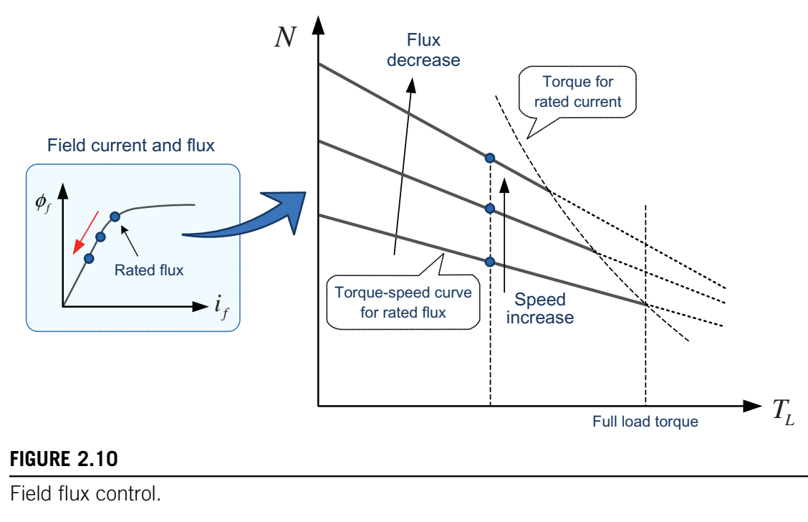
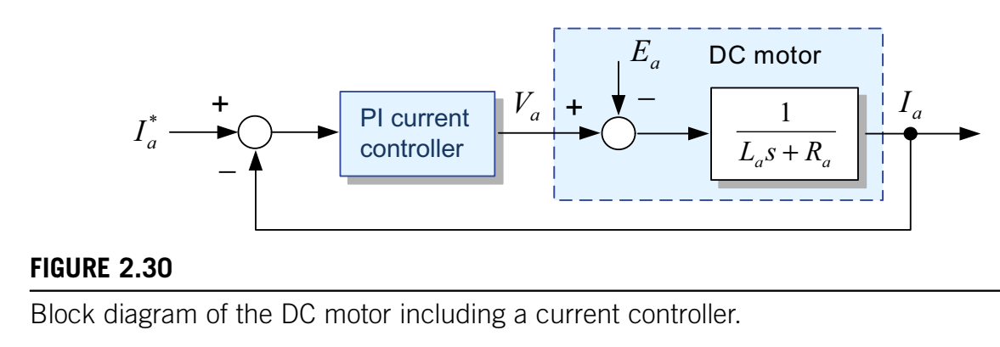
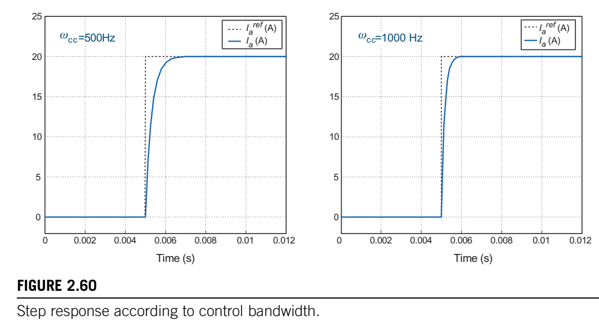

# 第二章 直流电机的控制

​	直流(DC)电机因其转矩易于控制且速度控制范围广，在可调速驱动或可变转矩控制中得到了广泛应用。然而，直流电机有一个主要缺点，即它们需要换向器和电刷等机械装置来实现连续旋转。这些机械部件需要定期维护，不利于高速运行。最近，由于交流(AC)电机控制技术、电力电子技术和微处理器的重大发展，交流电机已被用来替代直流电机，但直流电机仍用于几千瓦以下的低功率等级。 

​	在本章中，我们将研究直流电机的电流和速度控制。理解直流电机的电流和速度控制技术非常重要，因为这些技术直接适用于交流电机控制，这将在第6章中讨论。 

## 2.1 直流电机的结构 

图2.1 直流电机配置。

​	如图2.1所示，直流电机有两个绕组。一个位于定子中，产生磁场磁通，这个绕组称为励磁绕组。另一个位于转子中，称为电枢绕组。电枢电流与定子磁场磁通相互作用，在转子轴上产生转矩。小型直流电机通常用永磁体代替励磁绕组来产生定子磁通。直流电机还具有由电刷和换向器组成的机械换向装置，它将直流电源提供的直流电流转换为电枢绕组中的交流电流。 

​	直流电机主要可分为两类：他励直流电机和自励直流电机。在他励直流电机中，电枢绕组和励磁绕组分别由单独的直流电源供电，而在自励直流电机中，两个绕组共用一个直流电源。 

​	自励直流电机还可根据两个绕组与直流电源的连接方式分为并励电机、串励电机和复励电机。如今，直流电机大多使用永磁体来产生磁场磁通，直流电源仅应用于电枢绕组。 

图2.2单匝线圈上的力。

​	现在我们来了解一下电刷和换向器的作用，它们对直流电机的连续旋转至关重要。首先，我们来看图2.2，它展示了转子绕组中的一匝线圈。当线圈连接到直流电源时，电流在线圈中流动。我们假设，在初始阶段，磁通分布和在线圈中流动的电流如图左侧所示。在这种情况下，根据弗莱明左手定则，导体两侧的力使线圈沿顺时针方向旋转。 

图2.3 通过使用电刷和换向器实现连续旋转。

​	当线圈旋转到如图2.2右侧所示的位置时，导体两侧产生的力将使线圈再次回到其初始位置，如图2.2左侧所示。由于线圈上产生的力不是在一个方向上连续产生的，所以线圈也不能在同一方向上连续旋转。然而，当线圈处于如图右侧所示的位置时，如果其电流方向反转，那么导体两侧产生的力也会反转，从而使线圈上的力保持在顺时针方向。这样，线圈就会在该方向上连续旋转。通过电刷和换向器的换向作用，线圈电流可以如图2.3所示那样反转。需要注意的是，直流电机中流过线圈的电流必须是交流电。该交流电的频率始终与线圈的角速度相同，这表明了转子的速度。在1.2.3节中，我们已经看到这满足了双馈电机中连续产生转矩的必要条件。 

图2.4 电枢绕组。

​	如图2.4所示，直流电机的电枢绕组有许多线圈，以增加平均转矩并减少转矩脉动。每个线圈通过电刷和其自己的独立换向器连接到直流电源。 

​	如前所述，为了使直流电机连续旋转，其结构中必须有电刷和换向器。然而，由于电刷和换向器的磨损和电弧，直流电机需要更多的维护，并且在高速运行时受到限制。 

## 2.2 直流电机的建模 

​	直流电机驱动系统的完整动态模型可以用以下四个方程表示：电枢电路、反电动势、转矩和机械负载系统。

### 2.2.1 电枢电路 

​	直流电机电枢绕组的电压方程为
$$
V_{a}=R_{a}i_{a}+L_{a}\frac{di_{a}}{dt}+e_{a}\tag{2.1}
$$
其中$i_{a}$是绕组电流，$L_{a}$是绕组电感，$R_{a}$是绕组电阻，$e_{a}$是电枢绕组在磁场中旋转时感应的反电动势。由式(2.1)导出的直流电机等效电路如图2.5所示。 

图2.5 直流电机的等效电路。

​	为了从式(2.1)中得到施加到直流电机的电压$V_{a}$时流过电枢绕组的电流，我们需要反电动势$e_{a}$。 

### 2.2.2 反电动势 

图2.6 运动导体中的感应电压。

​	如图2.6所示，当一根长度为$l$米的导体在均匀磁场$B$中以恒定速度$v$运动时，导体中会感应出电压$e = Blv$(称为反电动势)。类似地，在直流电机中，当电枢绕组的导体以角速度$\omega_{m}$在均匀定子磁通$\phi_{f}$中运动时，电枢绕组中的反电动势将表示为
$$
e_{a}=k_{e}\phi_{f}\omega_{m}\quad(\leftarrow e = Blv)\tag{2.2}
$$

其中$k_{e}$是反电动势常数($Vs/rad/Wb$)。通常，由于磁通保持恒定，反电动势与角速度成正比。 

​	通过从施加的输入电压$V_{a}$和反电动势$e_{a}$计算出电枢电流$i_{a}$，我们可以得到直流电机的输出转矩，如下所示。 

### 2.2.3 转矩 

图2.7 载流导体受力。

​	如图2.7所示，当一根长度为$l$米、载有电流$i$安培的导体置于均匀磁场$B$中时，导体上的作用力将为$F = Bli$。类似地，在直流电机中，电枢绕组的导体在均匀定子磁通$\phi_{f}$中载有电流$i_{a}$时所受的转矩为
$$
T_{e}=k_{T}\cdot\phi_{f}\cdot i_{a}\quad(\leftarrow F = Bli)\tag{2.3}
$$
其中$k_{T}$是转矩常数($Nm/Wb/A$)。在国际单位制(SI)中，$k_{T}$和$k_{e}$常数的数值相等，即$k_{T}=k_{e}$。 

​	值得注意的是，直流电机的转矩可以表示为定子磁通$\phi_{f}$和电枢电流$i_{a}$的简单算术乘积。这是因为定子磁通$\phi_{f}$和载有电流$i_{a}$的导体始终相互垂直。因此，直流电机固有地具有每安培最大转矩特性。 

​	转子的速度可以由输出转矩确定，如下所示。 

### 2.2.4 机械负载系统 

​	当具有式(2.3)输出转矩的直流电机驱动机械负载系统时，转子速度可以根据第1章中提到的运动方程(2.4)确定：
$$
T_{e}=J\frac{d\omega_{m}}{dt}+B\omega_{m}+T_{L}\tag{2.4}
$$
其中$\omega_{m}$是转子的角速度，$T_{L}$是负载转矩，$J$是直流电机驱动系统的转动惯量，$B$是摩擦系数。 

​	从由式(2.1)~(2.4)表示的上述动态模型中，我们可以理解直流电机驱动系统中电流和速度的稳态以及瞬态特性。首先，基于此模型，我们将研究直流电机在稳态条件下的速度 - 转矩特性。 

## 2.3 直流电机的稳态特性 

​	术语“稳态”是指在所有初始瞬态或波动条件衰减后的状态。直流电机的稳态行为可以通过使式(2.1)和(2.4)中变量的时间导数为零来轻松确定，即$di_{a}/dt = 0$，$d\omega_{m}/dt = 0$。从稳态方程中，速度 - 转矩关系可以写为
$$
\omega_{m}=\frac{V_{a}}{k\phi_{f}}-\frac{R_{a}}{(k\phi_{f})^{2}}T_{L}\quad(k = k_{T}=k_{e})\tag{2.5}
$$
​	这里，忽略了摩擦系数$B$。 

图2.8 直流电机稳态下的速度 - 转矩特性。

​	从这个转矩 - 速度关系中可以看出，直流电机的速度随着负载转矩(或电枢电流)的增加而稳定降低，如图2.8所示。这里，$N$是用每分钟转数($r/min$)表示的速度，对应于角速度$\omega_{m}$。从曲线中，我们可以找到在特定负载下的速度和电流。 

​	式(2.5)意味着直流电机的稳态速度可以通过电枢电压$V_{a}$或定子磁场磁通$\phi_{f}$来调节。因此，直流电机有两种速度控制方法：电枢电压控制和磁场磁通控制。除了这两种方法，我们从式(2.5)中还可以看出，速度也可以通过改变电枢电阻$R_{a}$来控制。然而，这种低效的方法已不再使用。 

​	现在，我们来看一下通过电枢电压控制和磁场磁通控制的直流电机速度控制特性。 

### 2.3.1 电枢电压控制

​	在定子磁场磁通恒定的情况下，式(2.5)表示的转矩 - 速度特性可以简化为
$$
\omega_{m}=\frac{V_{a}}{k\phi_{f}}-\frac{R_{a}}{(k\phi_{f})^{2}}T_{L}=K_{1}V_{a}-K_{2}T_{L}\tag{2.6}
$$
其中$K_{1}=V_{a}/k\phi_{f}$，$K_{2}=R_{a}/(k\phi_{f})^{2}$。 

图2.9 电枢电压控制。

​	从这个表达式中可以看出，直流电机的速度$\omega_{m}$随电枢电压$V_{a}$线性变化。因此，对于诸如电梯和起重机等恒转矩负载，通过调整直流电机的电枢电压$V_{a}$，可以线性控制负载的速度，如图2.9所示。 

​	为了采用电枢电压控制，需要可变直流电源，如相控整流器或斩波器。因为不应将高于额定电压的电压施加到电机上，所以这种电枢电压控制方法只能提供额定速度内的速度控制范围。要在高于额定速度的速度范围内运行，直流电机必须采用磁场磁通控制，这将在后面描述。然而，永磁直流电机不能使用磁场磁通控制方法，因此它们无法在额定速度以上运行。 

### 2.3.2 磁场磁通控制 

​	在电枢电压恒定的情况下，式(2.5)可以重写为磁场磁通的函数：
$$
\omega_{m}=\frac{V_{a}}{k\phi_{f}}-\frac{R_{a}}{(K\phi_{f})^{2}}T_{L}=\frac{K_{1}}{\phi_{f}}-\frac{K_{2}}{\phi_{f}^{2}}T_{L}\tag{2.7}
$$
其中$K_{1}=V_{a}/k$，$K_{2}=R_{a}/k^{2}$。 

图2.10 磁场磁通控制。

​	从式(2.7)中可以看出，直流电机的速度与磁场磁通成反比。图2.10显示了使用磁场磁通控制的直流电机的转矩 - 速度特性。当使用这种磁场磁通控制方法时，磁场磁通必须控制在额定值以下，以避免铁芯磁饱和，因此额定磁通通常给定为磁化曲线拐点附近的值，如图2.10左侧所示。如果磁场磁通降低到额定值以下，那么速度可以增加到额定速度以上。 

​	当通过调整磁场磁通控制使直流电机的速度能够控制在额定速度以上时，可能会出现一些潜在问题。当磁场磁通降低以增加速度时，对于相同的电枢电流，输出转矩也会降低。如果增加电枢电流以产生相同的转矩，那么由于铜损增加，效率会降低。由于热极限和直流电源的容量，电枢电流也可能无法完全增加。此外，励磁绕组的电感通常设计得较大，以有效地产生磁通。因此，磁场磁通不能快速变化，这将导致速度调节响应缓慢。另外，在高速范围内，对于施加的负载，速度调节会变差，并且由此产生的较低磁场磁通容易受到电枢反应的影响。除了这些电气问题，直流电机还由于机械换向装置而存在速度限制。因此，这种磁场磁通控制的可实现速度范围通常限制在额定速度的三倍以内。 

### 2.3.3 直流电机的运行区域 

​	直流电机的运行速度范围分为以下两个区域：恒转矩区域和恒功率区域。通过电枢电压控制和磁场磁通控制可以实现这两个区域的运行。 

#### 2.3.3.1 恒转矩区域($0\leq\omega_{m}\leq$基速$\omega_{b}$) 

​	在额定速度以下的运行区域中，磁场磁通保持恒定，转矩产生仅由电枢电流$I_{a}$控制。这个区域称为恒转矩区域，因为在该区域内的任何速度下，相同的电枢电流都可以产生相同的转矩。 

​	随着运行速度的增加，反电动势增加。因此，为了保持相同的电枢电流(即相同的转矩)，施加到电机的电压也应该增加。这样，在这个区域中，直流电机的端电压随其速度而变化。因为施加到电机的电压不应超过额定值，所以这个区域的范围通常限制在直流电机端电压达到额定值时的速度。这个速度可能与额定速度不同，具体取决于运行条件。因此，它通常被称为基速$\omega_{b}$。 

#### 2.3.3.2 恒功率区域($\omega_{m}>$基速)：弱磁区域

​	一旦电机电压达到额定值，速度就不能再通过电压控制。在高于基速的速度下，施加的电压保持恒定。因此，代替电压控制，可以通过降低磁场磁通(称为磁场削弱操作)来增加速度。磁场磁通的降低可以使反电动势在速度增加时保持恒定。这允许产生转矩的电枢电流流动。然而，即使相同的电流在流动，由于磁场磁通降低，输出转矩会随着运行速度的增加而降低。因为在这个区域中端电压和电流保持恒定，电机在恒定功率下运行，$P=(V_{a}\cdot I_{a}=T_{e}\cdot\omega_{m})$。因此，这个速度区域称为恒功率区域。 

图2.11 直流电机的能力曲线。

​	图2.11显示了直流电机的速度 - 转矩特性，通常称为能力曲线。能力曲线展示了电机在可用电压和电流下可实现的速度范围和输出转矩。对于具有四象限运行模式的直流电机驱动，如1.3.2节所述，这种速度 - 转矩特性出现在所有四个象限中。考虑到电枢电阻中的电压降和损耗，象限2和4中的输出转矩比象限1和3中的略大。对于四象限运行，需要反转输出转矩的方向以改变转子的旋转方向。在这种情况下，改变电枢电流的极性会更有效。尽管通过反转磁场磁通的极性也可以改变转矩的方向，但由于励磁绕组的电感较大，其响应较慢，因此驱动系统的稳定性可能会恶化。 

> 示例1 
>
> 一台他励直流电机的额定值为$5kW$、$125V$、$1800r/min$，效率$\eta$为$91\%$(忽略机械损耗和铁损等损耗)。电枢电阻为$0.25\Omega$。评估以下问题： 
>
> 1. 电枢电流和额定转矩。
>
> 2. 当电枢电压降低$10\%$时的满载速度。
>
> 3. 当磁通降低$10\%$时的满载电流速度以及在此速度下电枢电流可提供的输出转矩。
>
> 解决方案
>
> 1. 根据输入和输出功率的关系
>    $$
>    P_{out}=P_{in}\cdot\eta=V_{a}\cdot I_{a}\cdot \eta
>    $$
>    电枢电流为
>    $$
>    I_{a}=\frac{P_{out}}{V_{a}\cdot\eta}=\frac{5kW}{125V\cdot0.91}=43.96A
>    $$
>    从输出功率$P_{out}=T_{e}\cdot\omega_{m}$，额定转矩为
>    $$
>    T_{e}=\frac{P_{out}}{\omega_{m}}=\frac{5000W}{(\frac{1800\cdot2\pi}{60})}=26.5Nm
>    $$
>
> 2. 电枢电压降低$10\%$后的新电压$V_{new}$为$112.5V$。在此电压下，速度为
>    $$
>    \omega_{m}=\frac{E_{a}}{k\phi_{f}}=\frac{V_{new}-R_{a}I_{a}}{k\phi_{f}}=\frac{112.5-0.25\cdot43.96}{0.605}=167.8rad/s(=1602.2r/min)
>    $$
>    这里$k\phi_{f}=E_{a}/\omega_{m}=(V_{a}-R_{a}I_{a})/\omega_{m}=(125-0.25\cdot43.96)/(1800\cdot2\pi/60)=0.605$。
>
> 3. 磁通降低$10\%$时的速度为
>    $$
>    \omega_{m}=\frac{E_{a}}{0.9k\phi_{f}}=\frac{(V_{a}-R_{a}I_{a})}{0.9k\phi_{f}}=\frac{125-0.25\cdot43.96}{(0.9\cdot0.605)}=209.4rad/s(=2000r/min)
>    $$
>    在此速度下，电枢电流可提供的输出转矩为
>    $$
>    T_{e@2000}=0.9k\phi_{f}I_{a}=0.9\cdot0.605*43.96=23.94Nm
>    $$

## 2.4 直流电机的瞬态响应特性

图2.12 阶跃给定下的转速瞬态响应。

​	在2.3节中，我们研究了直流电机的稳态特性，其展示了通过电枢电压或磁场通量对速度的控制。稳态特性表明了最终速度的情况，而瞬态响应则显示了如何达到最终速度。除了稳态特性外，瞬态特性对于高性能电机驱动也是非常重要的。这是因为瞬态响应表征了驱动系统的动态特性。例如，阶跃给定下的转速瞬态响应如图2.12所示。

​	尽管所有三个响应都达到了相同的最终速度，但它们达到最终速度的响应时间和运动轨迹是不同的。虽然振荡或缓慢的响应最终也能实现速度指令，但它没有实际用途。因此，对于高性能电机驱动，我们需要同时考虑瞬态特性和稳态特性。 

​	现在，让我们来看看直流电机通过施加电枢电压达到最终速度的瞬态响应。研究瞬态响应的一种简单方法是使用系统的传递函数。我们可以通过对式(2.1)和式(2.4)的微分方程进行拉普拉斯变换来获得直流电机驱动系统的传递函数，如下所示。 
$$
v_{a}=R_{a}i_{a}+L_{a}\frac{di_{a}}{dt}+e_{a}\\\to V_{a}(s)=(R_{a}+sL_{a})I_{a}(s)+E_{a}(s)=(R_{a}+sL_{a})I_{a}(s)+k_{e}\phi_{f}\omega_{m}(s)\tag{2.8}
$$

$$
T_{e}=J\frac{d\omega_{m}}{dt}+B\omega_{m}+T_{L}\to T_{e}(s)=(Js + B)\omega_{m}(s)+T_{L}=k_{T}\phi_{f}I_{a}(s)\tag{2.9}
$$

​	这里，$s$表示拉普拉斯算子。式(2.8)和式(2.9)一起可以用如图2.13所示的闭环方框图表示。

图2.13 直流电机的方框图。

​	从图2.13的方框图中，从输入电枢电压$V_{a}(s)$到输出角速度$\omega_{m}(s)$的传递函数由下式给出：
$$
\begin{align*}
\frac{\omega_{m}(s)}{V_{a}(s)}&=\frac{\frac{1}{L_{a}s + R_{a}}\cdot k_{e}\phi_{f}\cdot\frac{1}{Js + B}}{1 + (\frac{1}{L_{a}s + R_{a}}\cdot k_{e}\phi_{f}\cdot\frac{1}{Js + B}k_{T}\phi_{f})}\\
&=\frac{\frac{k}{JL_{a}}}{s^{2}+(\frac{R_{a}}{L_{a}}+\frac{B}{J})s + (\frac{R_{a}}{L_{a}}\frac{B}{J}+\frac{k^{2}}{JL_{a}})}\quad(k = k_{T}\phi_{f}=k_{e}\phi_{f})\tag{2.10}
\end{align*}
$$

图2.14 系统极点位置及相应的瞬态响应。

​	这个传递函数是一个二阶系统，包含两个极点，这两个极点是决定系统瞬态响应的重要因素。图2.14显示了系统极点在$s$平面上的位置以及相应的瞬态响应。极点的虚部位置决定了响应中的振荡频率。因此，如果极点是复数根，响应就是振荡的。极点的实部位置决定了瞬态情况的指数衰减速度。所以，极点在$s$平面左侧离原点越远，瞬态情况消失得越快，即系统越快达到最终值。

> 闭环传递函数 
>
> 具有反馈回路的系统具有以下传递函数： 
> $$
> \frac{Y(s)}{R(s)}=\frac{G(s)}{1 + G(s)H(s)}
> $$
> 

​	从式(2.10)中两个极点的位置，我们可以预测速度对施加的电枢电压的瞬态响应。因此，瞬态响应在很大程度上取决于系统参数，如电机参数$R_{a}$和$L_{a}$以及机械参数$J$和$B$，如下所示。 

​	假设$B = 0$，为了便于分析系统，我们可以得到一个简化的传递函数： 
$$
\frac{\omega_{m}}{V_{a}}=\frac{\frac{k}{JL_{a}}}{s^{2}+(\frac{R_{a}}{L_{a}})s + (\frac{k^{2}}{JL_{a}})}=\frac{\frac{1}{k}(\frac{R_{a}}{L_{a}}\cdot\frac{k^{2}}{JR_{a}})}{s^{2}+(\frac{R_{a}}{L_{a}})s + (\frac{R_{a}}{L_{a}}\cdot\frac{k^{2}}{JR_{a}})}\tag{2.11}
$$
​	令机电时间常数$T_{m}=JR_{a}/k^{2}$，电气时间常数$T_{a}=L_{a}/R_{a}$，式(2.11)可以重写为：
$$
\frac{\omega_{m}}{V_{a}}=\frac{\frac{1}{k}(\frac{1}{T_{m}T_{a}})}{s^{2}+\frac{1}{T_{a}}s+\frac{1}{T_{m}T_{a}}}\tag{2.12}
$$

​	极点可以从式(2.12)分母(也称为特征方程)的根中得到： 
$$
s_{1,2}=-\frac{1}{2T_{a}}\pm\frac{1}{T_{a}}\sqrt{\frac{1}{4}-\frac{T_{a}}{T_{m}}}\tag{2.13}
$$
​	如果$T_{m}\geq4T_{a}$，则特征方程有两个实根。较大的$J$或$R_{a}$的直流电机驱动系统对应这种情况，其响应为图2.14中的①或②。如果$T_{m}<4T_{a}$，则特征方程有两个复根。在这种情况下，系统响应是振荡的，如图2.14中的③。 

​	我们也可以从这个二阶系统的阻尼比来找出响应特性。为此，我们将这个方程与以下二阶系统的原型进行比较： 
$$
G(s)=\frac{\omega_{n}^{2}}{s^{2}+2\zeta\omega_{n}s+\omega_{n}^{2}}\tag{2.14}
$$
​	给定式(2.14)，直流电机驱动系统的无阻尼自然频率$\omega_{n}$和阻尼比$\zeta$由下式给出： 
$$
\omega_{n}=\frac{1}{\sqrt{T_{a}T_{m}}}=\frac{k}{\sqrt{JL_{a}}}\tag{2.15}
$$

$$
\zeta=\frac{1}{2}\sqrt{\frac{T_{m}}{T_{a}}}=\frac{1}{2}\frac{R_{a}}{k}\sqrt{\frac{J}{L_{a}}}\tag{2.16}
$$

图2.15 根据阻尼比的系统响应。(A)欠阻尼	
(&zeta;<1)，(B)临界阻尼(&zeta; = 1)，以及(C)过阻尼(&zeta;>1)

​	根据阻尼比$\zeta$的值，系统有三种典型响应：欠阻尼($0<\zeta<1$)、临界阻尼($\zeta = 1$)或过阻尼($\zeta>1$)[1]。如图2.15所示，在欠阻尼($0<\zeta<1$)情况下，系统迅速达到平衡，但有轻微振荡响应。随着$\zeta$增加，振荡减小。在过阻尼($\zeta>1$)情况下，系统不振荡但响应非常缓慢。临界阻尼系统响应($\zeta = 1$)，能尽快达到平衡且不振荡，是最理想的。 

​	式(2.16)意味着阻尼比$\zeta$(它表示速度对施加的电枢电压的动态性能)取决于机电时间常数$T_{m}$和电气时间常数$T_{a}$的值。如果$T_{m}<4T_{a}$，则$\zeta<1$，其速度响应将是振荡的。相反，在$T_{m}\geq4T_{a}$的情况下，系统将有稳定的速度响应而不振荡。 

​	通常，小型电机有$T_{m}>4T_{a}$，而伺服电机或大功率电机有$T_{m}<4T_{a}$，导致振荡响应。即使系统响应本质上是振荡的，我们也可以通过采用适当的控制器来实现期望的响应，这将在后面描述。 

​	在大多数电机驱动系统中，电气系统的时间响应比机械系统快。在这种情况下，我们可以忽略电路的瞬态，即$L_{a}=0$。因此，式(2.11)可以写为： 
$$
\frac{\omega_{m}}{V_{a}}=\frac{k}{R_{a}Js + K^{2}}=\frac{1}{k}\frac{\omega_{c}}{s+\omega_{c}}\quad(\omega_{c}=\frac{k^{2}}{R_{a}J})\tag{2.17}
$$
​	这个方程意味着，在直流电机中，速度$\omega_{m}$与电枢电压$V_{a}$之间的关系可以被认为是一个一阶低通滤波器，其截止频率为$\omega_{c}$。这意味着当电枢电压$V_{a}$的变化率低于$\omega_{c}$时，速度$\omega_{m}$与电枢电压$V_{a}$成正比，但两者之间存在时间延迟。一般可以假设直流电机的转速与施加到它的电压成正比。

> 示例2 
>
> 考虑一个具有以下参数的他励直流电机。电枢电阻为$0.28\Omega$，电枢电感为$1.7mH$，电机的转动惯量$J$为$0.00252$，且$k\phi_{f}=0.4078$。 
>
> 1. 计算空载时两个极点的位置，并预测速度对电枢电压的瞬态响应。
>
> 2. 预测当该电机驱动转动惯量为$6J$的负载时的瞬态响应。 
>
> 解决方案
>
> 
>
> 1. 根据式(2.13)，两个极点为：
>    $$
>    s_{1,2}=-\frac{1}{2T_{a}}\pm\frac{1}{T_{a}}\sqrt{\frac{1}{4}-\frac{T_{a}}{T_{m}}}=-76.47\pm j181.57
>    $$
>    由于系统有两个复极点，我们可以预期系统响应是振荡的。此外，根据式(2.16)，阻尼比为：
>    $$
>    \zeta=\frac{1}{2}\sqrt{\frac{T_{m}}{T_{a}}}=\frac{1}{2}\frac{R_{a}}{k}\sqrt{\frac{J}{L_{a}}}=0.3881
>    $$
>    因为$\zeta<1$，我们可以预期系统有欠阻尼响应和超调。从图A中，我们可以看到该系统对阶跃施加电压的振荡速度响应。 
>
> 2. 当该电机驱动转动惯量为$6J$的负载时，系统有两个实极点$2152$和$20.0002$。因此系统响应不振荡。而且，由于$\zeta = 1.0269$，我们可以预期临界阻尼系统响应如图B所示。
>
>    注：将转动惯量更改为$J+6J=7J$计算。

## 2.5 电机控制系统 

图2.16 电机驱动系统

​	电动机是一种将电能转换为机械扭矩的机电设备。作为产生扭矩的装置，电动机需要优先控制其扭矩。当电动机产生的扭矩施加到机械负载上时，扭矩会改变被驱动负载的速度$\omega_{m}$，进而改变其位置$\theta_{m}$，如图2.16所示。 

​	因此，在电机驱动中，控制到电机负载的位置或速度的最有效方法是直接控制电机的扭矩。然而，由于电机扭矩传感器成本较高，扭矩控制较为昂贵。从式(2.3)可以看出，在恒定磁场磁通下，扭矩与电流成正比。这告诉我们可以通过电流而不是扭矩本身来控制扭矩。因此，电流控制对于电机的速度或位置控制非常重要。 

### 2.5.1 控制系统的配置 

图2.17 电机控制系统的配置

​	图2.17展示了电机驱动系统中控制器的典型配置，其中位置、速度和电流控制所需的控制器通常以级联方式连接。 

​	在这些控制器中，电流控制器必须放置在最内环，并且具有最宽的带宽。如前所述，由于速度和位置可以通过电流控制来控制，因此电流控制的响应时间必须在三者中最快。同样，内环控制的响应应该比外环控制足够快，以提高外环控制回路的响应性能和稳定性。例如，为了确保电流控制不会对速度控制性能产生任何影响，电流回路的带宽需要至少比速度回路的带宽宽五倍。 

### 2.5.2 控制类型 

​	控制的目的是调整控制输入，使系统的状态或输出达到所需的目标。在电机驱动系统中，状态或输出可能是电流、磁通量、速度、位置或扭矩，而控制输入仅是输入电压。对于控制性能而言，给定目标跟踪能力，即系统输出尽可能准确地跟随参考输入，是最重要的因素。控制系统在跟踪参考输入时还需要具有抗干扰能力，这意味着任何干扰都不能对系统跟踪参考输入产生太大影响。 

​	控制主要有两种基本类型：开环控制和闭环控制，也分别称为无反馈控制和反馈控制。 

#### 2.5.2.1 开环控制(或无反馈控制) 

图2.18 开环控制

​	开环控制是一种通过使用系统模型$G_{s}(s)$来确定系统控制输入$U(s)$的控制类型，如图2.18所示。 

​	开环控制的一个缺点是它需要对系统有完全的了解。由于开环控制不使用系统输出$Y(s)$的反馈，参考$R(s)$与输出$Y(s)$之间的误差无法在确定其控制输入$U(s)$时得到反映。因此，由于系统参数的变化或干扰，其输出可能与期望目标不同。 

​	由于其简单性和低成本，开环控制常用于输入和输出之间具有明确关系且不受干扰影响的系统。然而，这种开环控制不适用于高性能电机驱动系统，因为高性能电机驱动系统容易受到参数变化和干扰(如反电动势和负载扭矩)的影响。 

#### 2.5.2.2 闭环控制(或反馈控制) 

图2.19 闭环控制

​	闭环控制是一种通过输出$Y(s)$的反馈来调整控制输入$U(s)$的控制类型，如图2.19所示。闭环控制通常用于控制电机驱动系统中的位置、速度、电流或磁通量。 

​	控制器$G_{c}(s)$调整其控制输入$U(s)$以减小输出与期望目标之间的误差。因此，控制器$G_{c}(s)$在闭环控制中的作用对系统性能至关重要。电机驱动系统中广泛使用的反馈控制器有以下几种类型。 

##### 2.5.2.2.1 比例控制器(P控制器) 

图2.20 比例控制

​	在如图2.20所示的这种类型的控制器中，控制器输出与当前误差$e(t)( = r(t) - y(t))$成正比，如式(2.18)所示
$$
U(t)=K_{p}e(t)\tag{2.18}
$$
其中$K_{p}$表示比例增益。 

​	比例控制的一个优点是它对误差的即时响应。比例增益越大，响应越快。需要注意的是，比例增益决定了控制带宽。然而，增加比例增益是有限度的，因为大增益可能导致系统不稳定或可能需要无法实现的控制输入。比例控制的一个缺点是误差永远不可能为零。换句话说，P控制中存在稳态误差。这是因为当误差变为零时，P控制器的输出变为零，因此系统将再次出现误差。可以从图2.20的框图中的闭环传递函数评估P控制器的稳态误差，如式(2.19)所示。 
$$
\frac{R(s)}{Y(s)}=\frac{G^{o}(s)}{1+G^{o}(s)}=\frac{K_{p}G_{s}(s)}{1+K_{p}G_{s}(s)}\tag{2.19}
$$
其中$G^{o}(s)( = K_{p}G_{s}(s))$是包括比例控制器的系统的开环传递函数。

​	从式(2.19)可以看出，如果比例增益$K_{p}$非常大，则$R(s)/Y(s)$将接近1，误差将非常小，但永远不会达到零。 

##### 2.5.2.2.2 积分控制器(I控制器) 

图2.21 积分控制

​	在这种类型的控制器中，控制器输出是误差的积分，如图2.21所示，过去的误差以及当前误差都会对控制输入产生影响，如式(2.20)所示，
$$
U(t)=K_{i}\int e(t)dt = \frac{K_{p}}{T_{pi}}\int e(t)dt\tag{2.20}
$$
其中$K_{i}$表示积分增益，$T_{pi}( = K_{p}/K_{i})$表示积分时间常数。 

​	积分控制器可以完全消除给定$R(s)$的稳态误差。这是因为即使当前误差为零，它也会根据累积的过去误差持续产生非零控制输入。然而，由于积分项中的累积误差，它对误差变化的响应较慢。因此，积分控制器通常不单独使用，而是与P控制器结合使用。 

##### 2.5.2.2.3 比例积分控制器 

图2.22 比例积分控制

​	电机驱动系统中广泛使用的控制器是比例积分控制器(PI控制器)，它是比例控制器和积分控制器的组合，以实现快速响应和零稳态误差。比例积分控制器的框图如图2.22所示。 

图2.23 对于误差的控制

​	图2.23比较了上述三种控制器在误差下的控制。 

#### 2.5.2.3 前馈控制 

​	在控制过程中始终存在干扰。在电机驱动系统中，例如，反电动势对电流控制起干扰作用，负载扭矩对速度和位置控制起干扰作用。从2.5.2.2.1节可以看出，反馈控制目的是减小输出与期望目标之间的误差。因此，反馈控制只能在干扰对输出产生影响后对干扰做出反应。因此，反馈控制无法对干扰实现快速响应。 

​	前馈控制是一种有效快速消除干扰对输出影响的方法。前馈控制通过预先将干扰添加到控制输入中来预测和补偿干扰。 

图2.24 前馈控制

​	前馈控制总是与反馈控制一起使用。图2.24显示了具有反馈控制和前馈控制的典型系统的框图。与仅具有反馈控制的系统相比，该控制系统可以更有效地减小干扰$D(s)$对输出$Y(s)$的影响。对于前馈控制，需要准确的系统参数来正确预测干扰。 

​	在电机电流控制系统中，前馈控制可以显著提高电流控制性能，它可以补偿对电流控制起干扰作用的反电动势。直流电机和交流电机的电流前馈控制将在后面详细描述。对于电机速度控制，负载扭矩的前馈控制也可以显著提高速度控制性能。 

### 2.5.3 控制系统设计的考虑因素 

​	PI控制器在电机驱动系统中被广泛用作电流、速度或磁链控制的控制器，因为它可以提供令人满意的性能。PI控制器的性能在很大程度上取决于其选定的增益。因此，为在给定系统中获得满意的性能，选择合适的PI控制器增益非常重要。 

​	现在，我们将讨论电流和速度PI控制器的增益选择方法。通过包括PI控制器的整个系统的频率响应，我们将确定P和I增益，以实现期望的瞬态和稳态特性。

> 什么是频率响应？ 
>
> ​	线性系统对正弦输入的输出是具有相同频率但幅度和相位不同的正弦波。频率响应是指系统在稳态下对不同频率正弦输入的开环响应，如下所示。
>
> 
>
> ​	频率响应用于表征系统的动态特性并衡量系统跟随输入参考的能力。频率响应由系统响应的幅度和相位作为频率的函数来表征，它们可以从系统的传递函数$G(s)$计算得到，如下所示：
> $$
> \left.\frac{C(s)}{R(s)}\right|_{s = j\omega}=\left.G(s)\right|_{s = j\omega}=|G(j\omega)|\angle\varphi(j\omega)
> $$
> 其中$|G(j\omega)|$和$\angle\varphi(j\omega)$分别表示输入和输出信号之间的幅度和相位角。 
>
> ​	我们可以通过波特图轻松查看动态系统的频率响应，波特图显示系统响应的幅度(以dB为单位)和相位(以度为单位)作为频率的函数。 

​	在设计控制系统时，我们应考虑三个要求：稳定性、响应时间和稳态误差。我们将首先简要回顾这些要求。 

#### 2.5.3.1 稳定性

​	首先，包括控制器在内的整个系统必须稳定。因此，稳定性是控制系统设计的最重要要求。不稳定系统对有界输入信号的响应将持续振荡，但其振荡幅度永远不会减小或增大。

​	线性系统的稳定性可以通过检查系统传递函数的极点，即$s$平面上特征方程的根来评估，正如我们在图2.14中已经看到的。如果所有极点都位于$s$平面的左半部分，则线性系统是稳定的。 

​	然而，仅仅知道系统是否稳定是不够的。我们需要找出系统有多稳定。我们可以通过频率响应波特图中的幅值裕度和相位裕度来衡量系统的相对稳定性。幅值裕度和相位裕度的简要描述如下。 

##### 2.5.3.1.1 幅值裕度和相位裕度

图2.25 幅值裕度和相位裕度。

​	相位裕度和幅值裕度是闭环控制系统稳定性的定义如图2.25所示。 

1. 幅值裕度 

   ​	幅值裕度定义为使闭环系统不稳定所需的开环增益的变化量。幅值裕度是$0\ dB$与在相位穿越频率(此时相位为$-180^{\circ}$)处的增益之差。如果在$\angle GH(j\omega)= -180^{\circ}$的频率处的增益$|GH(j\omega)|$大于$0\ dB$，如图2.25左侧所示，意味着正幅值裕度，则闭环系统是稳定的。 

2. 相位裕度 

      ​	相位裕度定义为使闭环系统不稳定所需的开环相位的变化量。相位裕度是$-180^{\circ}$与在增益穿越频率(此时增益为$0\ dB$)处的相位之差。如果在$|GH(j\omega)| = 1$的频率处的相位$\angle GH(j\omega)$大于$-180^{\circ}$，如图2.25左侧所示，意味着正相位裕度，则闭环系统是稳定的。 

​	一般来说，随着系统增益的增加，系统变得不太稳定。幅值裕度和相位裕度表明增益增加多少会使系统变得不稳定。 

​	让我们看看增益和相位裕度与系统稳定性之间的关系。例如，假设系统的相位裕度为零，即$\angle GH(j\omega)=180^{\circ}$在增益$|G(j\omega)| = 1\ dB$的频率处。在这种情况下，如图2.26所示，$Y(s)$和$R(s)$之间的相位差为$180^{\circ}$，因此这个闭环系统变成了正反馈系统。这个系统将继续放大其输出并变得不稳定。 

图2.26 不稳定系统的例子

​	如果闭环系统是稳定的，则幅值裕度和相位裕度都需要为正。一般来说，在闭环系统设计中，相位裕度为$30^{\circ}-60^{\circ}$和幅值裕度为$10\ dB$是理想的。具有大幅值裕度和相位裕度的系统是稳定的，但响应迟缓，而具有小幅值裕度和相位裕度的系统响应快但可能振荡。
#### 2.5.3.2 响应时间/响应速度 

图2.27 响应速度与系统带宽的关系。(A)频率响应和(B)阶跃响应。

​	系统对输入变化的响应速度是衡量系统动态性能的重要指标。闭环系统的响应速度与其控制带宽成正比。因此，控制带宽是响应速度的度量。 

​	我们可以从图2.27中看到系统根据其控制带宽的响应，该图显示了对阶跃指令的响应与系统带宽的关系。一般来说，系统的控制带宽越宽，响应速度越快。然而，如果系统的控制带宽太大，系统可能对噪声敏感并变得不稳定。

> 什么是带宽？ 
>
> ​	带宽描述系统跟随正弦输入的能力。我们可以从系统的闭环频率响应理解带宽。如下所示，带宽是频率响应幅度$|G|$大于$-3\ dB$的频率范围，即$0\leq\omega\leq\omega_{b}$。 
>
> ​	带宽是反馈系统跟随输入信号能力的度量。频率小于带宽频率$\omega_{b}$的正弦输入被系统很好地跟随，而频率大于带宽频率的正弦输入在幅度上被衰减$1/10$或更多(并且也会发生相位偏移)。带宽的概念在控制系统中非常重要，因为它描述了系统跟随其指令的速度。 
>
> 

#### 2.5.3.3 稳态误差 

图2.28 反馈系统单元

​	稳态误差定义为系统响应达到稳态时期望输出值与实际输出值之间的差值。我们可以使用终值定理计算系统的稳态误差。对于图2.28所示的单位反馈系统，终值定理为： 
$$
终值定理：e_{\infty}=\lim_{t \to \infty} e(t)=\lim_{s \to 0} sE(s)=\lim_{s \to 0} \frac{s}{1 + G(s)} R(s)\quad\\(误差：E(s)=R(s)-Y(s)=\frac{R(s)}{1 + G(s)})\tag{2.21}
$$
​	例如，让我们评估直流电机控制系统中对阶跃输入指令的稳态误差，其中速度或电流指令通常作为阶跃信号给出。假设直流电机的控制系统是如图2.28所示的单位反馈系统，并且电流控制系统的传递函数为$G(s)$。对于该系统的单位阶跃输入$(r(t)=1 \to R(s)=\frac{1}{s})$，根据终值定理，稳态误差为： 
$$
e_{\infty}=\lim_{s \to 0} \frac{s}{1 + G(s)} R(s)=\lim_{s \to 0} \frac{s}{1 + G(s)} \frac{1}{s}=\lim_{s \to 0} \frac{1}{1 + G(s)}\tag{2.22}
$$
​	稳态误差取决于系统类型(0型、I型或II型)。 

​	首先，假设一个0型控制系统，表示为$G(s)=\frac{K}{Ts + 1}$。在该系统中，稳态误差为：
$$
e_{\infty}=\frac{1}{1 + G(0)}=\frac{1}{1 + K}\tag{2.23}
$$
​	误差的大小取决于系统增益$K$，并且永远不会为零。 

​	接下来，假设一个I型系统$G(s)=\frac{K}{s(Ts + 1)}$。该控制系统没有稳态误差，因为： 
$$
e_{\infty}=\frac{1}{1 + G(0)}=\frac{1}{1 + \infty}=0\tag{2.24}
$$

​	由此可见，如果控制系统包含一个积分器$\frac{1}{s}$，则对阶跃参考的稳态误差将为零。

## 2.6 电流控制器设计

​	PI控制器是直流电机驱动系统中最常用于电流控制的控制器。在本节中，我们将介绍如何设计电流控制器，即如何为期望的性能选择PI电流控制器的比例(P)和积分(I)增益。 

​	PI控制器由一个比例项和一个积分项组成，比例项取决于当前误差，积分项取决于过去和当前误差的累积，如下所示：
$$
G_{pi}(s)=K_{p}+\frac{K_{i}}{s} \quad\tag{2.25}
$$
其中，$K_{p}$和$K_{i}$分别是比例增益和积分增益。 

图2.29 PI控制器的频率响应。

​	图2.29显示了PI控制器的频率响应。由于积分器的存在，PI控制器具有无限大的直流增益(即$\omega = 0$时的增益)。 

​	式(2.25)的传递函数可以重写为： 
$$
G_{pi}(s)=K_{p}\left(1+\frac{1}{T_{pi} s}\right)=K_{p} \frac{\left(s+\frac{1}{T_{pi}}\right)}{s} \quad\tag{2.26}
$$
其中，$T_{pi}=K_{p} / K_{i}$是PI控制器的积分时间常数，$1 / T_{pi}$称为PI控制器的转折频率。 

​	从式(2.26)可以看出，PI控制器可以在系统传递函数中添加一个位于$s = 0$的极点和一个位于$s=-K_{i} / K_{p}$的零点。这个零点的位置对系统性能有很大影响，稍后将详细描述。如果零点放置正确，系统的阻尼可以得到改善。如前所述，PI控制器在$s = 0$处的极点通过在传递函数中添加一个积分器$1/s$来增加系统类型，从而改善稳态误差。然而，增加系统类型可能会在增益较大时使系统不稳定。一般来说，PI控制器可以改善稳态误差，但会牺牲稳定性。此外，PI控制器可以减少最大超调量，改善增益裕度和相位裕度以及谐振峰值，但会降低带宽并延长上升时间。PI控制器还具有低通滤波器的特性，可以降低噪声。 

图2.30 包含电流控制器的直流电机方框图。

​	现在，让我们评估PI控制器在直流电机电流控制中的性能。包含PI电流控制器的直流电机系统的传递函数如图2.30所示，其表达式为： 
$$
I(s)=\frac{K_{pc} s + K_{ic}}{L_{a} s^{2}+\left(R_{a}+K_{pc}\right) s + K_{ic}} I^{*}(s)-\frac{s}{L_{a} s^{2}+\left(R_{a}+K_{pc}\right) s + K_{ic}} E(s)\tag{2.27}
$$
其中，$K_{pc}$和$K_{ic}$分别代表电流控制器的比例增益和积分增益。 

​	从式(2.27)可以看出，直流电机的反电动势$E(s)$将对电流控制系统产生干扰。如果直流电机的电流参考值保持恒定(即$s = 0$)，那么$E(s)$将不会影响电流控制性能。然而，当电流参考值$I^{*}(s)$发生变化时，$E(s)$可能会影响实际电流$I(s)$跟随其参考值的动态性能。 

​	对于大惯性系统，由于速度变化引起的$E(s)$变化很小，因此可以忽略反电动势对电流控制的影响。然而，对于为快速速度响应而设计的小惯性伺服电机，反电动势的影响不能忽略。为了通过消除反电动势的这种不良影响来获得良好的电流控制性能，我们可以采用如2.5.2.3节所述的前馈控制。由于直流电机的反电动势为$e_{a}=k_{e} \phi_{f} \omega_{m}$，我们可以很容易地根据速度信息来估计它。当通过前馈控制补偿干扰$E(s)$时，如图2.31A所示，直流电机将简化为如图2.31B所示的R - L电路。

图2.31 电流控制系统。(A)反电动势的前馈控制；(B)补偿反电动势后的系统。
 

​	对于图2.31B的情况，电流控制将更容易，其性能将得到改善。在这种情况下，式(2.27)变为： 
$$
\frac{I(s)}{I^{*}(s)}=\frac{K_{pc} s + K_{ic}}{L_{a} s^{2}+\left(R_{a}+K_{pc}\right) s + K_{ic}}\tag{2.28}
$$
​	从式(2.28)可以看出，电流控制特性取决于电流控制器的性能，而电流控制器的性能又由为PI控制器选择的P和I增益决定。 

​	现在，让我们看看如何选择合适的增益来实现期望的电流控制性能。这里，我们将介绍一种基于系统频率响应的增益选择方法。 

### 2.6.1 比例积分电流控制器 

图2.32 PI电流控制系统。
 

​	PI电流控制系统如图2.32所示。这里，假设前馈控制完美地补偿了直流电机的反电动势。 

​	在这个PI电流控制器中，电流误差与其输出电压之间的关系为： 
$$
V_{a}=K_{pc}\left(1+\frac{1}{T_{pi} s}\right)\left(I_{a}^{*}-I_{a}\right)\tag{2.29}
$$
其中，$T_{pi}(=K_{pc} / K_{ic})$是PI电流控制器的积分时间常数，$K_{ic}$是积分增益。 

​	有几种PI增益调整规则，如著名的齐格勒 - 尼科尔斯方法。 这里，我们将采用称为零极点抵消法的技术。通过使用零极点抵消，我们可以消除直流电机本身的电流控制特性，使PI控制器能够决定电流控制的性能。 该系统的开环传递函数$G_{c}^{o}(s)$为： 
$$
G_{c}^{o}(s)=K_{pc}\left(\frac{s+\frac{1}{T_{pi}}}{s}\right) \cdot \frac{1}{L_{a} s + R_{a}}=K_{pc} \frac{\left(s+\frac{K_{ic}}{K_{pc}}\right)}{s} \cdot \frac{\frac{1}{L_{a}}}{\left(s+\frac{R_{a}}{L_{a}}\right)}\tag{2.30}
$$
​	如果通过零极点抵消法将PI控制器的零点$(-K_{ic} / K_{pc})$设计为抵消直流电机的极点$(-R_{a} / L_{a})$，即：
$$
\frac{1}{T_{pi}}=\frac{K_{ic}}{K_{pc}}=\frac{R_{a}}{L_{a}} \quad\tag{2.31}
$$
​	式(2.30)变为： 
$$
G_{c}^{o}(s)=\frac{1}{\left(\frac{L_{a}}{K_{pc}}\right) s} \quad\tag{2.32}
$$

图2.33 开环频率响应
 

​	图2.33显示了$G_{c}^{o}(s)$的开环频率响应的波特图。在增益穿越频率$\omega_{cc}$处，相位为$-90^{\circ}$，此时幅度$\vert G_{c}^{o}(j\omega)\vert = 0\ dB$。因此，增益裕度为正，系统将是稳定的。此外，在这种情况下，式(2.32)的传递函数变为系统类型为1，因此，我们可以预期稳态误差为零，即： 
$$
e_{\infty}=\lim_{s \to 0} \frac{1}{1 + G_{c}^{o}(s)}=\frac{1}{1 + \infty}=0\tag{2.33}
$$
​	从式(2.32)可以确定增益穿越频率$\omega_{cc}$为： 
$$
\left\vert G_{c}^{o}(j\omega_{cc})\right\vert=\frac{1}{\left\vert\frac{L_{a}}{K_{pc}} j\omega_{cc}\right\vert}=1 \to \omega_{cc}=\frac{K_{pc}}{L_{a}}\tag{2.34}
$$
​	开环频率响应的增益穿越频率$\omega_{cc}$等于闭环频率响应的增益截止频率，这表明了电流控制系统的带宽。让我们检查这个电流控制系统的带宽。 

​	该系统的闭环传递函数为： 
$$
\frac{I(s)}{I^{*}(s)}=G_{c}^{c}(s)=\frac{G_{c}^{o}(s)}{1 + G_{c}^{o}(s)}=\frac{1}{\left(\frac{L_{a}}{K_{pc}}\right) s + 1}=\frac{\omega_{cc}}{s + \omega_{cc}}\tag{2.35}
$$

图2.34 闭环频率响应
 

​	其频率响应如图2.34所示。我们可以看到，通过令$\vert G_{c}^{c}(j\omega)\vert$等于$1 / \sqrt{2}(-3\ dB)$，可以得到系统的带宽为$\omega_{cc}$，即： 
$$
\left\vert G_{c}^{c}(j\omega)\right\vert=\left\vert\frac{\omega_{cc}}{j\omega + \omega_{cc}}\right\vert=\frac{1}{\sqrt{2}}\tag{2.36}
$$
​	因此，带宽等于开环频率响应的增益穿越频率。 

​	这样，如果将PI控制器的零点设计为抵消系统的极点，电流控制系统就可以简单地表示为一个具有截止频率$\omega_{cc}$的一阶系统，并且是稳定的。在这种情况下，响应中不会出现超调，响应达到最终值所需的时间约为系统时间常数的四倍。 

​	基于上述解释，为实现所需带宽，电流控制器的比例和积分增益可以确定如下。 如果所需的控制带宽为$\omega_{cc}$，则比例增益$K_{pc}$可以从式(2.34)获得，积分增益$K_{ic}$可以从式(2.31)获得： 

$$
比例增益：K_{pc}=L_{a} \cdot \omega_{cc} \quad\tag{2.37}
$$

$$
积分增益：K_{ic}=\frac{R_{a}}{L_{a}} K_{pc}=R_{a} \cdot \omega_{cc} \quad\tag{2.38}
$$

​	需要注意的是，控制器的增益取决于电机参数$L_{a}$和$R_{a}$。因此，为实现相同的电流控制性能，不同电机的增益值可能会有所不同。例如，对于绕组电感值较大(电流难以改变)的电机，与绕组电感值较小(电流容易改变)的电机相比，需要更大的比例增益来获得相同的电流控制带宽。因此，准确的电机参数信息对于实现所需的电流控制性能至关重要。 

#### 2.6.1.1 电流控制带宽的选择 

​	比例增益$K_{pc}$的值决定了系统的响应速度，而积分增益$K_{ic}$的值决定了稳态误差消除的速度。当这些增益的值较大时，控制性能更好。然而，大增益可能会导致振荡响应并使系统不稳定。如式(2.37)和(2.38)所示，由于电流控制器的增益由其带宽$\omega_{cc}$决定，我们首先需要为目标电流控制系统选择合适的带宽$\omega_{cc}$。较宽的带宽将导致更快的响应，但系统可能不稳定。 

​	电流控制器的带宽$\omega_{cc}$受到以下两个因素的限制：电力电子转换器的开关频率和电流采样频率。由于电机电流不能比电力电子转换器的开关频率变化得更快，开关频率限制了电流控制的带宽。如果在每个开关周期内对电流进行两次采样，根据经验，最大可用带宽可达开关频率的$1/10$。另一方面，如果在每个开关周期内对电流进行一次采样，最大可用带宽可达开关频率的$1/20$。对于后一种情况，最好将带宽限制为采样频率的$1/25$ [1,2]。 

​	例如，假设为直流电机提供电压的斩波器的开关频率为$5\ kHz$。在这种情况下，电流控制器的最大可用带宽最多可达开关频率的$1/10$，即$5\ kHz / 10 = 500\ Hz(≈3100\ rad / s)$。然而，为了实现稳定的电流控制或如果在每个开关周期内对电流进行一次采样，最好将其限制为开关频率的$1/20$，即$5\ kHz / 20 = 250\ Hz(≈1550\ rad / s)$。 

图2.35 电流控制性能和控制带宽的关系
 

​	图2.35比较了不同增益(由前面所述的增益选择方法确定)的电流控制性能。我们可以根据控制带宽区分不同的响应。 

### 2.6.2 抗饱和控制器 

​	如前所述，积分控制器可以有效地消除稳态误差。这是因为积分控制器的输出是由累积的过去误差产生的。然而，在控制器输出受限的情况下，这种特性往往会导致控制性能下降。 

​	PI电流控制器的输出(表示施加到直流电机的电压参考值)应受到限制，原因如下。首先，不应将超过其额定值的电压施加到电机上。此外，由于电力电子变换器的输入电压受限以及开关器件电压不应超过其电压额定值，因此电力电子转换器的输出电压也受限。 

​	一旦由于持续的误差信号在相当长的一段时间内使PI控制器的输出超过其限制，输出将饱和，但控制器中的积分器可能由于其持续的积分作用而具有较大的值。这种现象称为积分饱和。当饱和发生时，由于积分器内部的累积值较大，控制器无法立即响应误差的变化。需要误差具有相反的符号很长时间，直到控制器恢复到正常状态。此时系统变为开环系统，因为输出保持在其极限值，而与误差无关。结果，系统将表现出较大的超调量和较长的稳定时间。为了避免这种积分饱和，当饱和发生时，应将积分项的大小保持在适当的值，以便控制器在控制误差变化时能够立即恢复动作。 

图2.36 通过反向计算法进行抗积分饱和控制。
 

​	有几种避免积分饱和的方法，如反向计算、条件积分和有限积分[3,4]。由于其令人满意的动态特性，如图2.36所示的反向计算抗饱和方案被广泛使用。 

​	在该方案中，当输出饱和时，控制器输出与实际输出之间的差值以增益$K_{a}$反馈到积分器的输入，以便可以将积分器的累积值保持在适当的值。抗饱和控制器的增益通常选择为$K_{a}=1 / K_{p}$，以消除受限电压的动态影响。 

图2.37 抗积分饱和控制。(A)无抗积分饱和控制，(B)有抗积分饱和控制。
 
​	图2.37显示了由参考值的大变化引起的PI电流控制器的积分饱和现象。图2.37A显示了没有抗饱和控制的电流控制器的性能。由于其饱和的输出电压，实际电流表现出较大的超调量和较长的稳定时间。另一方面，图2.37B显示了具有抗饱和控制的电流控制器。当输出饱和时，积分器的累积值可以保持在适当的值，从而提高了性能。 

#### 2.6.2.1 比例积分电流控制器的增益选择程序 

1. 找到系统的开关频率$f_{sw}$。 

2. 选择电流控制器的控制带宽$\omega_{cc}$在开关频率$f_{sw}$的$1/10 - 1/20$范围内，并低于采样频率的$1/25$。 

3. 根据所选带宽$\omega_{cc}$计算比例和积分增益： 
$$
比例增益：K_{pc}=L_{a} \cdot \omega_{cc}
$$

$$
积分增益：K_{ic}=R_{a} \cdot \omega_{cc}
$$

4. 选择抗饱和控制器的增益为$K_{a}=1 / K_{pc}$。 

   程序中的步骤1和2可以相互交换，即开关频率可以根据电流控制所需的带宽$\omega_{cc}$来确定。

## 2.7 速度控制器设计 

​	在控制电机速度时，速度控制器必须置于电流控制器的外环，如图2.38所示。在这种情况下，如果电流控制的带宽选择得比速度控制的带宽足够大，那么电流控制将不会对速度控制性能产生任何影响，并且速度控制的稳定性将得到提高。 

​	与电流控制器类似，PI控制器也广泛用于速度控制。现在，我们将解释如何设计PI速度控制器，即如何选择合适的增益以实现期望的速度控制性能。 

### 2.7.1 比例积分速度控制器${^{[5]}}$

​	PI速度控制器的传递函数由下式给出： 
$$
G_{pi}(s)=K_{ps}+\frac{K_{is}}{s}\tag{2.39}
$$
​	其中$K_{ps}$和$K_{is}$分别是PI速度控制器的比例增益和积分增益。 

图2.38 速度控制系统
 

​	根据图2.38中的框图，速度控制系统的开环传递函数为： 
$$
G_{s}^{o}(s)=G_{pi}(s)G_{c}^{c}(s)\cdot\frac{K_{T}}{Js}=\left(K_{ps}+\frac{K_{is}}{s}\right)\cdot\frac{\omega_{cc}}{s+\omega_{cc}}\cdot\frac{K_{T}}{Js}\tag{2.40}
$$
​	此开环特性是三个部分频率响应的总和：PI速度控制器、PI电流控制器以及电机和负载的机械系统。这里，我们假设电流控制器是一个带宽为$\omega_{cc}$的一阶系统。同时，忽略负载转矩$T_{L}$，且$K_{T}=k_{T}\phi_{f}$。 

图2.39 速度控制系统的开环频率响应波特图。
 

​	速度控制系统的开环频率响应的波特图如图2.39所示。这里，$\omega_{cs}$是增益穿越频率，它等于速度控制器的带宽，$\omega_{pi}(=K_{is}/K_{ps})$是PI转折频率。根据经验，$\omega_{pi}$通常选择为$\omega_{cs}$的五分之一。如果$\omega_{pi}$太小，稳态性能将会下降，但如果太大，系统将会出现超调。 

​	如前所述，为了使电流控制不对速度控制产生任何影响，电流控制带宽$\omega_{cc}$应至少比速度控制带宽$\omega_{cs}$宽五倍。在这种条件下，电流控制器在穿越频率$\omega_{cs}$附近的增益几乎变为1，即： 
$$
G_{c}^{c}(s)=\frac{\omega_{cc}}{s+\omega_{cc}}\approx1\tag{2.41}
$$
​	此外，如果PI转折频率$\omega_{pi}$远小于速度控制带宽$\omega_{cs}$，那么PI电流控制器在$\omega_{cs}$附近的传递函数可以简化为：
$$
G_{pi}(s)=K_{ps}+\frac{K_{is}}{s}\approx K_{ps}\tag{2.42}
$$
​	因此，式(2.40)的开环传递函数在穿越频率$\omega_{cs}$附近可以简化为： 
$$
G_{s}^{o}(s)\approx K_{ps}\cdot\frac{K_{T}}{Js}\tag{2.43}
$$
​	此开环传递函数在频率$\omega_{cs}$处的增益为0 dB，即： 
$$
\vert G_{s}^{o}(j\omega_{cs})\vert = 0\ dB\tag{2.44}
$$
​	由此，我们可以得到比例增益$K_{ps}$和积分增益$K_{is}$为： 
$$
比例增益：K_{ps}=\frac{J\omega_{cs}}{K_{T}}\tag{2.45}
$$

$$
积分增益：K_{is}=K_{ps}\cdot\omega_{pi}=K_{ps}\cdot\frac{\omega_{cs}}{5}=\frac{J\omega_{cs}^{2}}{5K_{T}}\tag{2.46}
$$

​	需要注意的是，速度控制器的增益取决于系统惯性$J$和目标电机的转矩常数$K_{T}$。由于$J$和$K_{T}$在每个系统中可能不同，速度控制器的增益可能会因应用系统而异。从式(2.45)可以看出，为了实现相等的速度控制带宽，对于大惯性$J$，比例增益的值需要较大，而对于大转矩常数$K_{T}$，则需要较小。 

​	与电流控制器一样，PI速度控制器需要包含一个抗积分饱和控制器，以防止积分器饱和。 

#### 2.7.1.1 速度控制带宽的选择 

​	速度控制带宽$\omega_{cs}$决定了速度控制器的动态性能，它受到电流控制器带宽和速度采样频率(即速度控制周期)的限制。如前所述，速度控制带宽应比电流控制带宽小五倍，并且还应考虑速度采样频率。很自然，速度控制器的带宽不能大于测量速度的频率。我们可以在速度采样频率的十分之一或二十分之一的限制范围内选择速度控制带宽。 

​	例如，假设电流控制器的带宽为500 Hz，测量速度的采样周期为2 ms。在这种情况下，速度控制器的可用带宽最多可为电流控制器的五分之一，即$500\ Hz/5 = 100\ Hz(\approx628\ rad/s)$。然而，由于速度采样频率为$500\ Hz(=1/2\ ms)$，因此希望速度控制器的带宽小于50 Hz$(=500/10)$。 

#### 2.7.1.2 比例积分速度控制器的增益选择步骤 

1. 确定电流控制器的带宽。

2. 选择速度控制带宽$\omega_{cs}$，使其比电流控制带宽小五倍，并小于速度采样频率的十分之一。

3. 根据所选带宽$\omega_{cs}$计算比例和积分增益：
   $$
   比例增益：K_{ps}=\frac{J\omega_{cs}}{K_{T}}
   $$

   $$
   积分增益：K_{is}=K_{ps}\cdot\omega_{pi}=K_{ps}\cdot\frac{\omega_{cs}}{5}=\frac{J\omega_{cs}^{2}}{5K_{T}}
   $$

4. 选择抗积分饱和控制器的增益为$K_{a}=1/K_{ps}$。

图2.40 不同控制器增益时的瞬态响应
 

​	通常，我们可以使用上述设计方法获得速度控制器的合适增益。然而，系统参数$J$和$K_{T}$的不准确信息可能导致为实现所需带宽而选择的增益不正确，因此我们可能需要通过监测瞬态响应来进一步调整增益，如图2.40所示。如果系统有振荡响应，我们需要降低增益。另一方面，如果系统响应非常缓慢，我们需要增加增益。 

#### 2.7.1.3 比例积分速度控制器的缺点 

​	从式(2.40)的开环传递函数$G_{s}^{o}(s)$，速度控制系统的闭环传递函数$G_{s}^{c}(s)$为： 
$$
G_{s}^{c}(s)=\frac{G_{c}^{o}(s)}{1 + G_{c}^{o}(s)}=\frac{(\frac{K_{T}K_{ps}}{J})s + (\frac{K_{T}K_{is}}{J})}{s^{2}+(\frac{K_{T}K_{ps}}{J})s + (\frac{K_{T}K_{is}}{J})}\tag{2.47}
$$
​	这里，假设电流控制器的增益为1。 通过将此传递函数与二阶系统的原型形式$s^{2}+2\zeta\omega_{n}s+\omega_{n}^{2}$进行比较，可以得到阻尼比$\zeta$为： 
$$
\zeta=\frac{1}{2}\sqrt{\frac{K_{T}K_{is}}{J}\cdot\frac{K_{ps}}{K_{is}}}=\frac{1}{2}\sqrt{\frac{\omega_{cs}}{\omega_{pi}}}\tag{2.48}
$$
​	我们可以看到阻尼比$\zeta$取决于$\omega_{cs}$与$\omega_{pi}$的比值。在2.7节中给出的$\omega_{pi}=\omega_{sc}/5$的条件下，$\zeta=\sqrt{5}/2$。由于$\zeta$大于1，我们期望PI控制器的系统响应是过阻尼的且没有超调。然而，PI控制器的零点$s=-K_{is}/K_{ps}$会导致系统响应出现超调。零点在$s$平面中越靠近虚轴，其影响就越大[1]。我们可以通过将式(2.47)分为两部分来轻松看到这个零点的影响： 
$$
\frac{\frac{K_{T}K_{is}}{J}}{s^{2}+(\frac{K_{T}K_{ps}}{J})s + (\frac{K_{T}K_{is}}{J})}+\frac{(\frac{K_{T}K_{is}}{J})s}{s^{2}+(\frac{K_{T}K_{ps}}{J})s + (\frac{K_{T}K_{is}}{J})}\\
\to\frac{\omega_{n}^{2}}{s^{2}+2\zeta\omega_{n}s+\omega_{n}^{2}}+\frac{2\zeta\omega_{n}s}{s^{2}+2\zeta\omega_{n}s+\omega_{n}^{2}}\tag{2.49}
$$
​	这两部分对单位阶跃命令的响应如图2.41所示。可以看出，式(2.49)的第二项会给系统响应带来超调。有趣的是，在电流控制中，这个零点对系统响应没有影响，因为零点被系统极点抵消了。 

图2.41 单位阶跃响应
 

​	PI控制器中零点引起的超调问题可以通过积分 - 比例(IP)控制器来解决。 

### 2.7.2 积分-比例控制器 

​	我们可以通过调整PI控制器中P控制部分的位置来消除式(2.47)中的零点，如图2.42所示。这个控制器被称为IP控制器。 IP控制系统的传递函数为： 
$$
\frac{\omega_{m}}{\omega_{m}^{*}}=\frac{\frac{K_{T}K_{is}}{Js}}{s^{2}+(\frac{K_{T}K_{ps}}{J})s+\frac{K_{T}K_{is}}{J}}\tag{2.50}
$$
​	此传递函数的极点与PI控制器相同，但没有零点。因此，IP控制器不存在由零点引起的超调问题。 

​	在IP控制器中，系统对速度参考的响应仅取决于式(2.50)中的阻尼比。通过使$\omega_{pi}=\omega_{sc}/4$可以获得临界阻尼响应(即$\zeta = 1$)。 

图2.42 IP控制器框图
 

图2.43 IP控制器等价框图
 

​	通过将图2.42重构为图2.43，我们可以看到IP控制器相当于一个PI控制器，除了在输入侧有一个时间常数为$K_{ps}/K_{is}$的一阶低通滤波器。因此，由于对输入命令进行了低通滤波，IP控制器不会出现超调，但其响应将比PI控制器慢。 

​	虽然PI和IP控制器对速度参考的速度响应彼此不同，但它们对干扰转矩的速度响应是相同的。从图2.42可以得到IP控制器对干扰转矩$T_{L}$的速度响应的传递函数为： 
$$
\frac{\omega_{m}}{T_{L}}=-\frac{s}{Js^{2}+K_{T}K_{ps}s+K_{T}K_{ps}}\tag{2.51}
$$

图2.44 PI和IP控制器的速度响应。(A)相同带宽，(B)相同超调。
 

​	不难确定PI控制器的传递函数与式(2.51)相同。因此，两个控制器对干扰转矩的速度响应是相同的。PI和IP控制器在相等控制带宽下的速度响应如图2.44A所示。可以看出，IP控制器没有超调，但其响应比PI控制器慢。另一方面，正如我们所期望的，两个控制器对干扰转矩的速度响应是相同的。如果调整两个控制器的带宽，使它们对速度参考的响应具有相同的超调，IP控制器可以实现比PI控制器更大的带宽。对于相同的超调，IP控制器的带宽可以设置为PI控制器的5.44倍。在这种情况下，IP控制器对干扰转矩的速度响应将得到改善，如图2.44B所示。 

图2.45 组合控制器
 

​	通过组合这两个控制器，我们可以在对速度参考的响应和对干扰转矩的响应之间进行权衡。这个组合控制器如图2.45所示。组合控制器的特性取决于控制变量$\alpha$。当$\alpha = 0$时，它变成一个IP控制器，而当$\alpha = 1$时，它变成一个PI控制器。在$0 < \alpha < 1$的情况下，可以获得两个控制器的组合特性。 如果PI速度控制器的带宽足够大，它将表现出令人满意的性能。在许多应用中，如易受机械共振影响的电梯和柔性关节机器人，速度控制器往往无法具有足够大的带宽，因此我们无法期望得到令人满意的响应。在这种情况下，我们需要通过将PI控制器与其他控制方案(如加速度前馈补偿或模糊算法[6])相结合来提高控制性能。

## 2.8 用于直流电机的电力电子转换器

图2.46 直流电机的驱动电路
 

​	施加到直流电机的电压可以通过使用电力电子变换器来控制。图2.46展示了一个用于正向电动模式运行的简单驱动电路。通常，在驱动电路中，功率器件的开关状态由脉冲宽度调制(PWM)技术确定，以实现所需的电压指令。电压指令由前面所述的电流控制器给出。 

图2.47 H桥电路
 

​	四象限斩波器(或H桥电路)常用于使直流电机在正向和反向的电动和制动模式下运行。H桥电路由四个功率开关器件实现，如图2.47所示。 

​	该电路广泛应用于直流伺服驱动系统，因为它可以提供高性能的电流控制，带宽可达数千(rad/s)。在该电路中，有两种用于调节输出电压的PWM技术：双极性和单极性开关方案。 

### 2.8.1 开关方案 

#### 2.8.1.1 双极性开关方案 

图2.48 双极性开关策略
 

​	器件的开关状态通过将电压参考值$V_{a}^{*}$与三角载波进行比较来确定，如图2.48所示。 

​	在该方案中，如果电压参考值$V_{a}^{*}$大于三角载波，则$T_{1}$和$T_{4}$都将导通，输出$V_{a}$将变为$+V_{dc}$。另一方面，如果参考电压$V_{a}^{*}$小于三角载波，则$T_{2}$和$T_{3}$都将导通，输出$V_{a}$将变为$-V_{dc}$。以这种方式，对角放置的两个开关器件($T_{1}$和$T_{4}$，$T_{2}$和$T_{3}$)将同时导通或关断。由于这些开关动作产生正或负的直流电压输出(即$+V_{dc}$和$-V_{dc}$)，所以该方案称为双极性开关方案。 

图2.49 双极性开关的输出电压
 

​	在该方案中，开关频率等于三角载波的频率$(1/T_{s})$。该方案具有能够将平均输出电压从$+V_{dc}$平滑地变化到$-V_{dc}$的优点，如图2.49所示。然而，瞬时输出电压的宽度可达$2V_{dc}$，导致电机电流纹波较大。 

#### 2.8.1.2 单极性开关方案 

图2.50 双极性开关策略
 

​	在该方案中，器件的开关也像双极性开关方案那样通过将电压参考值与三角载波进行比较来确定，但H极和L极的开关根据其各自的参考值独立进行，如图2.50所示。H极的参考电压$V_{H}$由$V_{a}^{*}$给出。同时，L极的参考电压$V_{L}$由$-V_{a}^{*}$给出。输出电压(即电机电压)$V_{a}$由H极和L极之间的电压差给出，即$V_{H}-V_{L}$。由于这种开关动作产生的输出电压为0和$+V_{dc}$或0和$-V_{dc}$，所以该方案称为单极性开关方案。 

图2.51 两种开关策略的电流脉动比较
 

​	在该方案中，输出电压波动$V_{dc}$，所以电机的电流纹波将比双极性开关方案小两倍，并且转矩纹波也较小，如图2.51所示。此外，输出电压随着开关频率翻倍而有效地变化。然而，由于该方案难以提供小的平均电压，平均电压的符号转换可能不连续，如图2.52所述。因此，难以平滑地改变电机的旋转方向。

图2.52 单极性开关的输出电压
 

## 2.9 直流电机驱动系统的仿真：MATLAB/Simulink 

​	现在，我们将通过使用MATLAB/Simulink对直流电机驱动系统进行仿真，来检验2.6节和2.7节中提到的电流和速度控制器的性能。 

​	直流电机驱动系统的框图如图2.53所示。该系统由直流电机部分和机械负载部分组成。 

图2.53 永磁直流电机驱动系统的框图。
 

​	这些部分用于MATLAB/Simulink仿真的建模如下： 

### 2.9.1 直流电机建模 

​	在直流电机的电路中，输入是施加的电枢电压，输出是电枢电流。因此，为了获得电枢电流，可将方程(2.1)中的电压方程重写为： 
$$
\begin{align*} V_{a}&=R_{a}i_{a}+L_{a}\frac{di_{a}}{dt}+e_{a}\\ &\to i_{a}(t)=\frac{1}{L_{a}}\int[V_{a}(\tau)-R_{a}i_{a}(\tau)-e_{a}(\tau)]d\tau \end{align*}\tag{2.52}
$$
​	根据此方程，直流电机电路的仿真模型如图2.54所示。 

图2.54 直流电机电路的仿真框图。
 

### 2.9.2 机械系统建模 

​	在机械系统中，输入是直流电机产生的转矩，输出是负载的速度。为了获得速度，可将方程(2.4)中的运动方程重写为：
$$
\begin{align*} T_{e}&=k_{T}\phi i_{a}=J\frac{d\omega_{m}}{dt}+B\omega_{m}+T_{L}\\ &\to\omega_{m}(t)=\frac{1}{J}\int[T_{e}(\tau)-B\omega_{m}(\tau)-T_{L}(\tau)]d\tau \end{align*}\tag{2.53}
$$
​	根据此方程，机械负载系统的仿真模型如图2.55所示。 

图2.55 机械负载系统的仿真框图。
 

图2.56 直流电机驱动系统的完整仿真模型。
 

​	图2.56展示了一个完整的直流电机驱动系统模型，它结合了电路、机械系统、转矩和反电动势方程。 

​	在此，我们假设$K = k_{e}\phi = k_{T}\phi$且$T_{L}=0$。为了给直流电机施加阶跃输入电压，将阶跃模块($V_{a}$)添加到仿真模型中。 

图2.57 仿真用的M文件
 

​	现在，我们将使用这个完整模型进行仿真。用于仿真的直流电机的参数和额定值列在图2.57的M文件中。我们可以使用仿真/配置参数菜单设置仿真时间和解算器选项。 

图2.58 阶跃输入电压的速度响应(A) Va=70V和(B) Va=140V
 

​	首先，我们将检验对阶跃输入电压的速度响应。图2.58比较了该系统对两个不同阶跃输入电压的速度响应。最终速度取决于施加到电机的电压。正如预期的那样，直流电机的转速$W_{rpm}$与电枢电压$V_{a}$成正比。电机的参数给出的阻尼比$\zeta$为0.37。因为$\zeta<1$，我们可以预期系统具有欠阻尼响应和超调。仿真结果验证了这一点。 

​	接下来，我们将对PI电流控制器进行建模，然后将其与直流电机驱动系统连接。 

### 2.9.3 比例积分电流控制器建模 

图2.59 包含PI电流控制器的系统
 

​	包含PI电流控制器的整个系统如图2.59所示。 子系统PMDC代表图2.56中的所有模块。该系统还包括一个抗饱和控制器、反电动势前馈补偿和一个限幅器。限幅器将电流控制器的输出限制为电机的额定电压。比例和积分增益可以从方程(2.37)和(2.38)中获得，抗饱和增益为$K_{a}=1/K_{p}$。 

图2.60 不同控制带宽下的阶跃响应
 

​	图2.60比较了根据500Hz和1000Hz控制带宽的增益对阶跃电流指令($i_{a}^{*}=20A$)的响应。正如我们所预期的，PI电流控制器没有稳态误差，并且更大的带宽可以改善响应时间。 

​	这两个响应表明，实际电流分别在2ms和1ms达到其参考值。这表明电流控制系统的带宽分别为500Hz和1000Hz，与设计一致。 

### 2.9.4 比例积分速度控制器建模

图2.61 包含PI速度控制器的直流电机驱动系统
 

​	包含PI速度控制器的整个直流电机驱动系统如图2.61所示。子系统PMDC with CC代表图2.59中的所有模块。 该控制器也有一个抗饱和控制器。 

图2.62 不同带宽下的系统响应(A) &omega;cs=50Hz和(B) &omega;cs=100Hz
 

​	图2.62显示了系统对2500r/min阶跃速度指令根据两个不同带宽的响应。再次，我们可以确定更大的带宽可以导致更快的响应。 

### 2.9.5 四象限斩波器建模 

图2.63 包含四象限斩波器的仿真模块
 

​	包含四象限斩波器的仿真模块如图2.63所示，该斩波器产生施加到直流电机的电压。我们假设该斩波器采用单极性开关方案，开关频率为5kHz。

图2.64 单极性开关方案。(A) 开关信号以及 (B) 脉宽调制（PWM）输出电压和电流。
 

​	单极性开关方案产生的开关信号如图2.64A所示。斩波器的PWM输出电压和电机电流如图2.64B所示。 对于2500r/min的阶跃速度参考，电机的速度和转矩如图2.65所示。与图2.61相比，由斩波器供电的电流和转矩波形由于PWM开关而呈现纹波分量。

图2.65 速度、电流和输出转矩。
 

## 参考文献
1. G. Franklin, J.D. Powell, A. Emami - Naeini. Feedback Control of Dynamic Systems, fifth ed. Prentice Hall, Upper Saddle River, NJ, 2006.
2. Y. Peng, D. Vranic, R. Hamus. Design and analysis of pulse - width - modulated amplifiers for DC servo systems. IEEE Trans. Ind. Electron. Control Instr. IECI - 23(1), 1976, pp. 47 - 55.
3. Y. Peng, D. Vranic, R. Hamus. Anti - windup, bumpless, and conditioned transfer techniques for PID controllers. IEEE Control Syst. Mag. 16(2), 1996, pp. 48 - 57.
4. H - B. Shin. New anti - windup PI controller for variable - speed motors. IEEE Trans. Ind. Electron. 45(3), 1998, pp. 445 - 450.
5. H. Sugimoto, M. Koyama, S. Tamai. Practical Theory and Design of an AC Servo System. ISBN - 10: 4915449580 (in Japanese) (Chapter 7), Tokyo, 1990.
6. J.S. Yu, S.H. Kim, B.K. Lee, C.Y. Won, J. Har. Fuzzy - logic - based vector control scheme for permanent - magnet synchronous motors in elevator drive applications. IEEE Trans. Ind. Electron. 54(4), 2007, pp. 2190 - 2200.