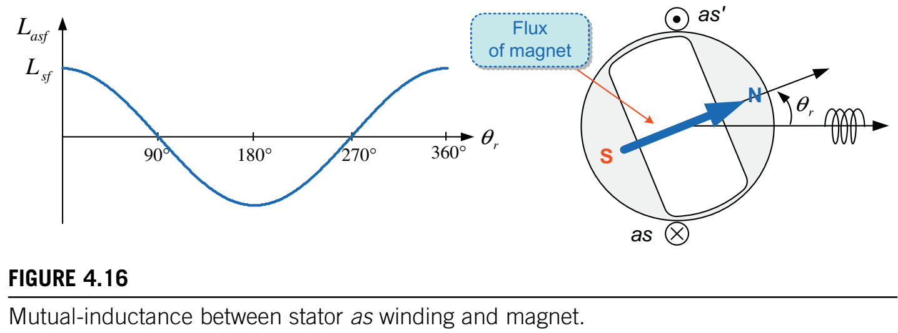

# 第四章 交流电动机建模与参考坐标系理论

​	为了对电动机进行恰当的控制，我们需要分析其动态性能以及稳态性能。这就需要一个能够描述电动机行为的数学模型。电动机模型主要可以通过电压方程和转矩方程来表示。电动机的电压方程基本上由以下几部分组成：绕组电阻$R$上的电压降以及与绕组磁链$\lambda$随时间变化率成正比的感应电压，其表达式为：
$$
\begin{aligned} v(t) & =Ri(t)+\frac{d \lambda(t)}{d t}  =Ri(t)+\frac{d\left[L\left(\theta_{r}\right) i(t)\right]}{d t} \quad\left(\theta_{r}=\omega_{r} t\right) \end{aligned}\tag{4.1}
$$
​	正如第一章所讨论的那样，磁链可以表示为电感与电流的乘积。对于定子和转子上带有绕组的交流(AC)电动机而言，互感(它意味着两个绕组之间交链磁通的数量)是一个随时间变化的参数。这是因为由于与转子位置相关的交链磁通数量会发生变化，互感是转子位置的函数。此外，在凸极同步电动机中，由于气隙会随转子位置而变化，甚至自感也是转子位置的函数。 

图4.1 定子和转子绕组之间的角度位置。

​	例如，考虑图4.1中的感应电动机，其中定子绕组是静止的，而转子绕组随转子一起旋转。由于转子的运动，除了静止状态外，定子绕组和转子绕组之间的角位置$\theta_{r}$会随时间变化。因此，即便在这两个绕组中流动的电流(也就是磁通)保持恒定，交链这些绕组的磁通数量也会随时间变化。这就导致互感成为随时间变化的量。由于存在这种随时间变化的电感，描述交流电动机行为的电压方程将由带有随时间变化系数的微分方程来表示。 

​	采用参考坐标系变换可以消除电压方程中的时变电感。使用这种变换时，三相abc变量在正交坐标系中被转换为dq变量。这些dq正交变量是采用矢量控制方案实现交流电机的动态转矩控制所必需的。该方案将在第5章中描述。

​	在本章中，我们将研究参考坐标系变换，并介绍在正交坐标系中用$dq$变量表示的交流电动机模型。在此之前，我们将开始探究用三相$abc$变量表示的交流电动机模型。

## 4.1 感应电机建模

​	与第3章所示的感应电机稳态模型不同，在本节中，我们将引入一个模型来描述瞬态以及稳态性能。 

图4.2 感应电动机的定子和转子绕组。

​	考虑如图4.2所示的三相两极感应电机。假设定子绕组有效匝数$N_s$、电阻$R_s$、漏电感$L_{ls}$和自感$L_s$。类似地，等效转子绕组有效匝数$N_r$、电阻$R_r$、漏电感$L_{lr}$和自感$L_r$。$\theta_r$是定子轴与转子轴之间的角位移。这里，我们将不考虑非理想特性，如铁芯饱和、槽效应和齿槽转矩。虽然这些绕组是相同的、相位相差120°的正弦分布绕组，但为了简单起见，我们将只考虑每相的中心线圈。

​	现在，让我们推导感应电机的电压方程。由于感应电机有六个绕组，可以用六个电压方程来表示。绕组电压由绕组电阻的压降和绕组磁链变化引起的电压组成。因此，定子和转子绕组的六个电压方程分别为
$$
v_{a s}=R_{s} i_{a s}+\frac{d \lambda_{a s}}{d t} \tag{4.2}
$$

$$
v_{b s}=R_{s} i_{b s}+\frac{d \lambda_{b s}}{d t}\tag{4.3}
$$

$$
v_{c s}=R_{s} i_{c s}+\frac{d \lambda_{c s}}{d t}\tag{4.4}
$$

$$
v_{a r}'=R' i_{a r}'+\frac{d \lambda_{a r}'}{d t}\tag{4.5}
$$

$$
v_{b r}'=R' i_{b r}'+\frac{d \lambda_{b r}'}{d t}\tag{4.6}
$$

$$
v_{c r}'=R' i_{c r}'+\frac{d \lambda_{c r}'}{d t}\tag{4.7}
$$

其中$v_{a s}$、$v_{b s}$、$v_{c s}$是定子电压，$i_{a s}$、$i_{b s}$、$i_{cs }$是定子电流，$v'_{ar}$、$v_{b r}'$、$v_{c r}'$是转子电压，$i_{a r}'$、$i_{b r}'$、$i_{c r}'$是转子电流，$\lambda_{a s}$、$\lambda_{b s}$、$\lambda_{c s}$是定子磁链，$\lambda_{a r}'$、$\lambda_{b r}'$、$\lambda_{c r}'$是转子磁链。在此，带撇号的变量表示考虑两个绕组的匝数比后归算到定子侧的转子变量。从现在起，我们将省略撇号(')。

图4.3 as相绕组的磁链&lambda;as。

​	为求解这些电压方程，我们需要知道每个绕组的磁链。由于有六个绕组，一个绕组不仅会与自身绕组电流产生的磁通交链，还会与另外五个绕组中流动的电流所产生的磁通交链。例如，图4.3所示的as相绕组的总磁链$\lambda_{as}$有以下六个组成部分。 
$$
\begin{aligned} \lambda_{as} &=\lambda_{asas}+\lambda_{asbs}+\lambda_{ascs}+\lambda_{asar}+\lambda_{asbr}+\lambda_{ascr} \\ &=L_{asas}i_{as}+L_{asbs}i_{bs}+L_{ascs}i_{cs}+L_{asar}i_{ar}+L_{asbr}i_{br}+L_{ascr}i_{cr} \end{aligned} \tag{4.8}
$$
其中，磁链$\lambda_{xsys}$表示由在ys绕组中流动的电流$i_{ys}$产生且与xs绕组交链的磁通。磁链$\lambda_{xsys}$可以表示为相关电流与电感的乘积。在这种情况下，电感$L_{xsys}$定义为与xs绕组交链的磁通与产生该磁通的电流$i_{ys}$的比值，即$L_{xsys}=\lambda_{xsys}/i_{ys}$。

​	定子和转子绕组中的六个磁链可以写成

$$
\begin{align*}
\begin{bmatrix} \lambda_{as} \\ \lambda_{bs} \\ \lambda_{cs} \\ \lambda_{ar} \\ \lambda_{br} \\ \lambda_{cr} \end{bmatrix} &= \begin{bmatrix} \lambda_{asas} & \lambda_{asbs} & \lambda_{ascs} & \lambda_{asar} & \lambda_{asbr} & \lambda_{ascr} \\ \lambda_{bsas} & \lambda_{bsbs} & \lambda_{bscs} & \lambda_{bsar} & \lambda_{bsbr} & \lambda_{bscr} \\ \lambda_{csas} & \lambda_{csbs} & \lambda_{cscs} & \lambda_{csar} & \lambda_{csbr} & \lambda_{cscr} \\ \lambda_{aras} & \lambda_{arbs} & \lambda_{arcs} & \lambda_{arar} & \lambda_{arbr} & \lambda_{arcr} \\ \lambda_{bras} & \lambda_{brbs} & \lambda_{brcs} & \lambda_{brar} & \lambda_{brbr} & \lambda_{brcr} \\ \lambda_{cras} & \lambda_{crbs} & \lambda_{crcs} & \lambda_{crar} & \lambda_{crbr} & \lambda_{crcr} \end{bmatrix} \\ &= \begin{bmatrix} L_{asas} & L_{asbs} & L_{ascs} & L_{asar} & L_{asbr} & L_{ascr} \\ L_{bsas} & L_{bsbs} & L_{bscs} & L_{bsar} & L_{bsbr} & L_{bscr} \\ L_{csas} & L_{csbs} & L_{cscs} & L_{csar} & L_{csbr} & L_{cscr} \\ L_{aras} & L_{arbs} & L_{arcs} & L_{arar} & L_{arbr} & L_{arcr} \\ L_{bras} & L_{brbs} & L_{brcs} & L_{brar} & L_{brbr} & L_{brcr} \\ L_{cras} & L_{crbs} & L_{crcs} & L_{crar} & L_{crbr} & L_{crcr} \end{bmatrix} \begin{bmatrix} i_{as} \\ i_{bs} \\ i_{cs} \\ i_{ar} \\ i_{br} \\ i_{cr} \end{bmatrix} \end{align*}\tag{4.9}
$$

​	这些电感大体上可分为四组，如下式所示：
$$
\begin{bmatrix} \lambda_{abcs} \\ \lambda_{abcr} \end{bmatrix} = \begin{bmatrix} L_{s} & L_{sr} \\ (L_{sr})^{T} & L_{r} \end{bmatrix} \begin{bmatrix} i_{abcs} \\ i_{abcr} \end{bmatrix} \quad\tag{4.10}
$$
其中，$L_{s}$和$L_{r}$分别代表定子绕组和转子绕组的电感矩阵，而$L_{sr}$代表定子绕组与转子绕组之间的互感矩阵。 

​	接下来，我们将计算这些电感。

### 4.1.1 定子绕组 

图4.4 定子电感。

​	定子电感矩阵$\boldsymbol{L}_s$如图4.4所示，由每个定子绕组的自感和定子绕组之间的互感组成： 
$$
\boldsymbol{L}_s=\begin{bmatrix}L_{asas}&L_{asbs}&L_{ascs}\\L_{bsas}&L_{bsbs}&L_{bscs}\\L_{csas}&L_{csbs}&L_{cscs}\end{bmatrix}\tag{4.11}
$$
​	我们可以得到自感和互感的表达式如下。

​	每个绕组产生的磁通量可分为两个部分：仅与自身绕组交链的漏磁通和与自身绕组及其他绕组交链的励磁磁通。它们可以分别用漏感和励磁电感来表示。因此，定子自感$L_{asas}$、$L_{bsbs}$、$L_{cscs}$由漏感$L_{ls}$和励磁电感$L_{ms}$组成，即
$$
L_{asas}=L_{bsbs}=L_{cscs}=L_{ls}+L_{ms}\tag{4.12}
$$
其中$L_{ms}=\mu_{o}N_{s}^{2}(rl/g)(\pi/4)$，$\mu_{o}$是空气磁导率，$l$是气隙轴向长度，$r$是气隙平均半径$1$。 

​	两个定子绕组之间互感$L_{asbs}$、$L_{ascs}$、$L_{bsas}$、$L_{bscs}$、$L_{csas}$、$L_{cbs}$(它们彼此错开120°)都相同，并且与励磁电感相关，即
$$
L_{asbs}=L_{ascs}=L_{bsas}=L_{bscs}=L_{csas}=L_{cbs}=L_{ms}\cos(\frac{2\pi}{3})=-\frac{1}{2}L_{ms}\tag{4.13}
$$
​	这里，互感中的负号表示每个绕组产生的磁通方向彼此相反。根据式(4.12)和(4.13)的电感，定子绕组的电感由下式给出： 
$$
\boldsymbol{L}_s=\begin{bmatrix}L_{ls}+L_{ms}&-\frac{L_{ms}}{2}&-\frac{L_{ms}}{2}\\-\frac{L_{ms}}{2}&L_{ls}+L_{ms}&-\frac{L_{ms}}{2}\\-\frac{L_{ms}}{2}&-\frac{L_{ms}}{2}&L_{ls}+L_{ms}\end{bmatrix}\tag{4.14}
$$

​	由于气隙长度恒定，这些电感值与转子位置无关，为恒定值。

### 4.1.2 转子绕组 

图4.5 转子电感。

​	如图4.5所示，转子电感矩阵$\boldsymbol{L}_r$由每个转子绕组的自感和这些绕组之间的互感组成： 
$$
\boldsymbol{L}_r=\begin{bmatrix}L_{arar}&L_{arbr}&L_{arcr}\\L_{brar}&L_{brbr}&L_{brcr}\\L_{crar}&L_{crbr}&L_{crcr}\end{bmatrix}\tag{4.15}
$$
​	与定子自感类似，转子自感$L_{arar}$、$L_{brbr}$、$L_{crcr}$由漏感$L_{lr}$和励磁电感$L_{mr}$组成，即
$$
L_{arar}=L_{brbr}=L_{crcr}=L_{lr}+L_{mr}\tag{4.16}
$$
其中$L_{mr}=\mu_{o}N_{r}^{2}(rl/g)(\pi/4)=(N_{r}/N_{s})^2L_{ms}$。 

​	两个转子绕组之间互感$L_{arbr}$、$L_{arcr}$、$L_{brar}$、$L_{brcr}$、$L_{crar}$、$L_{crbr}$(它们彼此错开120°)都相同，并且与励磁电感相关，即
$$
L_{arbr}=L_{arcr}=L_{brar}=L_{brcr}=L_{crar}=L_{crbr}\\=L_{mr}\cos(\frac{2\pi}{3})=-\frac{1}{2}L_{mr}=-\frac{1}{2}(\frac{N_{r}}{N_{s}})^2L_{ms}\tag{4.17}
$$
其中$N_{r}/N_{s}$是定子和转子绕组的匝数比。根据这些电感，转子绕组的电感由下式给出： 
$$
\boldsymbol{L}_r=\begin{bmatrix}L_{ls}+n^2L_{ms}&-n^2\frac{L_{ms}}{2}&-n^2\frac{L_{ms}}{2}\\-\frac{L_{ms}}{2}&L_{ls}+n^2L_{ms}&-n^2\frac{L_{ms}}{2}\\-n^2\frac{L_{ms}}{2}&-n^2\frac{L_{ms}}{2}&L_{ls}+n^2L_{ms}\end{bmatrix},n=(\frac{N_{r}}{N_{s}})\tag{4.18}
$$
这些电感值与转子位置无关，为恒定值。

### 4.1.3 定子与转子绕组之间的电感 

​	接下来，让我们研究定子和转子绕组的互感。首先，我们将探讨互感矩阵$\boldsymbol{L}_{sr}$。这是由转子绕组产生并与定子绕组交链的磁通量对应的电感。互感由九个分量组成：
$$
\boldsymbol{L}_{sr}=\begin{bmatrix}L_{asar}&L_{asbr}&L_{ascr}\\L_{bsar}&L_{bsbr}&L_{bscr}\\L_{csar}&L_{csbr}&L_{cscr}\end{bmatrix}\tag{4.19}
$$
​	例如，考察互感$L_{asar}$，它表示与定子$as$绕组交链的磁通量与产生该磁通量的转子$ar$绕组电流之比。如果转子绕组以速度$\omega_{r}$旋转，两个绕组之间的相对位置$\theta_{r}$将随时间变化。因此，互感随转子的位移角$\theta_{r}$呈正弦变化，如图4.6所示。 

图4.6 定子as绕组与转子ar绕组之间的互感。

​	考虑到两个绕组之间的匝数比，$L_{asar}$由下式给出： 
$$
L_{asar}=L_{mr}(\frac{N_{s}}{N_{r}})\cos\theta_{r}=L_{ms}(\frac{N_{r}}{N_{s}})\cos\theta_{r}\quad(\theta_{r}=\int\omega_{r}dt)\tag{4.20}
$$

​	类似地，其他互感由下式给出： 
$$
L_{asar}=L_{bsbr}=L_{cscr}=(\frac{N_{r}}{N_{s}})L_{ms}\cos\theta_{r}\tag{4.21}
$$

$$
L_{asbr}=L_{bscr}=L_{csar}=(\frac{N_{r}}{N_{s}})L_{ms}\cos(\theta_{r}+\frac{2\pi}{3})\tag{4.22}
$$

$$
L_{ascr}=L_{bsar}=L_{cbr}=(\frac{N_{r}}{N_{s}})L_{ms}\cos(\theta_{r}-\frac{2\pi}{3})\tag{4.23}
$$

​	根据这些电感，互感矩阵$\boldsymbol{L}_{sr}$由下式给出： 
$$
\begin{aligned}\boldsymbol{L}_{sr}&=\begin{bmatrix}L_{asar}&L_{asbr}&L_{ascr}\\L_{bsar}&L_{bsbr}&L_{bscr}\\L_{csar}&L_{csbr}&L_{cscr}\end{bmatrix}\\&=nL_{ms}\begin{bmatrix}\cos\theta_{r}&\cos(\theta_{r}+\frac{2\pi}{3})&\cos(\theta_{r}-\frac{2\pi}{3})\\\cos(\theta_{r}-\frac{2\pi}{3})&\cos\theta_{r}&\cos(\theta_{r}+\frac{2\pi}{3})\\\cos(\theta_{r}+\frac{2\pi}{3})&\cos(\theta_{r}-\frac{2\pi}{3})&\cos\theta_{r}\end{bmatrix}\end{aligned}\tag{4.24}
$$
​	从式(4.24)可以明显看出，互感是转子位置的函数，因此除了静止状态外，它们会随时间变化。因此，时变系数将出现在式(4.2)-(4.4)的定子电压方程中。 

​	根据式(4.14)和(4.24)，定子绕组的磁链由下式给出： 
$$
\begin{aligned}\boldsymbol{\lambda}_{abcs}&=\boldsymbol{L}_{s}\boldsymbol{i}_{abcs}+\boldsymbol{L}_{sr}\boldsymbol{i}_{abcr}\\&=\begin{bmatrix}L_{ls}+L_{ms}&-\frac{L_{ms}}{2}&-\frac{L_{ms}}{2}\\-\frac{L_{ms}}{2}&L_{ls}+L_{ms}&-\frac{L_{ms}}{2}\\-\frac{L_{ms}}{2}&-\frac{L_{ms}}{2}&L_{ls}+L_{ms}\end{bmatrix}\begin{bmatrix}i_{as}\\i_{bs}\\i_{cs}\end{bmatrix}\\&+nL_{ms}\begin{bmatrix}\cos\theta_{r}&\cos(\theta_{r}+\frac{2\pi}{3})&\cos(\theta_{r}-\frac{2\pi}{3})\\\cos(\theta_{r}-\frac{2\pi}{3})&\cos\theta_{r}&\cos(\theta_{r}+\frac{2\pi}{3})\\\cos(\theta_{r}+\frac{2\pi}{3})&\cos(\theta_{r}-\frac{2\pi}{3})&\cos\theta_{r}\end{bmatrix}\begin{bmatrix}i_{ar}\\i_{br}\\i_{cr}\end{bmatrix}\end{aligned}\tag{4.25}
$$
​	接下来，考察互感$\boldsymbol{L}_{rs}$。这与由定子绕组产生并与转子绕组交链的磁通量有关。这个互感$\boldsymbol{L}_{rs}$等于$\boldsymbol{L}_{sr}$的转置：
$$
\begin{aligned}\boldsymbol{L}_{rs}=\boldsymbol{L}_{sr}^{T}&=\begin{bmatrix}L_{tras}&L_{urcs}\\L_{bras}&L_{brs}&L_{brcs}\\L_{cras}&L_{crbs}&L_{crcs}\end{bmatrix}\\&=nL_{ms}\begin{bmatrix}\cos\theta_{r}&\cos(\theta_{r}-\frac{2\pi}{3})&\cos(\theta_{r}+\frac{2\pi}{3})\\\cos(\theta_{r}+\frac{2\pi}{3})&\cos\theta_{r}&\cos(\theta_{r}-\frac{2\pi}{3})\\\cos(\theta_{r}-\frac{2\pi}{3})&\cos(\theta_{r}+\frac{2\pi}{3})&\cos\theta_{r}\end{bmatrix}\end{aligned}\tag{4.26}
$$

​	与$\boldsymbol{L}_{sr}$类似，互感$\boldsymbol{L}_{rs}$在非静止状态下也会随时间变化。因此，时变系数将出现在转子绕组的电压方程中。 根据式(4.18)和(4.26)，转子绕组的磁链由下式给出： 
$$
\begin{aligned}\boldsymbol{\lambda}_{abcr}&=\boldsymbol{L}_{r}\boldsymbol{i}_{abcr}+\boldsymbol{L}_{rs}\boldsymbol{i}_{abcs}\\&=\begin{bmatrix}L_{ls}+n^2L_{ms}&-n^2\frac{L_{ms}}{2}&-n^2\frac{L_{ms}}{2}\\-\frac{L_{ms}}{2}&L_{ls}+n^2L_{ms}&-n^2\frac{L_{ms}}{2}\\-n^2\frac{L_{ms}}{2}&-n^2\frac{L_{ms}}{2}&L_{ls}+n^2L_{ms}\end{bmatrix}\begin{bmatrix}i_{ar}\\i_{br}\\i_{cr}\end{bmatrix}\\&+nL_{ms}\begin{bmatrix}\cos\theta_{r}&\cos(\theta_{r}-\frac{2\pi}{3})&\cos(\theta_{r}+\frac{2\pi}{3})\\\cos(\theta_{r}+\frac{2\pi}{3})&\cos\theta_{r}&\cos(\theta_{r}-\frac{2\pi}{3})\\\cos(\theta_{r}-\frac{2\pi}{3})&\cos(\theta_{r}+\frac{2\pi}{3})&\cos\theta_{r}\end{bmatrix}\begin{bmatrix}i_{as}\\i_{bs}\\i_{cs}\end{bmatrix}\end{aligned}\tag{4.27}
$$
​	最后，根据式 (4.25) 和 (4.27)，感应电机的总磁链由下式给出：
$$
\begin{align*} &\left[ \begin{array}{c} \lambda_{as} \\\lambda_{bs}\\ \lambda_{cs}\\ \lambda_{ar}\\ \lambda_{br}\\ \lambda_{cr} \end{array} \right]=\begin{bmatrix}\boldsymbol{L}_{s}&\boldsymbol{L}_{sr}\\\boldsymbol{L}_{rs}&\boldsymbol{L}_{r}\end{bmatrix}\left[ \begin{array}{c} i_{as}\\ i_{bs}\\ i_{cs}\\ i_{ar}\\ i_{br}\\ i_{cr} \end{array} \right]
\\
&
\boldsymbol{L}_{s}=\begin{bmatrix}&L_{ls}+L_{ms}&-\frac{L_{ms}}{2}&-\frac{L_{ms}}{2}\\&-\frac{L_{ms}}{2}&L_{ls}+L_{ms}&-\frac{L_{ms}}{2}\\&-\frac{L_{ms}}{2}&-\frac{L_{ms}}{2}&L_{ls}+L_{ms}\end{bmatrix}
\\
&
\boldsymbol{L}_{sr}=\begin{bmatrix}&nL_{ms}\cos\theta_{r}&nL_{ms}\cos(\theta_{r}+\frac{2\pi}{3})&nL_{ms}\cos(\theta_{r}-\frac{2\pi}{3})\\&nL_{ms}\cos(\theta_{r}-\frac{2\pi}{3})&nL_{ms}\cos\theta_{r}&nL_{ms}\cos(\theta_{r}+\frac{2\pi}{3})\\&nL_{ms}\cos(\theta_{r}+\frac{2\pi}{3})&nL_{ms}\cos(\theta_{r}-\frac{2\pi}{3})&nL_{ms}\cos\theta_{r}\end{bmatrix}
\\
&
\boldsymbol{L}_{rs}=\begin{bmatrix}&nL_{ms}\cos\theta_{r}&nL_{ms}\cos(\theta_{r}-\frac{2\pi}{3})&nL_{ms}\cos(\theta_{r}+\frac{2\pi}{3})\\&nL_{ms}\cos(\theta_{r}+\frac{2\pi}{3})&nL_{ms}\cos\theta_{r}&nL_{ms}\cos(\theta_{r}-\frac{2\pi}{3})\\&nL_{ms}\cos(\theta_{r}-\frac{2\pi}{3})&nL_{ms}\cos(\theta_{r}+\frac{2\pi}{3})&nL_{ms}\cos\theta_{r}\end{bmatrix}
\\
&
\boldsymbol{L}_{r}=\begin{bmatrix}&L_{lr}+n^{2}L_{ms}&-\frac{1}{2}n^{2}L_{ms}&-\frac{1}{2}n^{2}L_{ms}\\&-\frac{1}{2}n^{2}L_{ms}&L_{lr}+n^{2}L_{ms}&-\frac{1}{2}n^{2}L_{ms}\\&-\frac{1}{2}n^{2}L_{ms}&-\frac{1}{2}n^{2}L_{ms}&L_{lr}+n^{2}L_{ms}\end{bmatrix}
\end{align*} \tag{4.28}
$$
​	将这些磁链代入式 (4.2)-(4.7)，感应电机的电压方程就完整了。

## 4.2 永磁同步电机建模 

​	同步电机的定子结构与感应电机相同。定子绕组连接到三相交流电源以产生旋转磁场。然而，与具有三相绕组的感应电机不同，同步电机的转子有励磁绕组或永磁体来产生磁场通量。近年来，同步电机的磁场大多是通过永磁体而非励磁绕组产生的。 

​	除了定子和转子磁场产生的电磁转矩外，带有凸极的同步电机还可以利用磁阻转矩。根据电磁转矩与磁阻转矩的比率，同步电机可分为几类，如图4.7[2]所示。 

图4.7 同步电机的分类。

​	在本书中，除了仅利用磁阻转矩的同步磁阻电机外，我们将研究范围限定于永磁同步电机（PMSM）。 

​	永磁同步电机相对于其他电机有许多优势。由于转子没有铜损，它们比感应电机具有更高的效率。此外，由于钕铁硼（NdFeB）等经济高效的高性能永磁材料的应用，它们还具有高功率密度、高转矩体积比和快速动态响应的特点。 

​	除了这些优势，带有磁阻凸极的永磁同步电机还能利用磁阻转矩和磁转矩。由于这些吸引人的特性，永磁同步电机在从通用驱动到高性能驱动的各种住宅和工业驱动应用中受到越来越多的关注。

### 4.2.1 永磁同步电机的结构 

#### 4.2.1.1 定子结构 

​	三相定子绕组通常采用分布式绕组配置，以便在气隙中产生正弦磁通，如图4.8A所示。然而，最近在永磁同步电机中越来越多地采用集中式绕组，如图4.8B所示。 

图4.8 永磁同步电机定子和转子的不同结构。(A)分布式绕组；(B)集中式绕组。

​	尽管与分布式绕组相比，集中式绕组产生的正弦磁动势分布较少，但这种绕组类型可以提供诸如高功率密度、高效率、短端部匝数、高槽满率、通过分段定子结构降低制造成本、低齿槽转矩、弱磁能力和容错能力等优点[3]。

​	图4.9对永磁同步电机定子中的分布式绕组和集中式绕组进行了比较。集中式绕组主要有两种类型：单层绕组结构，即每个槽被一相的线圈边占据；双层绕组结构，即每个槽被两相的线圈边平均占据[4]。

图4.9 分布式绕组和集中式绕组的比较。(A)分布式绕组；(B)集中式绕组。

#### 4.2.1.2 转子结构 

​	永磁同步电机（PMSM）的转子上有永磁体以产生磁场通量。永磁同步电机的特性，如功率、转矩密度、重量和尺寸可能会因所选永磁材料的不同而有所变化。如今，钕铁硼（也称为NdFeB）由于其出色的磁特性和低成本而最常用于永磁同步电机。尽管我们使用相同的永磁材料，但永磁同步电机的许多特性在很大程度上取决于涉及永磁体形状和排列的转子结构。 

​	根据永磁体产生的磁通量方向，永磁同步电机可分为两种类型，如图4.10所示：径向磁通型和轴向磁通型。在径向磁通型中，呈圆柱形的转子在定子内部旋转，磁通量沿径向穿过气隙。另一方面，在轴向磁通型中，形状像薄饼的转子在定子旁边旋转，磁通量沿轴向穿过气隙[5]。 

图4.10 永磁同步电机（PMSM）的结构。(A)径向磁通型；(B)轴向磁通型。

​	在这两种类型中，径向磁通型在许多应用中更为常用。径向磁通型永磁同步电机还可根据永磁体的位置进一步分为两类，如图4.11所示：表面贴装永磁同步电机（SPMSM），其永磁体安装在转子表面；内置式永磁同步电机（IPMSM），其永磁体嵌在转子铁芯内部。 

图4.11 永磁同步电机（四极）的转子拓扑结构(A)表面贴装式(B)内置式（平行）(C)内置式（垂直）。

​	对于内置式永磁同步电机，根据永磁体的排列方式有两种拓扑结构：平行拓扑结构，其中磁极与转子圆周平行，如图4.11B所示；垂直拓扑结构（也称为辐条型），其中磁极与圆周垂直，如图4.11C所示。 

​	平行拓扑结构的内置式永磁同步电机更为常用。垂直拓扑结构可以汇聚永磁体的磁通量并实现高极数，这样气隙中的磁通密度可以高于永磁体本身的磁通密度。因此，尽管采用低成本、低磁通密度的永磁材料（如铁氧体），电机仍能表现出高转矩密度。然而，由于磁极边缘处的磁通汇聚，在磁极尖端附近的气隙磁通密度可能会出现高次谐波畸变，进而导致反电动势波形出现高次谐波。这也会导致输出转矩产生较大的纹波。 

图4.12 内置式永磁同步电机（IPMSM）的转子结构。(A)内转子型；(B)外转子型。

​	转子还可以构造成在定子绕组内部旋转的内转子型，或在定子绕组外部旋转的外转子型，如图4.12所示。内转子型具有较低的转动惯量，因此能够实现快速的速度响应。另一方面，外转子型具有相对较高的转动惯量，因此更适合于恒速运行。

> 电动机中使用的永磁体 
>
> 电动机中使用的永磁体主要可分为以下三类，依据磁性材料的类型：铝镍钴、铁氧体和稀土（钐钴、钕铁硼）。 
>
> 1. **铝镍钴磁体** 
>    	铝镍钴具有高剩磁通量（称为剩磁）但矫顽力低。它的剩磁温度系数也较低。然而，由于矫顽力低，其磁化强度容易因外加磁场而降低（这被称为退磁）。 
>
> 2. **铁氧体（或陶瓷）磁体** 
>            铁氧体的矫顽力比铝镍钴高，但剩磁通量密度较低。由于其价格低廉且磁性适中，铁氧体磁体广泛用于低性能应用。 
>
> 3. **稀土磁体**   
>    a. **钐 - 钴（SmCo）磁体**   
>            SmCo因其高剩磁通量密度和矫顽力而具有较高的能量积（BHmax）。钐 - 钴磁体具有较高的居里温度（在此温度下材料失去磁性），且矫顽力和剩磁的温度系数较低，但它们非常昂贵且易碎。
>    b. **钕 - 铁 - 硼（NdFeB）磁体** 
>            NdFeB被认为是目前最好的磁性材料之一，因为它具有高得多的剩磁通量密度和矫顽力。然而，钕磁体对温度敏感，在高温下甚至可能失去磁性。这一缺点正在逐步改善。 
>
> ​        在这些材料中，由于NdFeB出色的磁特性及其近期价格下降，它是永磁同步电机（PMSM）中最常用的永磁体材料。下图展示了这些磁性材料的B - H特性曲线。 
>
> 
>
> - **剩磁Br和矫顽力Hc** 
>           剩磁或剩磁通量是指当外部磁场移除后，磁性材料中剩余的磁通量密度。具有高剩磁通量的磁性材料适合用于强永磁体。矫顽力表示将材料的磁化强度降至零所需的磁场强度。具有高矫顽力的磁性材料通常用于制造电动机的永磁体。
> - **温度对永磁体的影响** 
>           永磁体对温度敏感。剩磁通量密度随着温度升高而降低。例如，NdFeB的温度系数约为每摄氏度0.1%。当磁体恢复到原始温度时，其初始磁通量可以恢复。然而，如果磁体暴露在高于最大工作温度的温度下并经历大量的磁性损失，则可能会发生不可逆变化，当其恢复到原始温度时，其原始磁通量水平无法恢复。因此，最好在最大工作温度以下操作磁体。这限制了电机的最大转矩能力，因为应限制最大电流以避免磁体退磁。

​	图4.11中所示的所有转子均为圆柱形，因此物理气隙是恒定的。然而，有效气隙可能会随着磁体的排列方式而变化。由于磁体的磁导率近似于空气的磁导率，放置在磁通路径中的磁体可被视为空气。因此，从磁场的角度来看，有效气隙将是实际气隙长度与磁体径向厚度之和。 

​	对于表面贴装式永磁同步电机（SPMSM），其转子表面的磁体具有均匀厚度，有效气隙会因磁体的径向厚度而增加。因此，SPMSM具有较小的定子绕组电感，且d轴电感等于q轴电感。 

​	对于内置式永磁同步电机（IPMSM），d - q轴电感可能会因磁体的排列方式而不同。一方面，在平行拓扑结构的IPMSM中，磁体沿d轴排列，使得q轴电感高于d轴电感。另一方面，在垂直拓扑结构的IPMSM中，q轴电感小于d轴电感。由于d轴和q轴电感之间的差异会产生磁阻转矩，IPMSM能够利用磁阻转矩。 

​	SPMSM不适合高速运行，因为转子表面贴有磁体会产生较大的离心力。此外，由于有效气隙增加导致电感较小，SPMSM在高速运行时的弱磁能力相对有限。另一方面，IPMSM在高速运行时具有更强的机械强度，因为磁体嵌在转子内部。此外，IPMSM的d轴电感与等效的SPMSM相比要高，这对于第八章将讨论的弱磁运行是一个很大的优势。因此，IPMSM适合高速运行。 

​	如前文所述，SPMSM和IPMSM在特性上存在差异，需要不同的控制方法。现在，我们将推导永磁同步电机的模型。首先，我们将介绍具有磁阻特性的内置式永磁同步电机（IPMSM）模型。表面贴装式永磁同步电机（SPMSM）的模型可以从IPMSM模型中轻松推导出来。如前文所述，IPMSM有平行和垂直两种拓扑结构。这两种拓扑结构可以用相同的模型表示，但d - q轴电感值不同。本节将讨论最常用的平行拓扑结构的IPMSM。

### 4.2.2 永磁同步电机模型 

​	对于平行拓扑结构的内置式永磁同步电机（IPMSM），由于磁体沿d轴放置，q轴电感高于d轴电感。尽管IPMSM的转子是圆柱形的，但为了简化对IPMSM的分析，我们将把它表示为一个等效的磁阻转子，如图4.13所示。 

图4.13 内置式永磁同步电机（IPMSM）的转子及其等效结构。

​	由于永磁同步电机（PMSM）没有转子电路，我们只需考虑定子绕组的电压方程。同步电机的定子绕组电压方程与感应电机相同，因此定子电压方程为： 
$$
 v_{abcs} = R_si_{abcs} + \frac{d\lambda_{abcs}}{dt} \tag{4.29}
$$
其中$ v_{abcs} = [v_{as} v_{bs} v_{cs}]^T $，$ i_{abc_s} = [i_{as} i_{bs} i_{cs}]^T $，$ \lambda_{abcs} = [\lambda_{as} \lambda_{bs} \lambda_{cs}]^T $。 

​	由于同步电机的转子结构与感应电机不同，定子绕组的磁链分量也不同。 

​	IPMSM的磁链由以下四个部分组成：定子电流产生的磁链和永磁体产生的磁链，如下所示： 
$$
\lambda_{as} = \lambda_{asas} + \lambda_{asbs} + \lambda_{ascs} + \phi_{asf}\tag{4.30}
$$

$$
\lambda_{bs} = \lambda_{bsas} + \lambda_{bsbs} + \lambda_{bscs} + \phi_{bsf} \tag{4.31}
$$

$$
\lambda_{cs} = \lambda_{csas} + \lambda_{csbs} + \lambda_{cscs} + \phi_{csf}\tag{4.32}
$$

​	这些磁链可以表示为相关电流和电感的乘积： 
$$
\lambda_{as} = L_{asas}i_{as} + L_{asbs}i_{bs} + L_{ascs}i_{cs} + L_{asf}I_f \tag{4.33}
$$

$$
\lambda_{bs} = L_{bsas}i_{as} + L_{bsbs}i_{bs} + L_{bscs}i_{cs} + L_{bsf}I_f\tag{4.34}
$$

$$
\lambda_{cs} = L_{csas}i_{as} + L_{csbs}i_{bs} + L_{cscs}i_{cs} + L_{csf}I_f\tag{4.35}
$$

其中，$ \phi_{asf} $、$ \phi_{bsf} $、$ \phi_{csf} $是永磁体产生的磁链，表示为等效磁场电流$ I_f $和相关电感$ L_{asf} $、$ L_{bsf} $、$ L_{csf} $的乘积。 

​	现在，我们将确定定子电感： 
$$
 L_s = \begin{bmatrix} L_{asas} & L_{asbs} & L_{ascs} \\ L_{bsas} & L_{bsbs} & L_{bscs} \\ L_{csas} & L_{csbs} & L_{cscs} \end{bmatrix} \tag{4.36}
$$
​	如4.1.1节所述，定子电感由定子绕组的自感和定子绕组之间的互感组成。此外，定子自感$ L_{asas} $、$ L_{bsbs} $、$ L_{cscs} $由漏感和磁化感组成。 

​	与感应电机不同，IPMSM的自感可能会因转子的角位置而变化，因为有效气隙会随转子位置而变化。考虑图4.14所示的$ a_s $相绕组的例子。在这种情况下，自感在转子位置为90°和270°（磁阻最小位置）时达到最大值，此时由$ a_s $相电流产生的磁通达到最大值，进而使其自身绕组的磁链达到最大值。另一方面，自感在转子位置为0°和180°（磁阻最大位置）时达到最小值。 

图4.14 相对于转子位置的a相绕组自感。

​	因此，自感随转子角$ \theta_r $呈正弦变化，可表示为： 
$$
L_{asas} = L_{ls} + L_{A} - L_{B}\cos 2\theta_r \tag{4.37}
$$

$$
L_{bsbs} = L_{ls} + L_{A} - L_{B}\cos 2\left( \theta_r - \frac{2\pi}{3} \right) \tag{4.38}
$$

$$
L_{cscs} = L_{ls} + L_{A} - L_{B}\cos 2\left( \theta_r + \frac{2\pi}{3} \right) \tag{4.39}
$$

其中，$ L_{ls} $表示漏感，$ L_{A} $表示励磁电感的平均值，$ L_{B} $表示励磁电感的变化量。 

图4.15 a相和b相定子绕组之间的互感。

​	与感应电机类似，定子绕组之间的互感也随转子角$ \theta_r $呈正弦变化，如图4.15所示，它们分别为： 
$$
 L_{asbs} = L_{bsas} = -\frac{1}{2}L_{A} - L_{B}\cos 2\left( \theta_r - \frac{\pi}{3} \right) \tag{4.40}
$$

$$
L_{ascs} = L_{csas} = -\frac{1}{2}L_{A} - L_{B}\cos 2\left( \theta_r + \frac{\pi}{3} \right)\tag{4.41}
$$

$$
L_{bscs} = L_{csbs} = -\frac{1}{2}L_{A} - L_{B}\cos 2\theta_r\tag{4.42}
$$

​	有了这些电感，定子电感矩阵为： 
$$
\begin{aligned} &L_s= \\
&
\begin{bmatrix} L_{ls} \!+\! L_{A} \!-\! L_{B}\cos 2\theta_r \!&\! -\frac{1}{2}L_{A} \!-\! L_{B}\cos 2\left( \theta_r \!-\! \frac{\pi}{3} \right) & -\frac{1}{2}L_{A} \!-\! L_{B}\cos 2\left( \theta_r \!+\! \frac{\pi}{3} \right) \\ -\frac{1}{2}L_{A} \!-\! L_{B}\cos 2\left( \theta_r \!-\! \frac{\pi}{3} \right) & L_{ls} \!+ \!L_{A} \!-\! L_{B}\cos 2\left( \theta_r \!-\! \frac{2\pi}{3} \right) & -\frac{1}{2}L_{A} \!-\! L_{B}\cos 2\theta_r \\ -\frac{1}{2}L_{A} - L_{B}\cos 2\left( \theta_r + \frac{\pi}{3} \right) & -\frac{1}{2}L_{A} \!-\! L_{B}\cos 2\theta_r & L_{ls} \!+\! L_{A} \!-\! L_{B}\cos 2\left( \theta_r \!+\! \frac{4\pi}{3} \right) \end{bmatrix}\end{aligned}\\
\begin{aligned}
(4.43)
\end{aligned}
$$
​	接下来，我们将确定定子绕组与永磁体磁链相关的互感$ L_{asf} $、$ L_{bsf} $、$ L_{csf} $，这些互感因转子位置不同而不同。以$ a_s $相绕组为例，从图4.16可以看出，互感在转子位置为0°时达到最大值，而在转子位置为180°时达到最小值。 

图4.15 定子a相绕组与磁体之间的互感。

​	与自感不同，互感每转一圈随$ \cos \theta_r $变化。因此有：
$$
 L_{asf} = L_{sf}\cos \theta_r \tag{4.44}
$$

$$
L_{bsf} = L_{sf}\cos \left( \theta_r - \frac{2\pi}{3} \right)\tag{4.45}
$$

$$
L_{csf} = L_{sf}\cos \left( \theta_r + \frac{2\pi}{3} \right)\tag{4.46}
$$

其中$ L_{sf} $取决于永磁体建立的磁通链的幅值。 

​	由这些电感可得IPMSM的总磁链为：
$$
\begin{aligned}&\lambda_{abc_s} = L_si_{abc_s} \!+\! L_fI_f = \\&\begin{bmatrix} L_{ls} \!+\! L_{A} \!-\! L_{B}\cos 2\theta_r & \!-\frac{1}{2}L_{A} \!-\! L_{B}\cos 2\left( \theta_r \!-\! \frac{\pi}{3} \right) & -\frac{1}{2}L_{A}\! -\! L_{B}\cos 2\left( \theta_r \!+\! \frac{\pi}{3} \right) \\ -\frac{1}{2}L_{A} \!-\! L_{B}\cos 2\left( \theta_r \!-\! \frac{\pi}{3} \right) & L_{ls} \!+\! L_{A}\! -\! L_{B}\cos 2\left( \theta_r\! -\! \frac{2\pi}{3} \right) & -\frac{1}{2}L_{A} \!-\! L_{B}\cos 2\theta_r \\ -\frac{1}{2}L_{A} \!-\! L_{B}\cos 2\left( \theta_r\! +\! \frac{\pi}{3} \right) & -\frac{1}{2}L_{A} \!- \!L_{B}\cos 2\theta_r & L_{ls}\! +\! L_{A} \!-\! L_{B}\cos 2\left( \theta_r\! +\! \frac{4\pi}{3} \right) \end{bmatrix} \begin{bmatrix} i_{as} \\ i_{bs} \\ i_{cs} \end{bmatrix} \\&+ \begin{bmatrix} L_{sf}\cos \theta_r \\ L_{sf}\cos \left( \theta_r - \frac{2\pi}{3} \right) \\ L_{sf}\cos \left( \theta_r + \frac{2\pi}{3} \right) \end{bmatrix} I_f\qquad\qquad\qquad\qquad\qquad\qquad\qquad\qquad\qquad\qquad\qquad\qquad\qquad\qquad(4.47)\end{aligned}
$$
​	IPMSM的所有磁链中的电感除了电机静止时都是时变的。因此，时变系数将出现在IPMSM的电压方程中。对于SPMSM，我们可以通过在式(4.47)中令$ L_{B} = 0 $轻松得到磁链。 

​	从目前的讨论中可以看出，感应电机和同步电机的电压方程都表示为具有时变系数的微分方程。幸运的是，通过采用参考系变换，可以消除电压方程中的这些时变电感。现在，我们将研究参考系变换和用$ dq $变量表示的交流电机模型。
